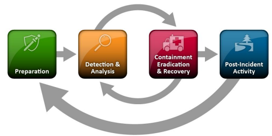

# Incident Response

## What is an incident

An event is an action occurring in a system or network. Examples of events are:

    A user sending an email
    A mouse click
    A firewall allowing a connection request

An incident is an event with a negative consequence. One example of an incident is a system crash. Another example is unauthorized access to sensitive data. Incidents can also occur due to natural disasters, power failures, etc.

Incident handling is a clearly defined set of procedures to manage and respond to security incidents in a computer or network environment.

Bear in mind that it may not be immediately clear that an event is an incident, until an initial investigation is performed.

Because different incidents will have different impacts on the organization, we need to understand the importance of prioritization. Incidents with greater severity will require immediate attention and resources to be allocated for them, while others rated lower may also require an initial investigation to understand whether it is in fact an IT security incident that we are dealing with.

## The cyber kill Chain

1. Recon: Attacked will get any information then can get (OSINT), whether from Job ads, employee posts (Linkedin, Instagram..) and even light port scanning sometimes.
2. Weaponize: Malware creation with the goal of remote access, based on recon information.
3. Delivery: Getting the malicious software in, whether through fishing, (credential theft, malware download and click), social engineering, or even phisical interaction to plug in a usb for example. It is extremely rare to deliver a payload that requires the victim to do more than double-click an executable file or a script (in Windows environments, this can be .bat, .cmd, .vbs, .js, .hta and other formats).
4. Exploitation: executing the payload on the target system.
5. Installation: the initial stager is executed and the attacked is looking to either get persistance or execute the goal of the malicious code:
 - Droppers: Attackers may use droppers to deliver malware onto the target system. A dropper is a small piece of code that is designed to install malware on the system and execute it.
 - Backdoors: A backdoor is a type of malware that is designed to provide the attacker with ongoing access to the compromised system. 
 - Rootkits: A rootkit is a type of malware that is designed to hide its presence on a compromised system. Rootkits are often used in the installation stage to evade detection by antivirus software and other security tools. The rootkit may be installed by the attacker during the exploitation stage or delivered through a dropper.
6. Command and Controle: The attacked established remote access capability on the compromised machine.
7. Action: The objective of each attack can vary. Some adversaries may go after exfiltrating confidential data, while others may want to obtain the highest level of access possible within a network to deploy ransomware.

## Incident Handling Overview

Incident handlers spend most of their time in the first two stages, preparation and detection & analysis. When a malicious event is detected, we then move on to the next stage and respond to the event (but there should always be resources operating on the first two stages, so that there is no disruption of preparation and detection capabilities).

The investigation aims to:

- Discover the initial 'patient zero' victim and create an (ongoing if still active) incident timeline
- Determine what tools and malware the adversary used
- Document the compromised systems and what the adversary has done

Following the investigation, the recovery activity involves creating and implementing a recovery plan. When the plan is implemented, the business should resume normal business operations, if the incident caused any disruptions.

When an incident is fully handled, a report is issued that details the cause and cost of the incident. Additionally, "lessons learned" activities are performed, among others, to understand what the organization should do to prevent incidents of similar type from occurring again.

## Preparation Stage

In the preparation stage, we have two separate objectives. The first one is the establishment of incident handling capability within the organization. The second is the ability to protect against and prevent IT security incidents by implementing appropriate protective measures.

#### Prerequisites
- skilled reponse team 
- trained workforce
- clear policies and documentation
- tools (software and hardware)

#### Clear policies and documentation

- Contact information and roles of the incident handling team members
- Contact information for the legal and compliance department, management team, IT support, communications and media relations department, law enforcement, internet service providers, facility management, and external incident response team
- Incident response policy, plan, and procedures
- Incident information sharing policy and procedures
- Baselines of systems and networks, out of a golden image and a clean state environment
- Network diagrams
- Organization-wide asset management database
- User accounts with excessive privileges that can be used on-demand by the team when necessary (also to business-critical systems, which are handled with the skills needed to administer that specific system). These user accounts are normally enabled when an incident is confirmed during the initial investigation and then disabled once it is over. A mandatory password reset is also performed when disabling the users.
- Ability to acquire hardware, software, or an external resource without a complete procurement process (urgent purchase of up to a certain amount). The last thing you need during an incident is to wait for weeks for the approval of a $500 tool.
- Forensic/Investigative cheat sheets

While having documentation in place is vital, it is also important to document the incident as you investigate. Therefore, during this stage you will also have to establish an effective reporting capability. Incidents can be extremely stressful, and it becomes easy to forget this part as the incident unfolds itself, especially when you are focused and going extremely fast in order to solve it as soon as possible. Try to remain calm, take notes, and ensure that these notes contain timestamps, the activity performed, the result of it, and who did it. Overall, you should seek answers to who, what, when, where, why and how.

#### Tools

- Additional laptop or a forensic workstation for each incident handling team member to preserve disk images and log files, perform data analysis, and investigate without any restrictions (we know malware will be tested here, so tools such as antivirus should be disabled). These devices should be handled appropriately and not in a way that introduces risks to the organization.
- Digital forensic image acquisition and analysis tools
- Memory capture and analysis tools
- Live response capture and analysis
- Log analysis tools
- Network capture and analysis tools
- Network cables and switches
- Write blockers
- Hard drives for forensic imaging
- Power cables
- Screwdrivers, tweezers, and other relevant tools to repair or disassemble hardware devices if needed
- Indicator of Compromise (IOC) creator and the ability to search for IOCs across the organization
- Chain of custody forms
- Encryption software
- Ticket tracking system
- Secure facility for storage and investigation
- Incident handling system independent of your organization's infrastructure

Many of the tools mentioned above will be part of what is known as a `jump bag` - always ready with the necessary tools to be picked up and leave immediately. Without this prepared bag, gathering all necessary tools on the fly may take days or weeks before you are ready to respond.

### Preparation - Protection

#### DMARC

`Domain-based Message Authentication, Reporting & Conformance` is made to dissuade phishing attemps. It `must` be thuroughtly test though to prevent potentially loosing legitimate emails forever. 'on behalf of' emails tend to be the most common victim.

#### Endpoint Hardening

Endpoint devices (workstations, laptops, etc.) are the entry points for most of the attacks that we are facing on a daily basis.

Some examples:

- Disable LLMNR/NetBIOS
- Implement LAPS and remove administrative privileges from regular users
- Disable or configure PowerShell in "ConstrainedLanguage" mode
- Enable Attack Surface Reduction (ASR) rules if using Microsoft Defender
- Implement whitelisting. We know this is nearly impossible to implement. Consider at least blocking execution from user-writable folders (Downloads, Desktop, AppData, etc.). These are the locations where exploits and malicious payloads will initially find themselves. Remember to also block script types such as .hta, .vbs, .cmd, .bat, .js, and similar. Please pay attention to LOLBin files while implementing whitelisting. Do not overlook them; they are really used in the wild as initial access to bypass whitelisting.
- Utilize host-based firewalls. As a bare minimum, block workstation-to-workstation communication and block outbound traffic to LOLBins
- Deploy an EDR product. At this point in time, AMSI provides great visibility into obfuscated scripts for antimalware products to inspect the content before it gets executed. It is highly recommended that you only choose products that integrate with AMSI.

