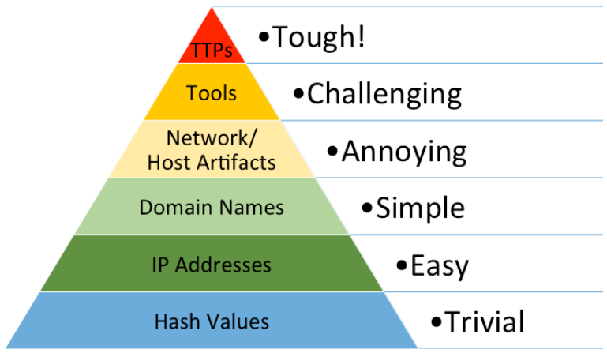

# Introduction to Threat Hunting & Hunting With Elastic

## Threat Hunting Fundamentals

The median duration between an actual security breach and its detection, otherwise termed "dwell time", is usually several weeks, if not months. Threat hunting is an active, human-led, and often hypothesis-driven practice that systematically combs through network data to identify stealthy, advanced threats that evade existing security solutions.

The principal objective of threat hunting is to substantially reduce dwell time by recognizing malicious entities at the earliest stage of the cyber kill chain. This proactive stance has the potential to prevent threat actors from entrenching themselves deeply within our infrastructure and to swiftly neutralize them.

The threat hunting process commences with the identification of assets – systems or data – that could be high-value targets for threat actors. Next, we analyze the TTPs (Tactics, Techniques, and Procedures) these adversaries are likely to employ, based on current threat intelligence. We subsequently strive to proactively detect, isolate, and validate any artifacts related to the abovementioned TTPs and any anomalous activity that deviates from established baseline norms.

Key facets of threat hunting include:

- An offensive, proactive strategy that prioritizes threat anticipation over reaction, based on hypotheses, attacker TTPs, and intelligence.
- An offensive, reactive response that searches across the network for artifacts related to a verified incident, based on evidence and intelligence.
- A solid, practical comprehension of threat landscape, cyber threats, adversarial TTPs, and the cyber kill chain.
- Cognitive empathy with the attacker, fostering an understanding of the adversarial mindset.
- A profound knowledge of the organization's IT environment, network topology, digital assets, and normal activity.
- Utilization of high-fidelity data and tactical analytics, and leveraging advanced threat hunting tools and platforms.

### The relationship between Incident Handling & Threat Hunting

- `Preparation`: Operational protocle preparation. Threat hunting max me weaved into other operations.
- `Detection and Analysis`: th threat hunter is indisipensable. They can augment investigations, ascertain whether the observed indicators of compromise (IoCs) truly signify an incident, and further.
- `Containment, Eradication, and Recovery`: depends on the org.
- `Post-Incident Activity`: Valuable asset, they can proffer recommendations to fortify the organization's overall security posture.

### Threat Hunting Teqm Structure

- `Threat Hunter`: The core role within the team, threat hunters are cybersecurity professionals with a deep understanding of the threat landscape, cyber adversaries' Tactics, Techniques, and Procedures (TTPs), and sophisticated threat detection methodologies. They proactively search for Indicators of Compromise (IoCs) and are proficient in using a variety of threat hunting tools and platforms.

- `Threat Intelligence Analyst`: These individuals are responsible for gathering and analyzing data from a variety of sources, including open-source intelligence, dark web intelligence, industry reports, and threat feeds. Their job is to understand the current threat landscape and predict future trends, providing valuable insights to threat hunters.

- `Incident Responders`: When threat hunters identify potential threats, incident responders step in to manage the situation. They investigate the incident thoroughly and they are also responsible for containment, eradication, and recovery actions, and they ensure that the organization can quickly resume normal operations.

- `Forensics Experts`: These are the team members who delve deep into the technical details of an incident. They are proficient in digital forensics and incident response (DFIR), capable of analyzing malware, reverse engineering attacks, and providing detailed incident reports.

- `Data Analysts/Scientists`: They play a pivotal role in examining large datasets, using statistical models, machine learning algorithms, and data mining techniques to uncover patterns, correlations, and trends that can lead to actionable insights for threat hunters.

- `Security Engineers/Architects`: Security engineers are responsible for the overall design of the organization's security infrastructure. They ensure that all systems, applications, and networks are designed with security in mind, and they often work closely with threat hunters to implement tools and techniques that facilitate threat hunting, as well as kill-chain defenses.

- `Network Security Analyst`: These professionals specialize in network behavior and traffic patterns. They understand the normal ebb and flow of network activity and can quickly identify anomalies indicative of a potential security breach.

- `SOC Manager`: The Security Operations Center (SOC) manager oversees the operations of the threat hunting team, ensuring smooth coordination among team members and effective communication with the rest of the organization.

### When should we Hunt ?

- When New Information on an Adversary or Vulnerability Comes to Light: The cybersecurity landscape is always evolving, with fresh intel on potential threats and system vulnerabilities being uncovered regularly. If there's a newly discovered adversary or a vulnerability associated with an application that our network utilizes, this calls for an immediate threat hunting session. It's imperative to decipher the adversary's modus operandi and scrutinize the vulnerability to evaluate the possible risk to our systems. For instance, if we stumble upon a previously unknown vulnerability in a widely utilized application, we'd promptly kickstart a threat hunting initiative to seek out any signs of exploitation.

- When New Indicators are Associated with a Known Adversary: Often, cybersecurity intelligence sources release new Indicators of Compromise (IoCs) tied to specific adversaries. If these indicators are associated with an adversary known for targeting networks akin to ours or if we've been a past target of the same adversary, we need to launch a threat hunting initiative. This aids in detecting any traces of the adversary's activities within our system, allowing us to ward off potential breaches.

- When Multiple Network Anomalies are Detected: Network anomalies might sometimes be harmless, caused by system glitches or valid alterations. However, several anomalies appearing concurrently or within a short period might hint at a systemic issue or an orchestrated attack. In such cases, it's crucial to carry out threat hunting to pinpoint the root cause of these anomalies and address any possible threats. For instance, if we observe odd network traffic behavior or unexpected system activities, we'd initiate threat hunting to probe these anomalies.

- During an Incident Response Activity: Upon the detection of a confirmed security incident, our Incident Response (IR) team will concentrate on containment, eradication, and recovery. Yet, while the IR process is in motion, it's vital to simultaneously conduct threat hunting across the network. This enables us to expose any connected threats that might not be readily visible, understand the full extent of the compromise, and avert further harm. For example, during a confirmed malware infiltration, while the IR team is dealing with the infected system, threat hunting can assist in identifying other potentially compromised systems.

- Periodic Proactive Actions: Beyond the scenarios mentioned above, it's crucial to note that threat hunting should not be simply a reactive task. Regular, proactive threat hunting exercises are key to discovering latent threats that may have slipped past our security defenses. This guarantees a continual monitoring strategy, bolstering our overall security stance and minimizing the prospective impact of an attack.

## Threat Hunting Process

- `Setting the Stage`: The initial phase is all about planning and preparation. It includes laying out clear targets based on a deep understanding of the threat landscape, our business's critical requirements, and our threat intelligence insights. The preparation phase also encompasses making certain our environment is ready for effective threat hunting, which might involve enabling extensive logging across our systems and ensuring threat hunting tools, such as SIEM, EDR, IDS, are correctly set up. Additionally, we stay informed about the most recent cyber threats and familiarize ourselves with threat actor profiles.

- `Formulating Hypotheses`: The next step involves making educated predictions that will guide our threat hunting journey. These hypotheses can stem from various sources, like recent threat intelligence, industry updates, alerts from security tools, or even our professional intuition. We strive to make these hypotheses testable to guide us where to search and what to look for.

- `Designing the Hunt`: Upon crafting a hypothesis, we need to develop a hunting strategy. This includes recognizing the specific data sources that need analysis, the methodologies and tools we'll use, and the particular indicators of compromise (IoCs) or patterns we'll hunt for. At this point, we might also create custom scripts or queries and utilize dedicated threat hunting tools.

- `Data Gathering and Examination`: This phase is where the active threat hunt occurs. It involves collecting necessary data, such as log files, network traffic data, endpoint data, and then analyzing this data using the predetermined methodologies and tools. Our goal is to find evidence that either supports or refutes our initial hypothesis. This phase is highly iterative, possibly involving refinement of the hypothesis or the investigation approach as we uncover new information.

- `Evaluating Findings and Testing Hypotheses`: After analyzing the data, we need to interpret the results. This could involve confirming or disproving the hypothesis, understanding the behavior of any detected threats, identifying affected systems, or determining the potential impact of the threat. This phase is crucial, as it will inform the next steps in terms of response and remediation.

- `Mitigating Threats`: If we confirm a threat, we must undertake remediation actions. This could involve isolating affected systems, eliminating malware, patching vulnerabilities, or modifying configurations. Our goal is to eradicate the threat and limit any potential damage.

- `After the Hunt`: Once the threat hunting cycle concludes, it's crucial to document and share the findings, methods, and outcomes. This might involve updating threat intelligence platforms, enhancing detection rules, refining incident response playbooks, or improving security policies. It's also vital to learn from each threat hunting mission to enhance future efforts.

- `Continuous Learning and Enhancement`: Threat hunting is not a one-time task, but a continuous process of learning and refinement. Each threat hunting cycle should feed into the next, allowing for continuous improvement of hypotheses, methodologies, and tools based on the evolving threat landscape and the organization's changing risk profile.

## Threat Hunting glossary

- `Adversary`: An adversary, within the realm of Cyber Threat Intelligence (CTI), refers to an entity driven by shared objectives as your organization, albeit unauthorized, seeking to infiltrate your business and satisfy their collection requirements, which may include financial gains, insider information, or valuable intellectual property. These adversaries possess varying levels of technical expertise and are motivated to circumvent your security measures.
    Adversaries can be classified into distinct categories, including cyber criminals, insider threats, hacktivists, or state-sponsored operators. Each category exhibits unique characteristics and motivations in their pursuit of unauthorized access and exploitation.

- `Advanced Persistent Threat (APT)`: APTs are typically associated with highly organized groups or nation-state entities that possess extensive resources, thereby enabling them to carry out their malicious activities over prolonged periods. While APTs target various sectors, they show a marked preference for high-value targets, which can include governmental organizations, healthcare infrastructures, and defense systems.
Contrary to what the name might suggest, being labeled as an APT doesn't necessarily imply that the group utilizes technologically advanced techniques. Rather, the 'Advanced' aspect can refer to the sophisticated strategic planning, and 'Persistent' alludes to their dogged persistence in achieving their objectives, backed by substantial resources including, but not limited to, financial backing, manpower, and time.

- `Tactics, Techniques, and Procedures (TTPs)`: A term borrowed from the military, TTPs symbolize the distinct operational patterns or 'signature' of an adversary.
  - `Tactics`: This term describes the strategic objectives and high-level concepts of operations employed by the adversary. Essentially, it addresses the 'why' behind their actions.
  - `Techniques`: These are the specific methods utilized by an adversary to accomplish their tactical objectives, providing the 'how' behind their actions. Techniques don't provide step-by-step instructions but rather describe the general approach to achieving a goal.
  - `Procedures`: These are the granular, step-by-step instructions, essentially the 'recipe' for the implementation of each technique.
    Analyzing TTPs offers deep insights into how an adversary penetrates a network, moves laterally within it, and achieves their objectives. Understanding TTPs allows for the creation of Indicators of Compromise (IOCs), which can help detect and thwart future attacks.

- `Indicator`: An indicator, when analyzed in CTI, encompasses both technical data and contextual information. Isolated technical data lacking relevant context holds limited or negligible value for network defenders. Contextual details allow for a comprehensive understanding of the indicator's significance, enabling effective threat analysis and response.
    Data plus context equals indicator.

- `Threat`: A threat is a multifaceted concept, consisting of three fundamental factors, intent, capability, and opportunity.
    Capability, Intent, and Opportunity combine to form a Threat.
    Firstly, intent signifies the underlying rationale driving adversaries to target and exploit your network infrastructure. This intent can range from corporate espionage to financial gains through cybercrime, or even targeting your business relationships with other entities.
    Secondly, capability denotes the tools, resources, and financial backing that adversaries possess to carry out their operations successfully. Their skill level in penetrating your network and the availability of sufficient financial resources determine their capability to sustain ongoing attacks against your organization.
    Lastly, opportunity refers to conditions or events that provide favorable circumstances for adversaries to execute their operations. This encompasses instances where adversaries acquire relevant email addresses or credentials from your network, as well as their awareness of vulnerabilities in specific software systems.

- `Campaign`: A campaign refers to a collection of incidents that share similar Tactics, Techniques, and Procedures (TTPs) and are believed to have comparable collection requirements. This type of intelligence necessitates substantial time and effort to aggregate and analyze, as businesses and organizations progressively report and uncover related malicious activities.

- `Indicators of Compromise (IOCs)`: IOCs are digital traces or artifacts derived from active or past intrusions. They serve as 'signposts' of a specific adversary or malicious activity. IOCs can include a wide array of elements such as the hashes of malicious files, suspicious IP addresses, URLs, domain names, and names of malicious executables or scripts. Continually tracking, cataloging, and analyzing IOCs can greatly enhance our threat detection capabilities, leading to faster and more effective responses to cyber threats.

- `Pyramid of Pain`: Pyramid of Pain is a critical visualization which presents a hierarchy of indicators that can support us in detecting adversaries. It also showcases the degree of difficulty in acquiring these specific indicators and the subsequent impact of gathering intelligence on them. The Pyramid of Pain concept was brought to life by David Bianco from FireEye in his insightful presentation, [Intel-Driven Detection and Response to Increase Your Adversary’s Cost of Operations](https://rvasec.com/slides/2014/Bianco_Pyramid%20of%20Pain.pdf). As we ascend the Pyramid of Pain, obtaining adversary-specific Indicators of Compromise (IOCs) becomes increasingly challenging. However, the flip side is that acquiring these specific IOCs forces the adversary to alter their attack methodologies, a task that is far from simple for them.
    

    Pyramid showing difficulty levels: TTPs are Tough, Tools are Challenging, Network/Host Artifacts are Annoying, Domain Names are Simple, IP Addresses are Easy, Hash Values are Trivial.

    - `Hash Values`: Hash values are the digital fingerprints of files. They are created using algorithms like MD5, SHA-1, or SHA-256 that take an input (or 'message') and return a fixed-size string of bytes. For instance, malware binaries can be identified through their unique hash values. However, a slight change to the file, such as adding a byte or changing a single character, will dramatically alter the hash value, making it an easy-to-change and, therefore, less reliable indicator.

    - `IP Addresses`: IP addresses are unique identifiers for devices on a network. They can be used to track the source of network traffic or a potential attack. However, adversaries often use tactics such as IP spoofing, VPNs, proxies, or TOR networks to hide their true IP addresses, making this level of indicator easy to change and somewhat unreliable.

    - `Domain Names`: Domains are used to identify one or more IP addresses. For example, the domain name www.example.com represents about a dozen IP addresses. Malicious actors often use domain generation algorithms (DGAs) to produce a large number of pseudo-random domain names to evade detection. They can also use dynamic DNS services to quickly change the IP addresses associated with a domain.

    - `Network/Host Artifacts`:

      - `Network Artifacts`: These are residual traces of an attacker's activities within the network infrastructure. They can be found in network logs, packet captures, netflow data, or DNS request logs, to name a few. Examples might include certain patterns in network traffic, unique packet headers, or unusual protocol usage. Network artifacts are challenging for an attacker to modify without impacting the effectiveness or stealth of their operation.

      - `Host Artifacts`: On the other hand, host artifacts refer to remnants of malicious activity left on individual systems or endpoints. These could be found within system logs, file systems, registry keys, list of running processes, loaded DLLs, or even in volatile memory. For instance, unusual entries in the Windows Registry, unique file paths, or suspicious running processes could all be considered host artifacts. These indicators are also fairly hard for an adversary to alter without affecting their intrusion campaign or revealing their presence.

      - Analyzing these artifacts can provide valuable insights into an adversary's tools, techniques, and procedures (TTPs), and help in the detection and prevention of future attacks. However, the higher position of Network and Host Artifacts in the Pyramid of Pain indicates that they are harder to utilize for detection, and also harder for the attacker to change or obfuscate.

  - `Tools`: Tools refer to the software used by adversaries to conduct their attacks. This could include malware, exploits, scripts, or command and control (C2) frameworks. Identifying the tools used by an adversary can provide valuable insight into their capabilities and intentions. However, sophisticated adversaries often use custom tools or modify existing ones to evade detection.

  - `TTPs (Tactics, Techniques, and Procedures)`: This is the pinnacle of the Pyramid of Pain. TTPs refer to the specific methods used by adversaries to conduct their attacks. Tactics describe the adversary's overall objectives, techniques describe the actions taken to achieve those objectives, and procedures are the exact steps taken to execute the techniques. Identifying an adversary's TTPs can provide the most valuable insight into their operations and are the most difficult for an adversary to change without significant cost and effort. Examples might include the use of spear-phishing emails for initial access (tactic), exploitation of a specific software vulnerability (technique), and the specific steps taken to exploit that vulnerability (procedure).

- `Diamond Model`: The [Diamond Model of Intrusion Analysis](https://www.threatintel.academy/wp-content/uploads/2020/07/diamond_summary.pdf) is a conceptual framework designed to illustrate the fundamental aspects of a cyber intrusion. This model, developed by Sergio Caltagirone, Andrew Pendergast, and Christopher Betz, aims to provide a more structured approach to understand, analyze, and respond to cyber threats.

    The model is structured around four key components, represented as vertices of a diamond: Diagram with Adversary, Capability, Infrastructure, and Victim, including Meta-Features like Timestamp and Methodology.

  - `Adversary`: This represents the individual, group, or organization responsible for the cyber intrusion. It's important to understand their capabilities, motivations, and intent to effectively defend against their attacks.

  - `Capability`: This represents the tools, techniques, and procedures (TTPs) that the adversary uses to carry out the intrusion. This could include malware, exploits, and other malicious tools, as well as the specific methods used to deploy these tools.

  - `Infrastructure`: This represents the physical and virtual resources that the adversary uses to facilitate the intrusion. It can include servers, domain names, IP addresses, and other network resources used to deliver malware, control compromised systems, or exfiltrate data.

  - `Victim`: This represents the target of the intrusion, which could be an individual, organization, or system. Understanding the victim's vulnerabilities, the value of their assets, and their potential exposure to threats is crucial for effective defense.

  - These four components are connected by bidirectional arrows, representing the dynamic relationships and interactions between them. For example, an adversary uses capabilities through an infrastructure to target a victim. This model allows for the capture of complex relationships and the construction of robust strategies for threat detection, mitigation, and prediction.

	Comparing this to the Cyber Kill Chain model, we can see that the Diamond Model provides a more detailed view of the cyber intrusion ecosystem. While the Cyber Kill Chain focuses more on the stages of an attack (from reconnaissance to actions on objectives), the Diamond Model provides a more holistic view of the components involved in the intrusion and their interrelationships.

	Let's consider a technical example to illustrate the Diamond Model: Suppose a financial institution (Victim) is targeted by a cybercriminal group (Adversary). The group uses spear-phishing emails (Capability) sent from a botnet (Infrastructure) to deliver a banking Trojan. When a recipient clicks on a malicious link in the email, the Trojan is installed on their system, allowing the cybercriminals to steal sensitive financial data.

	In this scenario, the Diamond Model helps to highlight the interplay between the different components of the intrusion. By analyzing these components and their interactions, the financial institution can gain a deeper understanding of the threat they're facing and develop more effective strategies for mitigating this and future threats. This could involve strengthening their email security protocols, monitoring for signs of the specific banking Trojan, or implementing measures to detect and respond to unusual network activity associated with the botnet.

	Overall, the Diamond Model provides a complementary perspective to the Cyber Kill Chain, offering a different lens through which to understand and respond to cyber threats. Both models can be useful tools in the arsenal of a cybersecurity professional.

## Threat Intelligence Fundementals

### Cyber Threat Intelligence definition

`Cyber Threat Intelligence (CTI)` represents a vital asset in our arsenal, providing essential insights to fortify our defenses against cyberattacks. The primary objective of our CTI team is to transition our defense strategies from merely reactive measures to a more proactive, anticipatory stance. They contribute crucial insights to our Security Operations Center (SOC).

Four fundamental principles make CTI an integral part of our cybersecurity strategy:

- `Relevance`: The cyber world is awash with diverse sources of information, from social media posts and security vendor reports to shared insights from similar organizations. However, the true value of this information lies in its relevance to our organization. For instance, if there is a reported vulnerability in a software that we, or our trusted partner organizations, do not use, the urgency to implement defensive measures is naturally diminished.
- `Timeliness`: Swift communication of intelligence to our defense team is crucial for the implementation of effective mitigation measures. The value of information depreciates over time - freshly discovered data is more valuable, and 'aged' indicators lose their relevance as they might no longer be used by the adversary or may have been resolved by the affected organization.
- `Actionability`: Data under analysis by a CTI analyst should yield actionable insights for our defense team. If the intelligence doesn't offer clear directives for action, its value diminishes. Intelligence must be scrutinized until it yields relevant, timely, and actionable insights for our network defense. Unactionable intelligence can lead to a self-perpetuating cycle of non-productive analysis, often referred to as a "self-licking ice cream cone".
- `Accuracy`: Before disseminating any intelligence, it must be verified for accuracy. Incorrect indicators, misattributions, or flawed Tactics, Techniques, and Procedures (TTPs) can result in wastage of valuable time and resources. If the accuracy of any information is uncertain, it should be labeled with a confidence indicator, ensuring that our defense team is aware of potential inaccuracies.

When these four factors synergize, the intelligence gleaned allows us to:

- Gain insights into potential adversary operations and campaigns that might be targeting our organization.
- Enrich our data pool through analysis by CTI analysts and other network defenders.
- Uncover adversary TTPs, enabling the development of effective mitigation measures and enhancing our understanding of adversary behavior.
- Provide decision-makers within our organization with pertinent information for informed, impactful decision-making related to business operations.

Threat Intelligence and Threat Hunting bolster each other, strengthening our organization's overall network defense posture. As our Threat Intelligence team analyzes adversary activities and develops comprehensive adversary profiles, this information can be shared with our Threat Hunting analysts to inform their operations. Conversely, the findings from Threat Hunting operations can equip our Threat Intelligence analysts with additional data to refine their intelligence and enhance the accuracy of their predictions.

### Criteria of Cyber Threat Intelligence and Reporting

For CTI to be effective, it must be Actionable, Timely, Relevant, and Accurate. These four elements form the foundation of robust CTI that ultimately provides visibility into adversary operations. Additionally, well-constructed CTI brings forth secondary benefits, such as:

- Understanding of threats to our organization and partner entities
- Potential insights into our organization's network
- Enhanced awareness of potential problems that may have gone unnoticed

Furthermore, from a leadership standpoint, high-quality CTI aids in fulfilling the business objective of minimizing risk as much as possible. As intelligence about an adversary targeting our business is gathered and analyzed, it empowers leadership to adequately assess the risk, formulate a contingency action plan if an incident occurs, and ultimately frame the problem and disseminate the information in a coherent and meaningful way.

As this information is compiled, it transforms into intelligence. This intelligence can then be classified into three different categories, each having varying degrees of relevance for different teams within our organization.
These categories are:

- `Strategic Intelligence` is characterized by:

  - Being consumed by C-suite executives, VPs, and other company leaders
  - Aiming to align intelligence directly with company risks to inform decisions
  - Providing an overview of the adversary's operations over time
  - Mapping TTPs and Modus Operandi (MO) of the adversary
  - Striving to answer the Who? and Why?
  - Example: A report containing strategic intelligence might outline the threat posed by APT28 (also known as Fancy Bear), a nation-state actor linked to the Russian government. This report could cover the group's past campaigns, its motivations (such as political espionage), targets (like governments, military, and security organizations), and long-term strategies. The report might also explore how the group adapts its tactics and tools over time, based on historical data and the geopolitical context.

- `Operational Intelligence` is characterized by:

  - Also including TTPs of an adversary (similar to strategic intelligence)
  - Providing information on adversary campaigns
  - Offering more detail than what's found in strategic intelligence reports
  - Being produced for mid-level management personnel
  - Working towards answering the How? and Where?
  - Example: A report containing operational intelligence can provide detailed analysis of a ransomware campaign conducted by the REvil group. It would include how the group gains initial access (like through phishing or exploiting vulnerabilities), its lateral movement tactics (such as credential dumping and exploiting Windows admin tools), and its methods of executing the ransomware payload (maybe after hours to maximize damage and encrypt as many systems as possible).

- `Tactical Intelligence` is characterized by:

  - Delivering immediate actionable information
  - Being provided to network defenders for swift action
  - Including technical details on attacks that have occurred or could occur in the near future
  - Example: A report containing tactical intelligence could include specific IP addresses, URLs, or domains linked to the REvil command and control servers, hashes of known REvil ransomware samples, specific file paths, registry keys, or mutexes associated with REvil, or even distinctive strings within the ransomware code. This type of information can be directly used by security technologies and incident responders to detect, prevent, and respond to specific threats.

### How To Go Through A Tactical Threat Intelligence Report

Interpreting threat intelligence reports loaded with tactical intelligence and Indicators of Compromise (IOCs) is a task that requires a structured methodology to optimize our responsiveness as SOC analysts or threat hunters. Let's delve into a procedural, in-depth process using a theoretical scenario involving a threat intelligence report on an elaborate Emotet malware campaign:

- `Comprehending the Report's Scope and Narrative`: The initial phase of interpreting the report involves comprehending its broader context. Suppose our report elucidates an ongoing Emotet campaign directed towards businesses in our sector. The report may offer macro-level insights about the attackers' objectives and the types of entities in their crosshairs. By grasping the narrative, we can assess the pertinence of the threat to our own business.

- `Spotting and Classifying the IOCs`: Tactical intelligence typically encompasses a list of IOCs tied to the threat. In the context of our Emotet scenario, these might include IP addresses linked to command-and-control (C2) servers, file hashes of the Emotet payloads, email addresses or subject lines leveraged in phishing campaigns, URLs of deceptive websites, or distinct Registry alterations by the malware. We should partition these IOCs into categories for more comprehensible understanding and actionable results: Network-based IOCs (IPs, domains), Host-based IOCs (file hashes, registry keys), and Email-based IOCs (email addresses, subject lines). Furthermore, IOCs could also contain Mutex names generated by the malware, SSL certificate hashes, specific API calls enacted by the malware, or even patterns in network traffic (such as specific User-Agents, HTTP headers, or DNS request patterns). Moreover, IOCs can be augmented with supplementary data. For instance, IP addresses can be supplemented with geolocation data, WHOIS information, or associated domains.

- `Comprehending the Attack's Lifecycle`: The report will likely depict the Tactics, Techniques, and Procedures (TTPs) deployed by the attackers, correspondingly mapped to the MITRE ATT&CK framework. For the Emotet campaign, it might commence with a spear-phishing email (Initial Access), proceed to execute the payload (Execution), establish persistence (Persistence), execute defense evasion tactics (Defense Evasion), and ultimately exfiltrate data or deploy secondary payloads (Command and Control). Comprehending this lifecycle aids us in forecasting the attacker's moves and formulating an effective response.

- `Analysis and Validation of IOCs`: Not all IOCs hold the same utility or accuracy. We need to authenticate them, typically by cross-referencing with additional threat intelligence sources or databases such as VirusTotal or AlienVault's OTX. We also need to contemplate the age of IOCs. Older ones may not be as pertinent if the attacker has modified their infrastructure or tactics. Moreover, contextualizing IOCs is critical for their correct interpretation. For example, an IP address employed as a C2 server may also host legitimate websites due to IP sharing in cloud environments. Analysts should also consider the source's reliability and whether the IOC has been whitelisted in the past. Ultimately, understanding the false positive rate is crucial to avoid alert fatigue.

- `Incorporating the IOCs into our Security Infrastructure`: Once authenticated, we can integrate these IOCs into our security solutions. This might involve updating firewall rules with malicious IP addresses or domains, incorporating file hashes into our endpoint detection and response (EDR) solution, or creating new IDS/IPS signatures. For email-based IOCs, we can update our email security gateway or anti-spam solution. When implementing IOCs, we should consider the potential impact on business operations. For example, blocking an IP address might affect a business-critical service. In such cases, alerting rather than blocking might be more appropriate. Additionally, all changes should be documented and approved following change management procedures to maintain system integrity and avoid unintentional disruptions.

- `Proactive Threat Hunting`: Equipped with insights from the report, we can proactively hunt for signs of the Emotet threat in our environment. This might involve searching logs for network connections to the C2 servers, scanning endpoints for the identified file hashes, or checking email logs for the phishing email indicators. Threat hunting shouldn't be limited to searching for IOCs. We should also look for broader signs of TTPs described in the report. For instance, Emotet often employs PowerShell for execution and evasion. Therefore, we might hunt for suspicious PowerShell activity, even if it doesn't directly match an IOC. This approach aids in detecting variants of the threat not covered by the specific IOCs in the report.

- `Continuous Monitoring and Learning`: After implementing the IOCs, we must continually monitor our environment for any hits. Any detection should trigger a predefined incident response process. Furthermore, we should utilize the information gleaned from the report to enhance our security posture. This could involve user education around the phishing tactics employed by the Emotet group or improving our detection rules to catch the specific evasion techniques employed by this malware. While we should unquestionably learn from each report, we should also contribute back to the threat intelligence community. If we discover new IOCs or TTPs, these should be shared with threat intelligence platforms and ISACs/ISAOs (Information Sharing and Analysis Centers/Organizations) to aid other organizations in defending against the threat.
