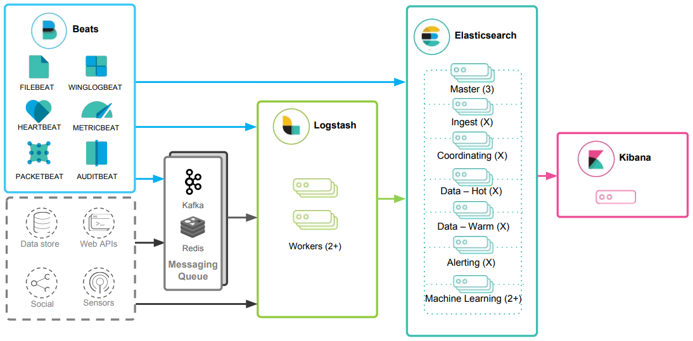
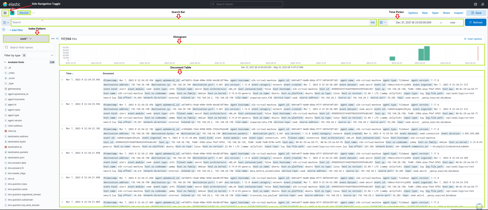
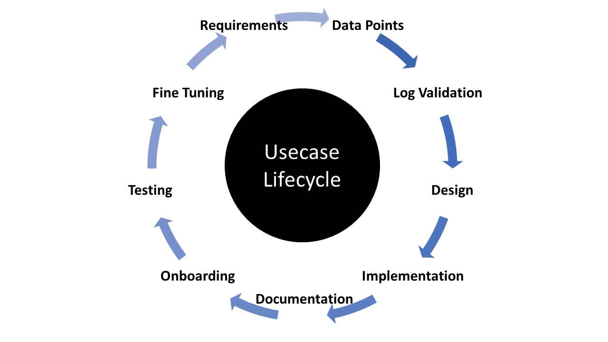

# SIEM Definition & Fundamentals

Security Information and Event Management (SIEM) encompasses the utilization of software offerings and solutions that merge the management of security data with the supervision of security events. 

SIEM tools possess an extensive range of core functionalities, such as the collection and administration of log events, the capacity to examine log events and supplementary data from various sources, as well as operational features like incident handling, visual summaries, and documentation.

SIEM systems generate a vast number of alerts owing to the substantial volume of events produced for each monitored platform. It is not unusual for an hourly log of events to range from hundreds to thousands. As a result, fine-tuning the SIEM for detecting and alerting on high-risk events is crucial.

### SIEM Business Requirements & Use Cases

#### Log Aggregation & normalization

Log consolidation entails gathering terabytes of security information from vital firewalls, confidential databases, and essential applications.

By centralizing and correlating information from various sources, SIEM delivers a holistic strategy for threat detection and handling.

#### Threat Alerting

Advanced analytics and threat intelligence are employed by SIEM solutions to recognize potential threats and generate real-time alerts. When a threat is detected, the system forwards alerts to the IT security team, equipping them with the necessary details to effectively investigate and mitigate the risk. 

#### Contextualization & Response

It is important to understand that merely generating alerts is not enough. If a SIEM solution sends alerts for every possible security event, the IT security team will soon be overwhelmed by the sheer volume of alerts, and false positives may become a frequent issue, particularly in older solutions.

#### Compliance

SIEM solutions play a significant role in compliance by assisting organizations in meeting regulatory requirements through a comprehensive approach to threat detection and management.

Regulations like PCI DSS, HIPAA, and GDPR mandate organizations to implement robust security measures, including real-time monitoring and analysis of network traffic. SIEM solutions can help organizations fulfill these requirements, enabling SOC teams to detect and respond to security incidents promptly.

Automated reporting and auditing capabilities are also provided by SIEM solutions, which are essential for compliance. These features allow organizations to produce compliance reports swiftly and accurately, ensuring that they satisfy regulatory requirements and can demonstrate compliance to auditors and regulators.

### SIEM benefits as a solution

In the absence of a SIEM, IT personnel would not have a centralized perspective on all logs and events, which could result in overlooking crucial events and accumulating a large number of events awaiting investigation. Conversely, a properly calibrated SIEM bolsters the incident response process, improving efficiency and offering a centralized dashboard for notifications based on predetermined categories and event thresholds.

For instance, if a firewall records five successive incorrect login attempts, resulting in the admin account being locked, a centralized logging system that correlates all logs is necessary for monitoring the situation. Similarly, a web filtering software that logs a computer connecting to a malicious website 100 times in an hour can be viewed and acted upon within a single interface using a SIEM.

## Eastic Stack Introduction

`Elasticsearch` is a distributed and JSON-based search engine, designed with RESTful APIs. As the core component of the Elastic stack, it handles indexing, storing, and querying. Elasticsearch empowers users to conduct sophisticated queries and perform analytics operations on the log file records processed by Logstash.

`Logstash` is responsible for collecting, transforming, and transporting log file records. Its strength lies in its ability to consolidate data from various sources and normalize them. It can [Process Inputs](https://www.elastic.co/guide/en/logstash/current/input-plugins.html), [modify a log record's format and content](https://www.elastic.co/guide/en/logstash/current/filter-plugins.html), [send logs to Elasticsearch](https://www.elastic.co/guide/en/logstash/current/output-plugins.html).

`Kibana` serves as the visualization tool for Elasticsearch documents. Users can view the data stored in Elasticsearch and execute queries through Kibana.

`Beats` is an additional component of the Elastic stack that simplifies collecting data from various sources.

### Elastic Stask as a SIEM solution

To implement the Elastic stack as a SIEM solution, security-related data from various sources such as firewalls, IDS/IPS, and endpoints should be ingested into the Elastic stack using Logstash. Elasticsearch should be configured to store and index the security data, and Kibana should be used to create custom dashboards and visualizations to provide insights into security-related events.

Kibana Query Language (KQL) is a powerful and user-friendly query language designed specifically for searching and analyzing data in Kibana.

`Basic structure`: field:value, eg. `event.code:4625` for [Windows event code 4625](https://www.ultimatewindowssecurity.com/securitylog/encyclopedia/event.aspx?eventid=4625) aka a failed login attempt on windows machine. Useful for brute force attacks, password guessing etc. ...

`Free Text Search`: search for a specific term across multiple fields, eg. `svc-sql1`.

`Logical Operators`: KQL supports logical operators AND, OR, NOT and parentheses, eg. `event.code:4625 AND winlog.event_data.SubStatus:0xC0000072` to fiter data for events that have the Windows event code 4625 (login failure) and the SubStatus vaue 0xC0000072 (reason for a login failure, 0xC0000072 indicates account is currently disabed). This would require further investigation.

`Comparison Operators`: :, :>, :>=, :<, :<=, and :! . Eg. `event.code:4625 AND winlog.event_data.SubStatus:0xC0000072 AND @timestamp >= "2023-03-03T00:00:00.000Z" AND @timestamp <= "2023-03-06T23:59:59.999Z"` aka identify failed login attempts against disabled accounts that took place between March 3rd 2023 and March 6th 2023.

`Wildcards and Regular Expressions`: eg. `event.code:4625 AND user.name: admin*` aka failed login attempt for usernames that start with admin.

### How to Identify the Available Data

Using the [Discover feature](https://www.elastic.co/guide/en/kibana/current/discover.html) we can explore and sift through the avaiable data, as well as gain insight into the architecture of the available fields, before we start constructing KQL queries.

Enter any fields like "4625", "0xC0000072"...

Good documentations on fields to search up:
- [Elastic Common Schema (ECS)](https://www.elastic.co/guide/en/ecs/current/ecs-reference.html)
- [Elastic Common Schema (ECS) event fields](https://www.elastic.co/guide/en/ecs/current/ecs-event.html)
- [Winlogbeat fields](https://www.elastic.co/guide/en/beats/winlogbeat/current/exported-fields-winlog.html)
- [Winlogbeat ECS fields](https://www.elastic.co/guide/en/beats/winlogbeat/current/exported-fields-ecs.html)
- [Winlogbeat security module fields](https://www.elastic.co/guide/en/beats/winlogbeat/current/exported-fields-security.html)
- [Filebeat fields](https://www.elastic.co/guide/en/beats/filebeat/current/exported-fields.html)
- [Filebeat ECS fields](https://www.elastic.co/guide/en/beats/filebeat/current/exported-fields-ecs.html)

## SOC Definition & Fundamentals

The SOC team usually consists of proficient security analysts, engineers, and managers overseeing security operations. They collaborate closely with organizational incident response teams to guarantee security concerns are promptly detected and resolved.

Various technology solutions, such as Security Information and Event Management (SIEM) systems, Intrusion Detection and Prevention Systems (IDS/IPS), and Endpoint Detection and Response (EDR) tools, are utilized by the SOC team to monitor and identify security threats. They also make use of threat intelligence and engage in threat hunting initiatives to proactively detect potential threats and vulnerabilities.

Besides employing technology solutions, the SOC team follows a series of well-defined processes for addressing security incidents. These processes encompass incident triage, containment, elimination, and recovery. The SOC team cooperates closely with the incident response team to ensure proper handling of security incidents, safeguarding the organization's security stance.

### Roles within a SOC

- `SOC Director`: Responsible for overall management and strategic planning of the SOC, including budgeting, staffing, and alignment with organizational security objectives.

- `SOC Manager`: Oversees day-to-day operations, manages the team, coordinates incident response efforts, and ensures smooth collaboration with other departments.

- `Tier 1 Analyst`: Also known as "first responders," these analysts monitor security events and alerts, perform initial triage, and escalate potential incidents to higher tiers for further investigation. Their main goal is to quickly identify and prioritize security incidents.

- `Tier 2 Analyst`: These analysts are more experienced and perform deeper analysis of escalated incidents. They identify patterns and trends, develop mitigation strategies, and sometimes assist in incident response efforts. They may also be responsible for tuning security monitoring tools to reduce false positives and improve detection capabilities.

- `Tier 3 Analyst`: Often considered the most experienced and knowledgeable analysts on the team, Tier 3 analysts handle the most complex and high-profile security incidents. They may also engage in proactive threat hunting, develop advanced detection and prevention strategies, and collaborate with other teams to improve the organization's overall security posture.

- `Detection Engineer`: A Detection Engineer is responsible for developing, implementing, and maintaining detection rules and signatures for security monitoring tools, such as SIEM, IDS/IPS, and EDR solutions. They work closely with security analysts to identify gaps in detection coverage and continuously improve the organization's ability to detect and respond to threats.

- `Incident Responder`: Takes charge of active security incidents, carries out in-depth digital forensics and containment and remediation efforts, and collaborates with other teams to restore affected systems and prevent future occurrences.

- `Threat Intelligence Analyst`: Gathers, analyzes, and disseminates threat intelligence data to help SOC team members better understand the threat landscape and proactively defend against emerging risks.

- `Security Engineer`: Develops, deploys, and maintains security tools, technologies, and infrastructure, and provides technical expertise to the SOC team.

- `Compliance and Governance Specialist`: Ensures that the organization's security practices and processes adhere to relevant industry standards, regulations, and best practices, and assists with audit and reporting requirements.

- `Security Awareness and Training Coordinator`: Develops and implements security training and awareness programs to educate employees about cybersecurity best practices and promote a culture of security within the organization.

### SOC History

Security Operations Centers (SOCs) have evolved significantly from their early days as Network Operation Centers focused primarily on network security. In the first generation, known as SOC 1.0, organizations invested in certain security layers such as security intelligence platforms or identity management systems. However, the lack of proper integration led to uncorrelated alerts and a buildup of tasks across multiple platforms. This stage was characterized by an emphasis on network and perimeter security, even as threats began exploiting other vectors. Surprisingly, some organizations continue to rely on this outdated approach, seemingly waiting for a major breach to occur.

The emergence of sophisticated threats, including multi-vector, persistent, and asynchronous attacks with concealed indicators of compromise, has spurred the transition to SOC 2.0. Malware, including mobile variants, and botnets serve as the primary delivery methods for these attacks. The longevity, evolving behavior, and growth of botnets over time have become focal points for threat intelligence. SOC 2.0 is built on intelligence, integrating security telemetry, threat intelligence, network flow analysis, and other anomaly detection techniques. Additionally, layer-7 analysis is employed at this stage to identify low and slow attacks and other hidden threats. A forward-looking approach to threat research and collaboration between SOCs, either within sectors or at the national level, is crucial for SOC 2.0's success. Emphasis is placed on complete situational awareness, pre-event preparedness through vulnerability management, configuration management, and dynamic risk management, as well as post-event analysis and learning through incident response and in-depth forensics. Refining security intelligence rules and deploying countermeasures are also vital in this stage.

The cognitive SOC, or next-generation SOC, seeks to address the remaining shortcomings of SOC 2.0. While SOC 2.0 has all the essential subsystems, it often lacks operational experience and effective collaboration between business and security teams to create rules that detect threats specific to business processes and systems. Moreover, many organizations still lack standardized incident response and recovery procedures.

Cognitive SOCs aim to resolve these issues by incorporating learning systems that compensate for experience gaps in security decision-making. While the success rate of this approach may not be perfect in every instance, it is expected to improve over time.

## MITRE ATT&CK & Security Operations

The [MITRE ATT&CK](https://attack.mitre.org/) (Adversarial Tactics, Techniques, and Common Knowledge) framework serves as an extensive, regularly updated resource outlining the tactics, techniques, and procedures (TTPs) employed by cyber threat actors. This structured methodology assists cybersecurity experts in comprehending, identifying, and reacting to threats more proactively and knowledgeably.

### Use Cases in Security Operations

- `Detection and Response`: The framework supports SOCs in devising detection and response plans based on recognized attacker TTPs, empowering security teams to pinpoint potential dangers and develop proactive countermeasures.

- `Security Evaluation and Gap Analysis`: Organizations can leverage the ATT&CK framework to identify the strengths and weaknesses of their security posture, subsequently prioritizing security control investments to effectively defend against relevant threats.

- `SOC Maturity Assessment`: The ATT&CK framework enables organizations to assess their Security Operations Center (SOC) maturity by measuring their ability to detect, respond to, and mitigate various TTPs. This assessment assists in identifying areas for improvement and prioritizing resources to strengthen the overall security posture.

- `Threat Intelligence`: The framework offers a unified language and format to describe adversarial actions, enabling organizations to bolster their threat intelligence and improve collaboration among internal teams or with external stakeholders.

- `Cyber Threat Intelligence Enrichment`: Leveraging the ATT&CK framework can help organizations enrich their cyber threat intelligence by providing context on attacker TTPs, as well as insights into potential targets and indicators of compromise (IOCs). This enrichment allows for more informed decision-making and effective threat mitigation strategies.

- `Behavioral Analytics Development`: By mapping the TTPs outlined in the ATT&CK framework to specific user and system behaviors, organizations can develop behavioral analytics models to identify anomalous activities indicative of potential threats. This approach enhances detection capabilities and helps security teams proactively mitigate risks.

- `Red Teaming and Penetration Testing`: The ATT&CK framework presents a systematic way to replicate genuine attacker techniques during red teaming exercises and penetration tests, ultimately assessing an organization's defensive capabilities.

- `Training and Education`: The comprehensive and well-organized nature of the ATT&CK framework makes it an exceptional resource for training and educating security professionals on the latest adversarial tactics and methods.

## SIEM Use Case

### Development cycle
 

1. `Requirements`: porpose and necessity or the use case
2. `Data Points`: Ensure logs capture essential details like user, timestamp, source, destination, etc.
3. `Log Validation`: Confirm all logs are received during various user authentication events for critical data points.
4. `Design and Implementation`: Begin designing the use case by defining the conditions under which an alert should be triggered. Consider three primary parameters: Condition, Aggregation, and Priority.
5. `Documentation`: Standard Operating Procedures (SOP) detail the standard processes analysts must follow when working on alerts. This includes conditions, aggregations, priorities, and information about other teams to which analysts need to report activities. The SOP also contains the escalation matrix.
6. `Onboarding`: Identify and address any gaps to reduce false positives, then proceed to production.
7. `Periodic Update/Fine-tuning`: Obtain regular feedback from analysts and maintain up-to-date correlation rules by whitelisting.

### How to build SIEM Use Cases

- Comprehend your needs, risks, and establish alerts for monitoring all necessary systems accordingly.

- Determine the priority and impact, then map the alert to the kill chain or MITRE framework.

- Establish the Time to Detection (TTD) and Time to Response (TTR) for the alert to assess the SIEM's effectiveness and analysts' performance.

- Create a Standard Operating Procedure (SOP) for managing alerts.

- Outline the process for refining alerts based on SIEM monitoring.

- Develop an Incident Response Plan (IRP) to address true positive incidents.

- Set Service Level Agreements (SLAs) and Operational Level Agreements (OLAs) between teams for handling alerts and following the IRP.

- Implement and maintain an audit process for managing alerts and incident reporting by analysts.

- Create documentation to review the logging status of machines or systems, the basis for creating alerts, and their triggering frequency.

- Establish a knowledge base document for essential information and updates to case management tools.

### Example Use Case

Say we want to add an alert for an [attack on MSBuild](https://blog.talosintelligence.com/building-bypass-with-msbuild/). Attacked exploit it's ability to include malicious code qithint its configuration or project file. Programs like Excel, Microsoft Office or a web browser executables initiating MSBuild should be flagged. This technique, [Living-off-the-land binaries](https://www.cynet.com/attack-techniques-hands-on/what-are-lolbins-and-how-do-attackers-use-them-in-fileless-attacks), poses a significant threat and should be assigned a HIGH severity, though it might depend on your organization's specific context and landscape.

Regarding MITRE mapping, this use case involves bypassing detection techniques via LoLBins usage, falling under the Defense Evasion ([TA0005](https://attack.mitre.org/tactics/TA0005/)) tactic, the Trusted Developer Utilities Proxy Execution ([T1127](https://attack.mitre.org/techniques/T1127/)) technique, and the Trusted Developer Utilities Proxy Execution: MSBuild ([T1127.001](https://attack.mitre.org/techniques/T1127/001/)) sub-technique. Additionally, executing the MSBuild binary on the endpoint also falls under the Execution ([TA0002](https://attack.mitre.org/tactics/TA0002)) tactic.

To define TTD and TTR, we need to focus on the rule's execution interval and the data ingestion pipeline discussed earlier. For this example, we set the rule to run every five minutes, monitoring all incoming logs.

When creating an SOP and documenting alert handling, consider the following:

- process.name
- process.parent.name
- event.action
- machine where the alert was detected
- user associated with the machine
- user activity within +/- 2 days of the alert's generation
- After gathering this information, defenders should engage with the user and examine the user's machine to analyze system logs, antivirus logs, and proxy logs from the SIEM for full visibility.

The SOC team should document all the above points, along with the Incident Response Plan, so that Incident Handlers can reference them during analysis.

For rule fine-tuning, it is essential to understand the conditions that may trigger false positives. For example, while the Build Engine is common among Windows developers, its use by non-engineers is unusual. Excluding legitimate parent process names from the rule helps avoid false positives. Further details on fine-tuning SIEM rules will be given later on.