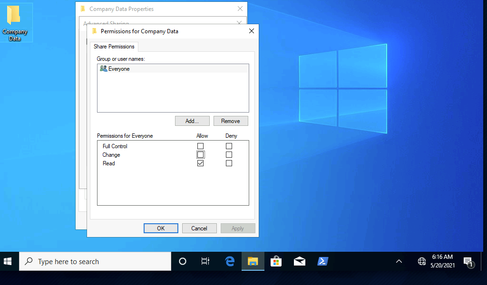

# Windows Basics

## Check versions and machine info

```powershell
PS C:\htb> Get-WmiObject -Class win32_OperatingSystem | select Version,BuildNumber

Version    BuildNumber
-------    -----------
10.0.19041 19041
```

can also select `Win32_Process` (process listing), `Win32_Service` (listing of services), and `Win32_Bios` (BIOS info).

## Accessing Windows

Windows is based on the idea of people coming to work on a specific computer and only there. 

Among the many ways of remote access technologies:

- Virtual Private Networks (VPN)
- Secure Shell (SSH)
- File Transfer Protocol (FTP)
- Virtual Network Computing (VNC)
- Windows Remote Management (or PowerShell Remoting) (WinRM)
- Remote Desktop Protocol (RDP)

Windows primarly uses RDP (port 3389).

By default it is disabled and will encourage users to only allow it on a local trusted network. Administrators and anyone with a username:password may access an RDP port.

Accessing from linux:
```bash
$> xfreerdp /v:<targetIp> /u:Username /p:Password
```

## Operating System Structure

- `Perflogs` &rarr; Can hold Windows performance logs but is empty by default.
- `Program` Files &rarr; On 32-bit systems, all 16-bit and 32-bit programs are installed here. On 64-bit systems, only 64-bit programs are installed here.
- `Program` Files (x86) &rarr; 32-bit and 16-bit programs are installed here on 64-bit editions of Windows.
- `ProgramData` &rarr; This is a hidden folder that contains data that is essential for certain installed programs to run. This data is accessible by the program no matter what user is running it.
- `Users` &rarr; This folder contains user profiles for each user that logs onto the system and contains the two folders Public and Default.
- `Default` &rarr; This is the default user profile template for all created users. Whenever a new user is added to the system, their profile is based on the Default profile.
- `Public` &rarr; This folder is intended for computer users to share files and is accessible to all users by default. This folder is shared over the network by default but requires a valid network account to access.
- `AppData` &rarr; Per user application data and settings are stored in a hidden user subfolder (i.e., cliff.moore\AppData). Each of these folders contains three subfolders. The Roaming folder contains machine-independent data that should follow the user's profile, such as custom dictionaries. The Local folder is specific to the computer itself and is never synchronized across the network. LocalLow is similar to the Local folder, but it has a lower data integrity level. Therefore it can be used, for example, by a web browser set to protected or safe mode.
- `Windows` &rarr; The majority of the files required for the Windows operating system are contained here.
- `System`, `System32`, `SysWOW64` &rarr; Contains all DLLs required for the core features of Windows and the Windows API. The operating system searches these folders any time a program asks to load a DLL without specifying an absolute path.
- `WinSxS` &rarr; The Windows Component Store contains a copy of all Windows components, updates, and service packs.

### commands

- [`dir [folder]`](https://learn.microsoft.com/en-us/windows-server/administration/windows-commands/dir) ~> `ls` on linux
- [`tree <folder>`](https://learn.microsoft.com/en-us/windows-server/administration/windows-commands/tree) &rarr; same as linux

## File System

Most commonly used are `FAT32`, `exFAT` and `NTFS`.

`FAT32` (File Allocation Table) is mostly used for it's wide compatibility (even MacOS and Linux), but it's very limited size (4Gb) and requirements of third party file encryption makes it less popular.

`NTFS` (New Technology File System) is default since Windows NT 3.1 (1993). It has finer permission controle, more size and built-in logging (!). Most mobile devices and older devices do not support it natively.

We will focus on `NTFS`.

### NTFS permissions

- `Full Control` &rarr; Allows reading, writing, changing, deleting of files/folders.
- `Modify` &rarr; Allows reading, writing, and deleting of files/folders.
- `List Folder Contents` &rarr; Allows for viewing and listing folders and subfolders as well as executing files. Folders only inherit this permission.
- `Read` and Execute &rarr; Allows for viewing and listing files and subfolders as well as executing files. Files and folders inherit this permission.
- `Write` &rarr; Allows for adding files to folders and subfolders and writing to a file.
- `Read` &rarr; Allows for viewing and listing of folders and subfolders and viewing a file's contents.
- `Traverse Folder` &rarr; This allows or denies the ability to move through folders to reach other files or folders. For example, a user may not have permission to list the directory contents or view files in the documents or web apps directory in this example c:\users\bsmith\documents\webapps\backups\backup_02042020.zip but with Traverse Folder permissions applied, they can access the backup archive.

we can use [`icalcs`](https://ss64.com/nt/icacls.html) to view permissions for each group/user:
```
C:\htb> icacls c:\Users
c:\Users NT AUTHORITY\SYSTEM:(OI)(CI)(F)
         BUILTIN\Administrators:(OI)(CI)(F)
         BUILTIN\Users:(RX)
         BUILTIN\Users:(OI)(CI)(IO)(GR,GE)
         Everyone:(RX)
         Everyone:(OI)(CI)(IO)(GR,GE)

Successfully processed 1 files; Failed processing 0 files
```

Inheritance settings:
- (CI): container inherit
- (OI): object inherit
- (IO): inherit only
- (NP): do not propagate inherit
- (I): permission inherited from parent container

Permissions:

- F : full access
- D :  delete access
- N :  no access
- M :  modify access
- RX :  read and execute access
- R :  read-only access
- W :  write-only access

addiional, grant full controle to user joe with:
`icacls c:\users /grant joe:f`

## Share permissions vs NTFS permission

Share permissions involve Full Controle, Change, and Read permissions for `sharing` files of a network, such a with `SMB`. 

NTFS permissions involve more granular permissions, and also add a layer of NTS special permissions.

note: `RDP` connection will only invoke `NTFS` permissions.

Configure folder Share Permissions:



The `ACL` (Access Control List) is similar to `NTFS`. Admins use the `ACL`'s `ACEs` (Access Controle Entries) seen above to comfigure `users` and `groups` (aka security principals) to manage and track access to shared ressources.

we can list the available shares via SMB:
```
$ smbclient -L SERVER_IP -U htb-student
Enter WORKGROUP\htb-student's password: 

	Sharename       Type      Comment
	---------       ----      -------
	ADMIN$          Disk      Remote Admin
	C$              Disk      Default share
	Company Data    Disk      
	IPC$            IPC       Remote IPC
```

and connect directly to the available share with:
```
$ smbclient '\\SERVER_IP\Company Data' -U htb-student
Password for [WORKGROUP\htb-student]:
Try "help" to get a list of possible commands.

smb: \> 
```

Here's what could block us from doing that:

## Windows Defender Firewall

the freiwall may block linux-based connections as we are not in the same `workgroup`. if a Windows system is part of a `workgroup`, all `netlogon` requests are authenticated against the system's `SAM` database. 

Systems can also be part of a `Windows Domain`, in which case they use `Active Directory` to process authentification requests.

A workgroup in a `SAM` is hosted **locally**, while a `Windows Domain` involves a centralized network-based database (`Active Directory`).

In a `SAM` setup, the workgroups are seperate from the firewall, and though the firewall may request users or workgroups from the `SAM` they are independant. In a `Windows Domain` setting these can be joined and configured in a `Group Policy`. Additionally to either of these modules NTFS have it's own Permissions ACL (Access Control List) configuration (By default inherited from parent directory, most spear-phishing attacks are directed towards system administrators for this reason).

---
---

# Only sctrict necessary from this point on

mount to SMB Share:
```bash
jucapik42@htb[/htb]$ sudo mount -t cifs -o username=htb-student,password=Academy_WinFun! //ipaddoftarget/"Company Data" /home/user/Desktop/
```

makes:
```
net share

Share name   Resource                        Remark

-------------------------------------------------------------------------------
C$           C:\                             Default share
IPC$                                         Remote IPC
ADMIN$       C:\WINDOWS                      Remote Admin
Company Data C:\Users\htb-student\Desktop\Company Data

The command completed successfully.
```

View Share accces logs in `Event Viewer`.

---

Query `Service Control Manager` system:
```PowerShell
PS C:\htb> Get-Service | ? {$_.Status -eq "Running"} | select -First 2 |fl


Name                : AdobeARMservice
DisplayName         : Adobe Acrobat Update Service
Status              : Running
DependentServices   : {}
ServicesDependedOn  : {}
CanPauseAndContinue : False
CanShutdown         : False
CanStop             : True
ServiceType         : Win32OwnProcess

Name                : Appinfo
DisplayName         : Application Information
Status              : Running
DependentServices   : {}
ServicesDependedOn  : {RpcSs, ProfSvc}
CanPauseAndContinue : False
CanShutdown         : False
CanStop             : True
ServiceType         : Win32OwnProcess, Win32ShareProcess
```

[Windows components list](https://en.wikipedia.org/wiki/List_of_Microsoft_Windows_components#Services)

---

examine service with:
```
C:\Users\htb-student>sc qc wuauserv
[SC] QueryServiceConfig SUCCESS

SERVICE_NAME: wuauserv
        TYPE               : 20  WIN32_SHARE_PROCESS
        START_TYPE         : 3   DEMAND_START
        ERROR_CONTROL      : 1   NORMAL
        BINARY_PATH_NAME   : C:\WINDOWS\system32\svchost.exe -k netsvcs -p
        LOAD_ORDER_GROUP   :
        TAG                : 0
        DISPLAY_NAME       : Windows Update
        DEPENDENCIES       : rpcss
        SERVICE_START_NAME : LocalSystem
```

query from a box:
```
C:\Users\htb-student>sc //hostname or ip of box query ServiceName
```

Can also be used to stop/start services with `sc stop servicename`.
If unsufficient priviledges can run:
```
C:\WINDOWS\system32> sc config wuauserv binPath=C:\Winbows\Perfectlylegitprogram.exe

[SC] ChangeServiceConfig SUCCESS

C:\WINDOWS\system32> sc qc wuauserv

[SC] QueryServiceConfig SUCCESS

SERVICE_NAME: wuauserv
        TYPE               : 20  WIN32_SHARE_PROCESS
        START_TYPE         : 3   DEMAND_START
        ERROR_CONTROL      : 1   NORMAL
        BINARY_PATH_NAME   : C:\Winbows\Perfectlylegitprogram.exe
        LOAD_ORDER_GROUP   :
        TAG                : 0
        DISPLAY_NAME       : Windows Update
        DEPENDENCIES       : rpcss
        SERVICE_START_NAME : LocalSystem
```


get gibberish permissions info with:
```
C:\WINDOWS\system32> sc sdshow wuauserv

D:(A;;CCLCSWRPLORC;;;AU)(A;;CCDCLCSWRPWPDTLOCRSDRCWDWO;;;BA)(A;;CCDCLCSWRPWPDTLOCRSDRCWDWO;;;SY)S:(AU;FA;CCDCLCSWRPWPDTLOSDRCWDWO;;;WD)
```

Ref for string `D: (A;;CCLCSWRPLORC;;;AU)`:

    D: - the proceeding characters are DACL permissions
    AU: - defines the security principal Authenticated Users
    A;; - access is allowed
    CC - SERVICE_QUERY_CONFIG is the full name, and it is a query to the service control manager (SCM) for the service configuration
    LC - SERVICE_QUERY_STATUS is the full name, and it is a query to the service control manager (SCM) for the current status of the service
    SW - SERVICE_ENUMERATE_DEPENDENTS is the full name, and it will enumerate a list of dependent services
    RP - SERVICE_START is the full name, and it will start the service
    LO - SERVICE_INTERROGATE is the full name, and it will query the service for its current status
    RC - READ_CONTROL is the full name, and it will query the security descriptor of the service

Get full permission info with:
```
PS C:\Users\htb-student> Get-ACL -Path HKLM:\System\CurrentControlSet\Services\wuauserv | Format-List

Path   : Microsoft.PowerShell.Core\Registry::HKEY_LOCAL_MACHINE\System\CurrentControlSet\Services\wuauserv
Owner  : NT AUTHORITY\SYSTEM
Group  : NT AUTHORITY\SYSTEM
Access : BUILTIN\Users Allow  ReadKey
         BUILTIN\Users Allow  -2147483648
         BUILTIN\Administrators Allow  FullControl
         BUILTIN\Administrators Allow  268435456
         NT AUTHORITY\SYSTEM Allow  FullControl
         NT AUTHORITY\SYSTEM Allow  268435456
         CREATOR OWNER Allow  268435456
         APPLICATION PACKAGE AUTHORITY\ALL APPLICATION PACKAGES Allow  ReadKey
         APPLICATION PACKAGE AUTHORITY\ALL APPLICATION PACKAGES Allow  -2147483648
         S-1-15-3-1024-1065365936-1281604716-3511738428-1654721687-432734479-3232135806-4053264122-3456934681 Allow
         ReadKey
         S-1-15-3-1024-1065365936-1281604716-3511738428-1654721687-432734479-3232135806-4053264122-3456934681 Allow
         -2147483648
Audit  :
Sddl   : O:SYG:SYD:AI(A;ID;KR;;;BU)(A;CIIOID;GR;;;BU)(A;ID;KA;;;BA)(A;CIIOID;GA;;;BA)(A;ID;KA;;;SY)(A;CIIOID;GA;;;SY)(A
         ;CIIOID;GA;;;CO)(A;ID;KR;;;AC)(A;CIIOID;GR;;;AC)(A;ID;KR;;;S-1-15-3-1024-1065365936-1281604716-3511738428-1654
         721687-432734479-3232135806-4053264122-3456934681)(A;CIIOID;GR;;;S-1-15-3-1024-1065365936-1281604716-351173842
         8-1654721687-432734479-3232135806-4053264122-3456934681)
```

---

Non-interactive accounts:

- Local System Account &rarr; Also known as the NT AUTHORITY\SYSTEM account, this is the most powerful account in Windows systems. It is used for a variety of OS-related tasks, such as starting Windows services. This account is more powerful than accounts in the local administrators group.
- Local Service Account &rarr; Known as the NT AUTHORITY\LocalService account, this is a less privileged version of the SYSTEM account and has similar privileges to a local user account. It is granted limited functionality and can start some services.
- Network Service Account &rarr; This is known as the NT AUTHORITY\NetworkService account and is similar to a standard domain user account. It has similar privileges to the Local Service Account on the local machine. It can establish authenticated sessions for certain network services.

---

for cmd terminal:

`help`

`help commandname`

`command /?`

for PowerShell:

`get-alias` for cmdlets

`help`

`Get-Help command`

import script command with `Import-Module .\PowerView.ps1` for example

`Get-ExecutionPolicy -List`

Almost anyone can change their execution policy with `Set-ExecutionPolicy Bypass -Scope Process` for example or running a script in the shell. Execution Policy is not a strong protection.

execution policy possibilities:

- AllSigned &rarr; All scripts can run, but a trusted publisher must sign scripts and configuration files. This includes both remote and local scripts. We receive a prompt before running scripts signed by publishers that we have not yet listed as either trusted or untrusted.
- Bypass &rarr; No scripts or configuration files are blocked, and the user receives no warnings or prompts.
- Default &rarr; This sets the default execution policy, Restricted for Windows desktop machines and RemoteSigned for Windows servers.
- RemoteSigned &rarr; Scripts can run but requires a digital signature on scripts that are downloaded from the internet. Digital signatures are not required for scripts that are written locally.
- Restricted &rarr; This allows individual commands but does not allow scripts to be run. All script file types, including configuration files (.ps1xml), module script files (.psm1), and PowerShell profiles (.ps1) are blocked.
- Undefined &rarr; No execution policy is set for the current scope. If the execution policy for ALL scopes is set to undefined, then the default execution policy of Restricted will be used.
- Unrestricted &rarr; This is the default execution policy for non-Windows computers, and it cannot be changed. This policy allows for unsigned scripts to be run but warns the user before running scripts that are not from the local intranet zone.

---