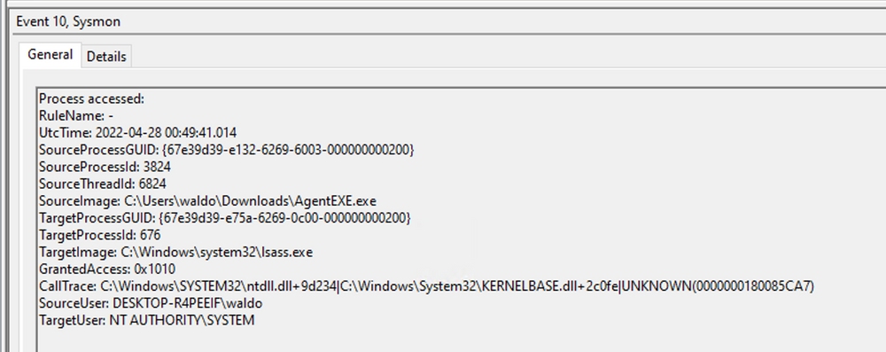
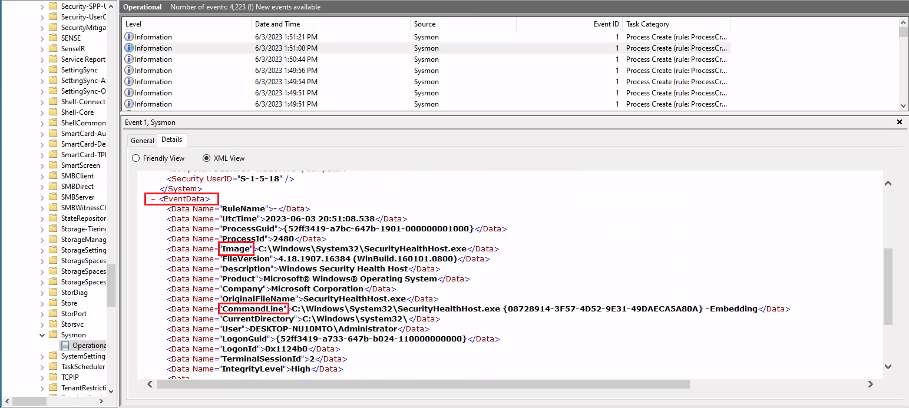
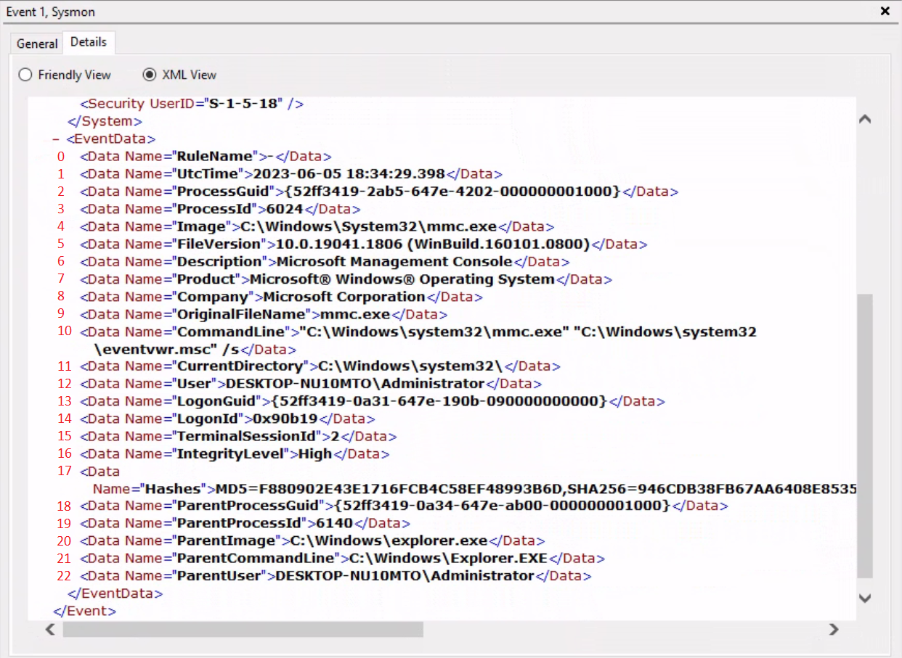

# Windows Event Logs & Finding Evil

## Windows Event Logs

Windows event logging offers comprehensive logging capabilities for application errors, security events, and diagnostic information. As cybersecurity professionals, we leverage these logs extensively for analysis and intrusion detection.

The logs are categorized into different event logs, such as "Application", "System", "Security", and others, to organize events based on their source or purpose.

Event logs can be accessed using the `Event Viewer` application or programmatically using APIs such as the Windows Event Log API.

The default Windows event logs consist of `Application`, `Security`, `Setup`, `System`, and `Forwarded Events`. While the first four logs cover application errors, security events, system setup activities, and general system information, the `Forwarded Events` section is unique, showcasing event log data forwarded from other machines.

It should be noted, that the Windows Event Viewer has the ability to open and display previously saved `.evtx` files, which can be then found in the `Saved Logs` section.

### The Anatomy of an Event Log

Each entry in the Windows Event Log is an "Event" and contains the following primary components:

- `Log Name`: The name of the event log (e.g., Application, System, Security, etc.).
- `Source`: The software that logged the event.
- `Event ID`: A unique identifier for the event.
- `Task Category`: This often contains a value or name that can help us understand the purpose or use of the event.
- `Level`: The severity of the event (Information, Warning, Error, Critical, and Verbose).
- `Keywords`: Keywords are flags that allow us to categorize events in ways beyond the other classification options. These are generally broad categories, such as "Audit Success" or "Audit Failure" in the Security log.
- `User`: The user account that was logged on when the event occurred.
- `OpCode`: This field can identify the specific operation that the event reports.
- `Logged`: The date and time when the event was logged.
- `Computer`: The name of the computer where the event occurred.
- `XML Data`: All the above information is also included in an XML format along with additional event data.

### Leveraging Custom XML Queries

To streamline our analysis, we can create custom XML queries to identify related events using the "Logon ID" as a starting point. By navigating to "Filter Current Log" -> "XML" -> "Edit Query Manually," we gain access to a custom XML query language that enables more granular log searches.

We can for example follow a event 4624 (ssh user successfully connected) with the feild "SubjectLogonId" say fr a value "0x3E7". we can do this with the query:

```
<QueryList>
    <Query id="0" Path="Security">
        <Select Path="Security">*[EventData[Data[@Name='SubjectLogonId']='0x3E7']]
        </Select>
    </Query>
</QueryList>
```

For further guidance, Microsoft offers informative articles on [advanced XML filtering in the Windows Event Viewer](https://techcommunity.microsoft.com/t5/ask-the-directory-services-team/advanced-xml-filtering-in-the-windows-event-viewer/ba-p/399761).

### Non-exhaustive list of Useful Windows Event Logs

1. Windows System Logs

    - [Event ID 1074](https://serverfault.com/questions/885601/windows-event-codes-for-startup-shutdown-lock-unlock) `(System Shutdown/Restart)`: This event log indicates when and why the system was shut down or restarted. By monitoring these events, you can determine if there are unexpected shutdowns or restarts, potentially revealing malicious activity such as malware infection or unauthorized user access.
    - [Event ID 6005](https://superuser.com/questions/1137371/how-to-find-out-if-windows-was-running-at-a-given-time) `(The Event log service was started)`: This event log marks the time when the Event Log Service was started. This is an important record, as it can signify a system boot-up, providing a starting point for investigating system performance or potential security incidents around that period. It can also be used to detect unauthorized system reboots.
    - [Event ID 6006](https://learn.microsoft.com/en-us/answers/questions/235563/server-issue) `(The Event log service was stopped)`: This event log signifies the moment when the Event Log Service was stopped. It is typically seen when the system is shutting down. Abnormal or unexpected occurrences of this event could point to intentional service disruption for covering illicit activities.
    - [Event ID 6013](https://serverfault.com/questions/885601/windows-event-codes-for-startup-shutdown-lock-unlock) `(Windows uptime)`: This event occurs once a day and shows the uptime of the system in seconds. A shorter than expected uptime could mean the system has been rebooted, which could signify a potential intrusion or unauthorized activities on the system.
    - [Event ID 7040](https://www.slideshare.net/Hackerhurricane/finding-attacks-with-these-6-events) `(Service status change)`: This event indicates a change in service startup type, which could be from manual to automatic or vice versa. If a crucial service's startup type is changed, it could be a sign of system tampering.

2. Windows Security Logs


    - [Event ID 1102](https://www.ultimatewindowssecurity.com/securitylog/encyclopedia/event.aspx?eventid=1102) `(The audit log was cleared)`: Clearing the audit log is often a sign of an attempt to remove evidence of an intrusion or malicious activity.
    - [Event ID 1116](https://learn.microsoft.com/en-us/microsoft-365/security/defender-endpoint/troubleshoot-microsoft-defender-antivirus?view=o365-worldwide) `(Antivirus malware detection)`: This event is particularly important because it logs when Defender detects a malware. A surge in these events could indicate a targeted attack or widespread malware infection.
    - [Event ID 1118](https://learn.microsoft.com/en-us/microsoft-365/security/defender-endpoint/troubleshoot-microsoft-defender-antivirus?view=o365-worldwide) `(Antivirus remediation activity has started)`: This event signifies that Defender has begun the process of removing or quarantining detected malware. It's important to monitor these events to ensure that remediation activities are successful.
    - [Event ID 1119](https://learn.microsoft.com/en-us/microsoft-365/security/defender-endpoint/troubleshoot-microsoft-defender-antivirus?view=o365-worldwide) `(Antivirus remediation activity has succeeded)`: This event signifies that the remediation process for detected malware has been successful. Regular monitoring of these events will help ensure that identified threats are effectively neutralized.
    - [Event ID 1120](https://learn.microsoft.com/en-us/microsoft-365/security/defender-endpoint/troubleshoot-microsoft-defender-antivirus?view=o365-worldwide) `(Antivirus remediation activity has failed)`: This event is the counterpart to 1119 and indicates that the remediation process has failed. These events should be closely monitored and addressed immediately to ensure threats are effectively neutralized.
    - [Event ID 4624](https://www.ultimatewindowssecurity.com/securitylog/encyclopedia/event.aspx?eventid=4624) `(Successful Logon)`: This event records successful logon events. This information is vital for establishing normal user behavior. Abnormal behavior, such as logon attempts at odd hours or from different locations, could signify a potential security threat.
    - [Event ID 4625](https://www.ultimatewindowssecurity.com/securitylog/encyclopedia/event.aspx?eventid=4625) `(Failed Logon)`: This event logs failed logon attempts. Multiple failed logon attempts could signify a brute-force attack in progress.
    - [Event ID 4648](https://www.ultimatewindowssecurity.com/securitylog/encyclopedia/event.aspx?eventid=4648) `(A logon was attempted using explicit credentials)`: This event is triggered when a user logs on with explicit credentials to run a program. Anomalies in these logon events could indicate lateral movement within a network, which is a common technique used by attackers.
    - [Event ID 4656](https://www.ultimatewindowssecurity.com/securitylog/encyclopedia/event.aspx?eventid=4656) `(A handle to an object was requested)`: This event is triggered when a handle to an object (like a file, registry key, or process) is requested. This can be a useful event for detecting attempts to access sensitive resources.
    - [Event ID 4672](https://www.ultimatewindowssecurity.com/securitylog/encyclopedia/event.aspx?eventid=4672) `(Special Privileges Assigned to a New Logon)`: This event is logged whenever an account logs on with super user privileges. Tracking these events helps to ensure that super user privileges are not being abused or used maliciously.
    - [Event ID 4698](https://www.ultimatewindowssecurity.com/securitylog/encyclopedia/event.aspx?eventid=4698) `(A scheduled task was created)`: This event is triggered when a scheduled task is created. Monitoring this event can help you detect persistence mechanisms, as attackers often use scheduled tasks to maintain access and run malicious code.
    - [Event ID 4700](https://www.ultimatewindowssecurity.com/securitylog/encyclopedia/event.aspx?eventid=4700) & [Event ID 4701](https://www.ultimatewindowssecurity.com/securitylog/encyclopedia/event.aspx?eventid=4701) `(A scheduled task was enabled/disabled)`: This records the enabling or disabling of a scheduled task. Scheduled tasks are often manipulated by attackers for persistence or to run malicious code, thus these logs can provide valuable insight into suspicious activities.
    - [Event ID 4702](https://www.ultimatewindowssecurity.com/securitylog/encyclopedia/event.aspx?eventid=4702) `(A scheduled task was updated)`: Similar to 4698, this event is triggered when a scheduled task is updated. Monitoring these updates can help detect changes that may signify malicious intent.
    - [Event ID 4719](https://www.ultimatewindowssecurity.com/securitylog/encyclopedia/event.aspx?eventid=4719) `(System audit policy was changed)`: This event records changes to the audit policy on a computer. It could be a sign that someone is trying to cover their tracks by turning off auditing or changing what events get audited.
    - [Event ID 4738](https://www.ultimatewindowssecurity.com/securitylog/encyclopedia/event.aspx?eventid=4738) `(A user account was changed)`: This event records any changes made to user accounts, including changes to privileges, group memberships, and account settings. Unexpected account changes can be a sign of account takeover or insider threats.
    - [Event ID 4771](https://www.ultimatewindowssecurity.com/securitylog/encyclopedia/event.aspx?eventid=4771) `(Kerberos pre-authentication failed)`: This event is similar to 4625 (failed logon) but specifically for Kerberos authentication. An unusual amount of these logs could indicate an attacker attempting to brute force your Kerberos service.
    - [Event ID 4776](https://www.ultimatewindowssecurity.com/securitylog/encyclopedia/event.aspx?eventid=4776) `(The domain controller attempted to validate the credentials for an account)`: This event helps track both successful and failed attempts at credential validation by the domain controller. Multiple failures could suggest a brute-force attack.
    - [Event ID 5001](https://learn.microsoft.com/en-us/microsoft-365/security/defender-endpoint/troubleshoot-microsoft-defender-antivirus?view=o365-worldwide) `(Antivirus real-time protection configuration has changed)`: This event indicates that the real-time protection settings of Defender have been modified. Unauthorized changes could indicate an attempt to disable or undermine the functionality of Defender.
    - [Event ID 5140](https://www.ultimatewindowssecurity.com/securitylog/encyclopedia/event.aspx?eventid=5140) `(A network share object was accessed)`: This event is logged whenever a network share is accessed. This can be critical in identifying unauthorized access to network shares.
    - [Event ID 5142](https://www.ultimatewindowssecurity.com/securitylog/encyclopedia/event.aspx?eventid=5142) `(A network share object was added)`: This event signifies the creation of a new network share. Unauthorized network shares could be used to exfiltrate data or spread malware across a network.
    - [Event ID 5145](https://www.ultimatewindowssecurity.com/securitylog/encyclopedia/event.aspx?eventid=5145) `(A network share object was checked to see whether client can be granted desired access)`: This event indicates that someone attempted to access a network share. Frequent checks of this sort might indicate a user or a malware trying to map out the network shares for future exploits.
    - [Event ID 5157](https://www.ultimatewindowssecurity.com/securitylog/encyclopedia/event.aspx?eventid=5157) `(The Windows Filtering Platform has blocked a connection)`: This is logged when the Windows Filtering Platform blocks a connection attempt. This can be helpful for identifying malicious traffic on your network.
    - [Event ID 7045](https://www.ultimatewindowssecurity.com/securitylog/encyclopedia/event.aspx?eventid=7045) `(A service was installed in the system)`: A sudden appearance of unknown services might suggest malware installation, as many types of malware install themselves as services.


## Analyzing Evil With Sysmon & Event Logs

### Sysmon Basics

System Monitor (Sysmon) is a Windows system service and device driver that remains resident across system reboots to monitor and log system activity to the Windows event log. Sysmon provides detailed information about process creation, network connections, changes to file creation time, and more.

Sysmon's unique capability lies in its ability to log information that typically doesn't appear in the Security Event logs, and this makes it a powerful tool for deep system monitoring and cybersecurity forensic analysis.

Sysmon categorizes different types of system activity using event IDs, where each ID corresponds to a specific type of event. For example, Event ID 1 corresponds to "Process Creation" events, and Event ID 3 refers to "Network Connection" events. The full list of Sysmon event IDs can be found [here](https://learn.microsoft.com/en-us/sysinternals/downloads/sysmon).

Example sysmon configs:
- [https://github.com/SwiftOnSecurity/sysmon-config](https://github.com/SwiftOnSecurity/sysmon-config)
- [https://github.com/olafhartong/sysmon-modular](https://github.com/olafhartong/sysmon-modular)

Download Sysmon from official documentation:
[https://docs.microsoft.com/en-us/sysinternals/downloads/sysmon](https://docs.microsoft.com/en-us/sysinternals/downloads/sysmon)

### Detection Example 1: Detecting DLL Hijacking

We're going to study dll hacking based on [this link](https://www.wietzebeukema.nl/blog/hijacking-dlls-in-windows). 
For our case we're going to turn on `Event ID 7: Image loaded` to check all dlls loaded. (cf [Sysmon Doc](https://learn.microsoft.com/en-us/sysinternals/downloads/sysmon))
``` xml
<!--- ... rule 7 ... --->
<RuleGroup name="" groupRelation="or">
    <ImageLoad onmatch="include">
        <!--- ... --->
    </ImageLoad>
</RuleGroup>
```
To:
``` xml
<!--- ... rule 7 ... --->
<RuleGroup name="" groupRelation="or">
    <ImageLoad onmatch="exclude">
        <!--- ... --->
    </ImageLoad>
</RuleGroup>
```

Turn on sysmon with:
``` Powershell
sysmon.exe -i -accepteula -h md5,sha256,imphash -l -n
```

Add config file:
``` Powershell
sysmon.exe -c filename.xml
```

To view the syslog events, navigate to the Event Viewer and access "Applications and Services" -> "Microsoft" -> "Windows" -> "Sysmon."

Next we follow the dll hacking tutorial and copy Stephen Fewer's "hello world" [reflective DLL](https://github.com/stephenfewer/ReflectiveDLLInjection/tree/master/bin), rename `reflective_dll.x64.dll` to `WININET.dll` and move `calc.exe` to the same directory. Now when we start `calc.exe` we have a [MessageBox](https://learn.microsoft.com/en-us/windows/win32/api/winuser/nf-winuser-messageboxa) with the text `"Welcome from DLLMain!"`.

We can then find this in the event logs by focusing on `Event ID 7` with the `Filter Current Log..` option. The output from Sysmon gives us multiple valuabe insights.

In this case here are the IOCs:

- "calc.exe", originally located in System32, should not be found in a writable directory. Therefore, a copy of "calc.exe" in a writable directory serves as an IOC, as it should always reside in System32 or potentially Syswow64.

- "WININET.dll", originally located in System32, should not be loaded outside of System32 by calc.exe. If instances of "WININET.dll" loading occur outside of System32 with "calc.exe" as the parent process, it indicates a DLL hijack within calc.exe. While caution is necessary when alerting on all instances of "WININET.dll" loading outside of System32 (as some applications may package specific DLL versions for stability), in the case of "calc.exe", we can confidently assert a hijack due to the DLL's unchanging name, which attackers cannot modify to evade detection.

- The original "WININET.dll" is Microsoft-signed, while our injected DLL remains unsigned.

### Detection Example 2: Detecting Unmanaged Powershell/C-Sharp Injection


We can use the [PSInject](https://github.com/EmpireProject/PSInject) repo to do an [unmanaged PowerShell-like injection](https://www.youtube.com/watch?v=7tvfb9poTKg&ab_channel=RaphaelMudge).

We'll notice this especially when the [Process Hacker](https://processhacker.sourceforge.io/) goes from indicating that say spoolsv.exe Is not using [Managed Code](https://docs.microsoft.com/en-us/dotnet/standard/managed-code) (ie using the .NET backend server, often used as `IOC`). We can see this by hovering over the process with our mouse in the `Process Hacker` (ie `System Informer`).

### Detection Example 3: Detecting Credential Dumping

We can see that once we execute [mimicatz](https://github.com/gentilkiwi/mimikatz) and then the command `sekurlsa::logonpasswords` to fetch passwords from the [LSASS](https://en.wikipedia.org/wiki/Local_Security_Authority_Subsystem_Service), `Event ID 10: ProcessAccess` is activated and shows for example the user `waldo` (with the `AgentEXE.exe` process) accessing `SYSTEM` managed information (`lsass.exe`). This informations can be used as an IOC.



## Event Tracing for Windows (ETW)

According to Microsoft, Event Tracing For Windows (ETW) is a general-purpose, high-speed tracing facility provided by the operating system. Using a buffering and logging mechanism implemented in the kernel, ETW provides a tracing mechanism for events raised by both user-mode applications and kernel-mode device drivers.

### ETW Architecture and Components


- `Controllers`: The Controllers component, as its name implies, assumes control over all aspects related to ETW operations. It encompasses functionalities such as initiating and terminating trace sessions, as well as enabling or disabling providers within a particular trace. Trace sessions can establish subscriptions to one or multiple providers, thereby granting the providers the ability to commence logging operations. An example of a widely used controller is the built-in utility "logman.exe," which facilitates the management of ETW activities.

At the core of ETW's architecture is the publish-subscribe model. This model involves two primary components:

- `Providers`: Providers play a pivotal role in generating events and writing them to the designated ETW sessions. Applications have the ability to register ETW providers, enabling them to generate and transmit numerous events. There are four distinct types of providers utilized within ETW.
    - `MOF Providers`: These providers are based on Managed Object Format (MOF) and are capable of generating events according to predefined MOF schemas. They offer a flexible approach to event generation and are widely used in various scenarios.
    - `WPP Providers`: Standing for "Windows Software Trace Preprocessor," WPP providers leverage specialized macros and annotations within the application's source code to generate events. This type of provider is often utilized for low-level kernel-mode tracing and debugging purposes.
    - `Manifest-based Providers`: Manifest-based providers represent a more contemporary form of providers within ETW. They rely on XML manifest files that define the structure and characteristics of events. This approach offers enhanced flexibility and ease of management, allowing for dynamic event generation and customization.
    - `TraceLogging Providers`: TraceLogging providers offer a simplified and efficient approach to event generation. They leverage the TraceLogging API, introduced in recent Windows versions, which streamlines the process of event generation with minimal code overhead.
- `Consumers`: Consumers subscribe to specific events of interest and receive those events for further processing or analysis. By default, the events are typically directed to an .ETL (Event Trace Log) file for handling. However, an alternative consumer scenario involves leveraging the capabilities of the Windows API to process and consume the events.
- `Channels`: To facilitate efficient event collection and consumption, ETW relies on event channels. Event channels act as logical containers for organizing and filtering events based on their characteristics and importance. ETW supports multiple channels, each with its own defined purpose and audience. Event consumers can selectively subscribe to specific channels to receive relevant events for their respective use cases.
- `ETL files`: ETW provides specialized support for writing events to disk through the use of event trace log files, commonly referred to as "ETL files." These files serve as durable storage for events, enabling offline analysis, long-term archiving, and forensic investigations. ETW allows for seamless rotation and management of ETL files to ensure efficient storage utilization.

Notes:

- ETW supports event providers in both kernel mode and user mode.
- Some event providers generate a significant volume of events, which can potentially overwhelm the system resources if they are constantly active. As a result, to prevent unnecessary resource consumption, these providers are typically disabled by default and are only enabled when a tracing session specifically requests their activation.
- In addition to its inherent capabilities, ETW can be extended through custom event providers.
- Only ETW provider events that have a Channel property applied to them can be consumed by the event log

### Interacting with ETW

`Logman` is a pre-installed utility for managing Event Tracing for Windows (ETW) and Event Tracing Sessions. This is particularly useful when determining which sessions are set for data collection or when initiating your own data collection.

let's look at the available `Event Tracing Sessions` with the `-ets` parameter:
``` PowerShell
> logman.exe query -ets

Data Collector Set                      Type                          Status
-------------------------------------------------------------------------------
Circular Kernel Context Logger          Trace                         Running
Eventlog-Security                       Trace                         Running
DiagLog                                 Trace                         Running
...
SYSMON TRACE                            Trace                         Running
--- SNIP ---
```

`logman.exe query "EventLog-System" -ets` for example can give us more information about a specific session's providers.

For each provider subscribed to the session, we can acquire critical data:

- `Name / Provider GUID`: This is the exclusive identifier for the provider.
- `Level`: This describes the event level, indicating if it's filtering for warning, informational, critical, or all events.
- `Keywords Any`: Keywords create a filter based on the kind of event generated by the provider.

by using the `logman[.exe] query providers` command we can generate a list of available providers on the system, including theur rspective GUIDs:

```PowerShell
> logman.exe query providers

Provider                                 GUID
-------------------------------------------------------------------------------
ACPI Driver Trace Provider               {DAB01D4D-2D48-477D-B1C3-DAAD0CE6F06B}
Active Directory Domain Services: SAM    {8E598056-8993-11D2-819E-0000F875A064}
Active Directory: Kerberos Client        {BBA3ADD2-C229-4CDB-AE2B-57EB6966B0C4}
Active Directory: NetLogon               {F33959B4-DBEC-11D2-895B-00C04F79AB69}
ADODB.1                                  {04C8A86F-3369-12F8-4769-24E484A9E725}
ADOMD.1                                  {7EA56435-3F2F-3F63-A829-F0B35B5CAD41}
--- SNIP ---
```

Windows 10 includes more than 1,000 built-in providers. Moreover, Third-Party Software often incorporates its own ETW providers, especially those operating in Kernel mode.

Due to the high number of providers, it's usually advantageous to filter them using findstr. For instance, you will see multiple results for "Winlogon" in the given example.

```PowerShell
> logman.exe query providers | findstr "Winlogon"
Microsoft-Windows-Winlogon               {DBE9B383-7CF3-4331-91CC-A3CB16A3B538}
Windows Winlogon Trace                   {D451642C-63A6-11D7-9720-00B0D03E0347}
```

You can get a description of the log functionalities with the command `logman.exe query providers Microsoft-Windows-Winlogon` for example:

``` PowerShell
> logman.exe query providers Microsoft-Windows-Winlogon

Provider                                 GUID
-------------------------------------------------------------------------------
Microsoft-Windows-Winlogon               {DBE9B383-7CF3-4331-91CC-A3CB16A3B538}

Value               Keyword              Description
-------------------------------------------------------------------------------
0x0000000000010000  PerfInstrumentation
0x0000000000020000  PerfDiagnostics
0x0000000000040000  NotificationEvents
0x0000000000080000  PerfTrackContext
0x0000100000000000  ms:ReservedKeyword44
0x0000200000000000  ms:Telemetry
0x0000400000000000  ms:Measures
0x0000800000000000  ms:CriticalData
0x0001000000000000  win:ResponseTime     Response Time
0x0080000000000000  win:EventlogClassic  Classic
0x8000000000000000  Microsoft-Windows-Winlogon/Diagnostic
0x4000000000000000  Microsoft-Windows-Winlogon/Operational
0x2000000000000000  System               System

Value               Level                Description
-------------------------------------------------------------------------------
0x02                win:Error            Error
0x03                win:Warning          Warning
0x04                win:Informational    Information

PID                 Image
-------------------------------------------------------------------------------
0x00001710
0x0000025c


The command completed successfully.
```

For GUI, the `Performance Monitor` application can help us visualize various running trace sessions, monitor their status, and configure them. *This does not let you see the logs themselves*.

`Performance Monitor` also allows you to create your own sessions as well.

### Useful Providers


- `Microsoft-Windows-Kernel-Process`: This ETW provider is instrumental in monitoring process-related activity within the Windows kernel. It can aid in detecting unusual process behaviors such as process injection, process hollowing, and other tactics commonly used by malware and advanced persistent threats (APTs).
- `Microsoft-Windows-Kernel-File`: As the name suggests, this provider focuses on file-related operations. It can be employed for detection scenarios involving unauthorized file access, changes to critical system files, or suspicious file operations indicative of exfiltration or ransomware activity.
- `Microsoft-Windows-Kernel-Network`: This ETW provider offers visibility into network-related activity at the kernel level. It's especially useful in detecting network-based attacks such as data exfiltration, unauthorized network connections, and potential signs of command and control (C2) communication.
- `Microsoft-Windows-SMBClient/SMBServer`: These providers monitor Server Message Block (SMB) client and server activity, providing insights into file sharing and network communication. They can be used to detect unusual SMB traffic patterns, potentially indicating lateral movement or data exfiltration.
- `Microsoft-Windows-DotNETRuntime`: This provider focuses on .NET runtime events, making it ideal for identifying anomalies in .NET application execution, potential exploitation of .NET vulnerabilities, or malicious .NET assembly loading.
- `OpenSSH`: Monitoring the OpenSSH ETW provider can provide important insights into Secure Shell (SSH) connection attempts, successful and failed authentications, and potential brute force attacks.
- `Microsoft-Windows-VPN-Client`: This provider enables tracking of Virtual Private Network (VPN) client events. It can be useful for identifying unauthorized or suspicious VPN connections.
- `Microsoft-Windows-PowerShell`: This ETW provider tracks PowerShell execution and command activity, making it invaluable for detecting suspicious PowerShell usage, script block logging, and potential misuse or exploitation.
- `Microsoft-Windows-Kernel-Registry`: This provider monitors registry operations, making it useful for detection scenarios related to changes in registry keys, often associated with persistence mechanisms, malware installation, or system configuration changes.
- `Microsoft-Windows-CodeIntegrity`: This provider monitors code and driver integrity checks, which can be key in identifying attempts to load unsigned or malicious drivers or code.
- `Microsoft-Antimalware-Service`: This ETW provider can be employed to detect potential issues with the antimalware service, including disabled services, configuration changes, or potential evasion techniques employed by malware.
- `WinRM`: Monitoring the Windows Remote Management (WinRM) provider can reveal unauthorized or suspicious remote management activity, often indicative of lateral movement or remote command execution.
- `Microsoft-Windows-TerminalServices-LocalSessionManager`: This provider tracks local Terminal Services sessions, making it useful for detecting unauthorized or suspicious remote desktop activity.
- `Microsoft-Windows-Security-Mitigations`: This provider keeps tabs on the effectiveness and operations of security mitigations in place. It's essential for identifying potential bypass attempts of these security controls.
- `Microsoft-Windows-DNS-Client`: This ETW provider gives visibility into DNS client activity, which is crucial for detecting DNS-based attacks, including DNS tunneling or unusual DNS requests that may indicate C2 communication.
- `Microsoft-Antimalware-Protection`: This provider monitors the operations of antimalware protection mechanisms. It can be used to detect any issues with these mechanisms, such as disabled protection features, configuration changes, or signs of evasion techniques employed by malicious actors.


`Microsoft-Windows-Threat-Intelligence` is also very interesting as a provider for Advanced Digital Forensics but is usually restricted behind an official Microsoft request to access. This can be [bypassed though](https://posts.specterops.io/uncovering-windows-events-b4b9db7eac54).

### Extra on ETW

- [https://nasbench.medium.com/a-primer-on-event-tracing-for-windows-etw-997725c082bf](https://nasbench.medium.com/a-primer-on-event-tracing-for-windows-etw-997725c082bf)
- [https://web.archive.org/web/20230222121234/https://bmcder.com/blog/a-begginers-all-inclusive-guide-to-etw](https://web.archive.org/web/20230222121234/https://bmcder.com/blog/a-begginers-all-inclusive-guide-to-etw)

### Detection Example 1: Detecting Strange Parent-Child Relationships

Samir Bousseaden has shared an insightful mind map introducing common parent-child relationships, which can be referenced [here](https://twitter.com/SBousseaden/status/1195373669930983424).

Before we start anything we launch the logging servuce [SilkETW](https://github.com/mandiant/SilkETW) to get data from the `Microsoft-Windows-Kernel-Process` provider:
```PowerShell
>SilkETW.exe -t user -pn Microsoft-Windows-Kernel-Process -ot file -p C:\windows\temp\etw.json
```

To showcase a strange parent-child relationship, where "cmd.exe" appears to be created by "spoolsv.exe" with no accompanying arguments for example, we will utilize an attacking technique called Parent PID Spoofing. Parent PID Spoofing can be executed through the [psgetsystem project](https://github.com/decoder-it/psgetsystem) in the following manner.

``` PowerShell
C:\Tools\psgetsystem> powershell -ep bypass
PS C:\Tools\psgetsystem> Import-Module .\psgetsys.ps1 
PS C:\Tools\psgetsystem> [MyProcess]::CreateProcessFromParent([Process ID of spoolsv.exe],"C:\Windows\System32\cmd.exe","")
```

It should be noted that SilkETW event logs can be ingested and viewed by Windows Event Viewer through `SilkService`to provide us with deeper and more extensive visibility into the actions performed on a system.

### Detection Example 2: Detecting Malicious .NET Assembly Loading

[Living off the Land (LotL)](https://www.attackiq.com/2023/03/16/hiding-in-plain-sight/) is a very popular method of attack, however the cybersecurity community has adapted and developed conntermeasures against this strategy. Attackers in turn have developed a new approach that Mandiant labels as [Bring Your Own Land (BYOL)](https://www.mandiant.com/resources/blog/bring-your-own-land-novel-red-teaming-technique).

The method takes advantage of all the modules offered by default in .NET windows default installation (functionalities for establishing HTTP connections, implementing cryptographic operations, and enabling inter-process communication (IPC), such as named pipes...).

A powerful illustration of this BYOL strategy is the "[execute-assembly](https://www.cobaltstrike.com/blog/cobalt-strike-3-11-the-snake-that-eats-its-tail/)" command implemented in CobaltStrike, a widely-used software platform for Adversary Simulations and Red Team Operations. CobaltStrike's 'execute-assembly' command allows the user to execute .NET assemblies directly from memory, making it an ideal tool for implementing a BYOL strategy.

Just like our example in the previous chapter, we can monitor this by looking for processes loaded that shouldn't be there (`clr.dll` or `mscoree.dll` for example).

For demonstrative purposes, let's emulate a malicious .NET assembly load by executing a precompiled version of [Seatbelt](https://github.com/GhostPack/Seatbelt) that resides on disk. `Seatbelt` is a well-known .NET assembly, often employed by adversaries who load and execute it in memory to gain situational awareness on a compromised system.

```PowerShell
> .\Seatbelt.exe TokenPrivileges
--- fetches and shows priviledged access tokens ... ---
```

We can also find this to with the `Sysmon Event ID 7` search (Seatbelt loads `mscoree.dll`) but this is challenging to use due to the large volume of events generated (especially if not configured properly). Additionally it doesn't provide granular details about the .NET assembly.

To augment our visibility and gain deeper insights into the actual assembly being loaded, we can again leverage Event Tracing for Windows (ETW) and specifically the Microsoft-Windows-DotNETRuntime provider.

Let's use SilkETW to collect data from the Microsoft-Windows-DotNETRuntime provider. After that, we can proceed to simulate the attack again to evaluate whether ETW can furnish us with more detailed and actionable intelligence regarding the loading and execution of the 'Seatbelt' .NET assembly.

```PowerShell
>SilkETW.exe -t user -pn Microsoft-Windows-DotNETRuntime -uk 0x2038 -ot file -p C:\windows\temp\etw.json
```

It's worth noting that in our current SilkETW configuration, we're not capturing the entirety of events from the "Microsoft-Windows-DotNETRuntime" provider. Instead, we're selectively targeting a specific subset (indicated by 0x2038), which includes: JitKeyword, InteropKeyword, LoaderKeyword, and NGenKeyword.

    The JitKeyword relates to the Just-In-Time (JIT) compilation events, providing information on the methods being compiled at runtime. This could be particularly useful for understanding the execution flow of the .NET assembly.
    The InteropKeyword refers to Interoperability events, which come into play when managed code interacts with unmanaged code. These events could provide insights into potential interactions with native APIs or other unmanaged components.
    LoaderKeyword events provide details on the assembly loading process within the .NET runtime, which can be vital for understanding what .NET assemblies are being loaded and potentially executed.
    Lastly, the NGenKeyword corresponds to Native Image Generator (NGen) events, which are concerned with the creation and usage of precompiled .NET assemblies. Monitoring these could help detect scenarios where attackers use precompiled .NET assemblies to evade JIT-related detections.

This [blog post](https://medium.com/threat-hunters-forge/threat-hunting-with-etw-events-and-helk-part-1-installing-silketw-6eb74815e4a0) provides valuable perspectives on SilkETW as well as the identification of malware based on .NET.

## Get-WinEvent

Understanding the importance of mass analysis of Windows Event Logs and Sysmon logs is pivotal in the realm of cybersecurity, especially in Incident Response (IR) and threat hunting scenarios. These logs hold invaluable information about the state of your systems, user activities, potential threats, system changes, and troubleshooting information. However, these logs can also be voluminous and unwieldy. For large-scale organizations, it's not uncommon to generate millions of logs each day. Hence, to distill useful information from these logs, we require efficient tools and techniques to analyze these logs en masse.

One of these tools is the [Get-WinEvent](https://learn.microsoft.com/en-us/powershell/module/microsoft.powershell.diagnostics/get-winevent?view=powershell-7.3) cmdlet in PowerShell.

### Using Get-WinEvent

The `Get-WinEvent` cmdlet provides us with the capability to retrieve different types of event logs, including classic Windows event logs like System and Application logs, logs generated by Windows Event Log technology, and Event Tracing for Windows (ETW) logs.

We can start by listing all the available log services with the `-ListLog` with the `*` operator:

```PowerShell
PS C:\Users\Administrator> Get-WinEvent -ListLog * | Select-Object LogName, RecordCount, IsClassicLog, IsEnabled, LogMode, LogType | Format-Table -AutoSize

LogName                                                                                RecordCount IsClassicLog IsEnabled  LogMode        LogType
-------                                                                                ----------- ------------ ---------  -------        -------
Windows PowerShell                                                                            2916         True      True Circular Administrative
System                                                                                        1786         True      True Circular Administrative
Security                                                                                      8968         True      True Circular Administrative
Key Management Service                                                                           0         True      True Circular Administrative
Internet Explorer                                                                                0         True      True Circular Administrative
HardwareEvents                                                                                   0         True      True Circular Administrative
Application                                                                                   2079         True      True Circular Administrative
Windows Networking Vpn Plugin Platform/OperationalVerbose                                                 False     False Circular    Operational
Windows Networking Vpn Plugin Platform/Operational                                                        False     False Circular    Operational
SMSApi                                                                                           0        False      True Circular    Operational
Setup                                                                                           16        False      True Circular    Operational
OpenSSH/Operational                                                                              0        False      True Circular    Operational
OpenSSH/Admin                                                                                    0        False      True Circular Administrative
Network Isolation Operational                                                                             False     False Circular    Operational
Microsoft-WindowsPhone-Connectivity-WiFiConnSvc-Channel                                          0        False      True Circular    Operational
Microsoft-Windows-WWAN-SVC-Events/Operational                                                    0        False      True Circular    Operational
Microsoft-Windows-WPD-MTPClassDriver/Operational                                                 0        False      True Circular    Operational
Microsoft-Windows-WPD-CompositeClassDriver/Operational                                           0        False      True Circular    Operational
Microsoft-Windows-WPD-ClassInstaller/Operational                                                 0        False      True Circular    Operational
Microsoft-Windows-Workplace Join/Admin                                                           0        False      True Circular Administrative
Microsoft-Windows-WorkFolders/WHC                                                                0        False      True Circular    Operational
Microsoft-Windows-WorkFolders/Operational                                                        0        False      True Circular    Operational
Microsoft-Windows-Wordpad/Admin                                                                           False     False Circular    Operational
Microsoft-Windows-WMPNSS-Service/Operational                                                     0        False      True Circular    Operational
Microsoft-Windows-WMI-Activity/Operational                                                     895        False      True Circular    Operational
Microsoft-Windows-wmbclass/Trace                                                                          False     False Circular    Operational
Microsoft-Windows-WLAN-AutoConfig/Operational                                                    0        False      True Circular    Operational
Microsoft-Windows-Wired-AutoConfig/Operational                                                   0        False      True Circular    Operational
Microsoft-Windows-Winsock-WS2HELP/Operational                                                    0        False      True Circular    Operational
Microsoft-Windows-Winsock-NameResolution/Operational                                                      False     False Circular    Operational
Microsoft-Windows-Winsock-AFD/Operational                                                                 False     False Circular    Operational
Microsoft-Windows-WinRM/Operational                                                            230        False      True Circular    Operational
Microsoft-Windows-WinNat/Oper                                                                             False     False Circular    Operational
Microsoft-Windows-Winlogon/Operational                                                         648        False      True Circular    Operational
Microsoft-Windows-WinINet-Config/ProxyConfigChanged                                              2        False      True Circular    Operational
--- SNIP ---
```

Additionally, we can explore the event log providers associated with each log using the `-ListProvider` parameter. Event log providers serve as the sources of events within the logs. 

```PowerShell
PS C:\Users\Administrator> Get-WinEvent -ListProvider * | Format-Table -AutoSize

Name                                                                       LogLinks
----                                                                       --------
PowerShell                                                                 {Windows PowerShell}
Workstation                                                                {System}
WMIxWDM                                                                    {System}
WinNat                                                                     {System}
Windows Script Host                                                        {System}
Microsoft-Windows-IME-OEDCompiler                                          {Microsoft-Windows-IME-OEDCompiler/Analytic}
Microsoft-Windows-DeviceSetupManager                                       {Microsoft-Windows-DeviceSetupManager/Operat...
Microsoft-Windows-Search-ProfileNotify                                     {Application}
Microsoft-Windows-Eventlog                                                 {System, Security, Setup, Microsoft-Windows-...
Microsoft-Windows-Containers-BindFlt                                       {Microsoft-Windows-Containers-BindFlt/Operat...
Microsoft-Windows-NDF-HelperClassDiscovery                                 {Microsoft-Windows-NDF-HelperClassDiscovery/...
Microsoft-Windows-FirstUX-PerfInstrumentation                              {FirstUXPerf-Analytic}
--- SNIP ---
```

This command provides us with an overview of the available providers and their associations with specific logs. It enables us to identify providers of interest for filtering purposes.

Now, let's focus on retrieving specific event logs using the Get-WinEvent cmdlet. At its most basic, Get-WinEvent retrieves event logs from local or remote computers. The examples below demonstrate how to retrieve events from various logs.

1. Retrieving events frothe System log

    ```PowerShell
    PS C:\Users\Administrator> Get-WinEvent -LogName 'System' -MaxEvents 50 | Select-Object TimeCreated, ID, ProviderName, LevelDisplayName, Message | Format-Table -AutoSize

    TimeCreated            Id ProviderName                             LevelDisplayName Message
    -----------            -- ------------                             ---------------- -------
    6/2/2023 9:41:42 AM    16 Microsoft-Windows-Kernel-General         Information      The access history in hive \??\C:\Users\Administrator\AppData\Local\Packages\MicrosoftWindows.Client.CBS_cw5...
    6/2/2023 9:38:32 AM    16 Microsoft-Windows-Kernel-General         Information      The access history in hive \??\C:\Users\Administrator\AppData\Local\Packages\Microsoft.Windows.ShellExperien...
    6/2/2023 9:38:32 AM 10016 Microsoft-Windows-DistributedCOM         Warning          The machine-default permission settings do not grant Local Activation permission for the COM Server applicat...
    6/2/2023 9:37:31 AM    16 Microsoft-Windows-Kernel-General         Information      The access history in hive \??\C:\Users\Administrator\AppData\Local\Packages\Microsoft.WindowsAlarms_8wekyb3...
    6/2/2023 9:37:31 AM    16 Microsoft-Windows-Kernel-General         Information      The access history in hive \??\C:\Users\Administrator\AppData\Local\Packages\microsoft.windowscommunications...
    6/2/2023 9:37:31 AM    16 Microsoft-Windows-Kernel-General         Information      The access history in hive \??\C:\Users\Administrator\AppData\Local\Packages\Microsoft.Windows.ContentDelive...
    6/2/2023 9:36:35 AM    16 Microsoft-Windows-Kernel-General         Information      The access history in hive \??\C:\Users\Administrator\AppData\Local\Packages\Microsoft.YourPhone_8wekyb3d8bb...
    6/2/2023 9:36:32 AM    16 Microsoft-Windows-Kernel-General         Information      The access history in hive \??\C:\Users\Administrator\AppData\Local\Packages\Microsoft.AAD.BrokerPlugin_cw5n...
    6/2/2023 9:36:30 AM    16 Microsoft-Windows-Kernel-General         Information      The access history in hive \??\C:\Users\Administrator\AppData\Local\Packages\Microsoft.Windows.Search_cw5n1h...
    6/2/2023 9:36:29 AM    16 Microsoft-Windows-Kernel-General         Information      The access history in hive \??\C:\Users\Administrator\AppData\Local\Packages\Microsoft.Windows.StartMenuExpe...
    6/2/2023 9:36:14 AM    16 Microsoft-Windows-Kernel-General         Information      The access history in hive \??\C:\Users\Administrator\AppData\Local\Microsoft\Windows\UsrClass.dat was clear...
    6/2/2023 9:36:14 AM    16 Microsoft-Windows-Kernel-General         Information      The access history in hive \??\C:\Users\Administrator\ntuser.dat was cleared updating 2366 keys and creating...
    6/2/2023 9:36:14 AM  7001 Microsoft-Windows-Winlogon               Information      User Logon Notification for Customer Experience Improvement Program	
    6/2/2023 9:33:04 AM    16 Microsoft-Windows-Kernel-General         Information      The access history in hive \??\C:\Windows\AppCompat\Programs\Amcache.hve was cleared updating 920 keys and c...
    6/2/2023 9:31:54 AM    16 Microsoft-Windows-Kernel-General         Information      The access history in hive \??\C:\Windows\ServiceProfiles\NetworkService\AppData\Local\Microsoft\Windows\Del...
    6/2/2023 9:30:23 AM    16 Microsoft-Windows-Kernel-General         Information      The access history in hive \??\C:\Windows\System32\config\COMPONENTS was cleared updating 54860 keys and cre...
    6/2/2023 9:30:16 AM    15 Microsoft-Windows-Kernel-General         Information      Hive \SystemRoot\System32\config\DRIVERS was reorganized with a starting size of 3956736 bytes and an ending...
    6/2/2023 9:30:10 AM  1014 Microsoft-Windows-DNS-Client             Warning          Name resolution for the name settings-win.data.microsoft.com timed out after none of the configured DNS serv...
    6/2/2023 9:29:54 AM  7026 Service Control Manager                  Information      The following boot-start or system-start driver(s) did not load: ...
    6/2/2023 9:29:54 AM 10148 Microsoft-Windows-WinRM                  Information      The WinRM service is listening for WS-Management requests. ...
    6/2/2023 9:29:51 AM 51046 Microsoft-Windows-DHCPv6-Client          Information      DHCPv6 client service is started
    --- SNIP ---
    ```

2. Retrieving events from Microsoft-Windows-WinRM/Operational

    ```PowerShell
    PS C:\Users\Administrator> Get-WinEvent -LogName 'Microsoft-Windows-WinRM/Operational' -MaxEvents 30 | Select-Object TimeCreated, ID, ProviderName, LevelDisplayName, Message | Format-Table -AutoSize

    TimeCreated            Id ProviderName            LevelDisplayName Message
    -----------            -- ------------            ---------------- -------
    6/2/2023 9:30:15 AM   132 Microsoft-Windows-WinRM Information      WSMan operation Enumeration completed successfully
    6/2/2023 9:30:15 AM   145 Microsoft-Windows-WinRM Information      WSMan operation Enumeration started with resourceUri...
    6/2/2023 9:30:15 AM   132 Microsoft-Windows-WinRM Information      WSMan operation Enumeration completed successfully
    6/2/2023 9:30:15 AM   145 Microsoft-Windows-WinRM Information      WSMan operation Enumeration started with resourceUri...
    6/2/2023 9:29:54 AM   209 Microsoft-Windows-WinRM Information      The Winrm service started successfully
    --- SNIP ---
    ```

    In this example, events are retrieved from the Microsoft-Windows-WinRM/Operational log. The command retrieves the first 30 events and selects relevant properties for display, including the event's creation time, ID, provider name, level display name, and message.

    To retrieve the oldest events, instead of manually sorting the results, we can utilize the -Oldest parameter with the Get-WinEvent cmdlet. This parameter allows us to retrieve the first events based on their chronological order.

    ```PowerShell
    PS C:\Users\Administrator> Get-WinEvent -LogName 'Microsoft-Windows-WinRM/Operational' -Oldest -MaxEvents 30 | Select-Object TimeCreated, ID, ProviderName, LevelDisplayName, Message | Format-Table -AutoSize

    TimeCreated           Id ProviderName            LevelDisplayName Message
    -----------            -- ------------            ---------------- -------
    8/3/2022 4:41:38 PM  145 Microsoft-Windows-WinRM Information      WSMan operation Enumeration started with resourceUri ...
    8/3/2022 4:41:42 PM  254 Microsoft-Windows-WinRM Information      Activity Transfer
    8/3/2022 4:41:42 PM  161 Microsoft-Windows-WinRM Error            The client cannot connect to the destination specifie...
    8/3/2022 4:41:42 PM  142 Microsoft-Windows-WinRM Error            WSMan operation Enumeration failed, error code 215085...
    8/3/2022 9:51:03 AM  145 Microsoft-Windows-WinRM Information      WSMan operation Enumeration started with resourceUri ...
    8/3/2022 9:51:07 AM  254 Microsoft-Windows-WinRM Information      Activity Transfer
    ```

3. Retrieving events from .evtx Files

    If you have an exported .evtx file from another computer or you have backed up an existing log, you can utilize the Get-WinEvent cmdlet to read and query those logs. This capability is particularly useful for auditing purposes or when you need to analyze logs within scripts.

    To retrieve log entries from a .evtx file, you need to provide the log file's path using the `-Path` parameter.

    ```PowerShell
    PS C:\Users\Administrator> Get-WinEvent -Path 'C:\Tools\chainsaw\EVTX-ATTACK-SAMPLES\Execution\exec_sysmon_1_lolbin_pcalua.evtx' -MaxEvents 5 | Select-Object TimeCreated, ID, ProviderName, LevelDisplayName, Message | Format-Table -AutoSize

    TimeCreated           Id ProviderName             LevelDisplayName Message
    -----------           -- ------------             ---------------- -------
    5/12/2019 10:01:51 AM  1 Microsoft-Windows-Sysmon Information      Process Create:...
    5/12/2019 10:01:50 AM  1 Microsoft-Windows-Sysmon Information      Process Create:...
    5/12/2019 10:01:43 AM  1 Microsoft-Windows-Sysmon Information      Process Create:...
    ```

4. Filtering events with FilterHashtable

    To filter Windows event logs, we can use the `-FilterHashtable` parameter, which enables us to define specific conditions for the logs we want to retrieve.

    ```PowerShell
    PS C:\Users\Administrator> Get-WinEvent -FilterHashtable @{LogName='Microsoft-Windows-Sysmon/Operational'; ID=1,3} | Select-Object TimeCreated, ID, ProviderName, LevelDisplayName, Message | Format-Table -AutoSize

    TimeCreated           Id ProviderName             LevelDisplayName Message
    -----------           -- ------------             ---------------- -------
    6/2/2023 10:40:09 AM   1 Microsoft-Windows-Sysmon Information      Process Create:...
    6/2/2023 10:39:01 AM   1 Microsoft-Windows-Sysmon Information      Process Create:...
    6/2/2023 10:34:12 AM   1 Microsoft-Windows-Sysmon Information      Process Create:...
    6/2/2023 10:33:26 AM   1 Microsoft-Windows-Sysmon Information      Process Create:...
    6/2/2023 10:33:16 AM   1 Microsoft-Windows-Sysmon Information      Process Create:...
    6/2/2023 9:36:10 AM    3 Microsoft-Windows-Sysmon Information      Network connection detected:...
    5/29/2023 6:30:26 PM   1 Microsoft-Windows-Sysmon Information      Process Create:...
    5/29/2023 6:30:24 PM   3 Microsoft-Windows-Sysmon Information      Network connection detected:...
    ```

    The command above retrieves events with IDs 1 and 3 from the Microsoft-Windows-Sysmon/Operational event log, selects specific properties from those events, and displays them in a table format. Note: If we observe Sysmon event IDs 1 and 3 (related to "dangerous" or uncommon binaries) occurring within a short time frame, it could potentially indicate the presence of a process communicating with a Command and Control (C2) server.

    For exported events the equivalent command is the following.

    ```PowerShell
    PS C:\Users\Administrator> Get-WinEvent -FilterHashtable @{Path='C:\Tools\chainsaw\EVTX-ATTACK-SAMPLES\Execution\sysmon_mshta_sharpshooter_stageless_meterpreter.evtx'; ID=1,3} | Select-Object TimeCreated, ID, ProviderName, LevelDisplayName, Message | Format-Table -AutoSize

    TimeCreated           Id ProviderName             LevelDisplayName Message
    -----------           -- ------------             ---------------- -------
    6/15/2019 12:14:32 AM  1 Microsoft-Windows-Sysmon Information      Process Create:...
    6/15/2019 12:13:44 AM  3 Microsoft-Windows-Sysmon Information      Network connection detected:...
    6/15/2019 12:13:42 AM  1 Microsoft-Windows-Sysmon Information      Process Create:...
    ```

    **Note**: These logs are related to a process communicating with a Command and Control (C2) server right after it was created.

    If we want the get event logs based on a date range (5/28/23 - 6/2/2023), this can be done as follows.

    ```PowerShell
    PS C:\Users\Administrator> $startDate = (Get-Date -Year 2023 -Month 5 -Day 28).Date
    PS C:\Users\Administrator> $endDate   = (Get-Date -Year 2023 -Month 6 -Day 3).Date
    PS C:\Users\Administrator> Get-WinEvent -FilterHashtable @{LogName='Microsoft-Windows-Sysmon/Operational'; ID=1,3; StartTime=$startDate; EndTime=$endDate} | Select-Object TimeCreated, ID, ProviderName, LevelDisplayName, Message | Format-Table -AutoSize

    TimeCreated           Id ProviderName             LevelDisplayName Message
    -----------           -- ------------             ---------------- -------
    6/2/2023 3:26:56 PM    1 Microsoft-Windows-Sysmon Information      Process Create:...
    6/2/2023 3:25:20 PM    1 Microsoft-Windows-Sysmon Information      Process Create:...
    6/2/2023 3:25:20 PM    1 Microsoft-Windows-Sysmon Information      Process Create:...
    6/2/2023 3:24:13 PM    1 Microsoft-Windows-Sysmon Information      Process Create:...
    6/2/2023 3:24:13 PM    1 Microsoft-Windows-Sysmon Information      Process Create:...
    6/2/2023 3:23:41 PM    1 Microsoft-Windows-Sysmon Information      Process Create:...
    6/2/2023 3:20:27 PM    1 Microsoft-Windows-Sysmon Information      Process Create:...
    6/2/2023 3:20:26 PM    1 Microsoft-Windows-Sysmon Information      Process Create:...
    --- SNIP ---
    ```

    **Note**: The above will filter between the start date inclusive and the end date exclusive. That's why we specified June 3rd and not 2nd.

5. Filtering events with FilterHashtable & XML

    Consider an intrusion detection scenario where a suspicious network connection to a particular IP (`52.113.194.132`) has been identified. With Sysmon installed, you can use Event ID 3 (Network Connection) logs to investigate the potential threat.

    ```PowerShell
    PS C:\Users\Administrator> Get-WinEvent -FilterHashtable @{LogName='Microsoft-Windows-Sysmon/Operational'; ID=3} |
    `ForEach-Object {
    $xml = [xml]$_.ToXml()
    $eventData = $xml.Event.EventData.Data
    New-Object PSObject -Property @{
        SourceIP = $eventData | Where-Object {$_.Name -eq "SourceIp"} | Select-Object -ExpandProperty '#text'
        DestinationIP = $eventData | Where-Object {$_.Name -eq "DestinationIp"} | Select-Object -ExpandProperty '#text'
        ProcessGuid = $eventData | Where-Object {$_.Name -eq "ProcessGuid"} | Select-Object -ExpandProperty '#text'
        ProcessId = $eventData | Where-Object {$_.Name -eq "ProcessId"} | Select-Object -ExpandProperty '#text'
    }
    }  | Where-Object {$_.DestinationIP -eq "52.113.194.132"}

    DestinationIP  ProcessId SourceIP       ProcessGuid
    -------------  --------- --------       -----------
    52.113.194.132 9196      10.129.205.123 {52ff3419-51ad-6475-1201-000000000e00}
    52.113.194.132 5996      10.129.203.180 {52ff3419-54f3-6474-3d03-000000000c00}
    ```

    Further, we can use the ProcessGuid to trace back the original process that made the connection, enabling us to understand the process tree and identify any malicious executables or scripts.

    You might wonder how we could have been aware of Event.EventData.Data. The Windows XML EventLog (EVTX) format can be found [here](https://github.com/libyal/libevtx/blob/main/documentation/Windows%20XML%20Event%20Log%20(EVTX).asciidoc).

    In the ETW section we were looking for anomalous `clr.dll` and `mscoree.dll` loading activity in processes that ordinarily wouldn't require them. The command below is leveraging Sysmon's `Event ID 7` to detect the loading of abovementioned DLLs.

    ```PowerShell
    PS C:\Users\Administrator> $Query = @"
        <QueryList>
            <Query Id="0">
                <Select Path="Microsoft-Windows-Sysmon/Operational">*[System[(EventID=7)]] and *[EventData[Data='mscoree.dll']] or *[EventData[Data='clr.dll']]
                </Select>
            </Query>
        </QueryList>
        "@
    PS C:\Users\Administrator> Get-WinEvent -FilterXml $Query | ForEach-Object {Write-Host $_.Message `n}
    Image loaded:
    RuleName: -
    UtcTime: 2023-06-05 22:23:16.560
    ProcessGuid: {52ff3419-6054-647e-aa02-000000001000}
    ProcessId: 2936
    Image: C:\Tools\GhostPack Compiled Binaries\Seatbelt.exe
    ImageLoaded: C:\Windows\Microsoft.NET\Framework64\v4.0.30319\clr.dll
    FileVersion: 4.8.4515.0 built by: NET48REL1LAST_C
    Description: Microsoft .NET Runtime Common Language Runtime - 	WorkStation
    Product: Microsoft® .NET Framework
    Company: Microsoft Corporation
    OriginalFileName: clr.dll
    Hashes: MD5=2B0E5597FF51A3A4D5BB2DDAB0214531,SHA256=8D09CE35C987EADCF01686BB559920951B0116985FE4FEB5A488A6A8F7C4BDB9,IMPHASH=259C196C67C4E02F941CAD54D9D9BB8A
    Signed: true
    Signature: Microsoft Corporation
    SignatureStatus: Valid
    User: DESKTOP-NU10MTO\Administrator

    Image loaded:
    RuleName: -
    UtcTime: 2023-06-05 22:23:16.544
    ProcessGuid: {52ff3419-6054-647e-aa02-000000001000}
    ProcessId: 2936
    Image: C:\Tools\GhostPack Compiled Binaries\Seatbelt.exe
    ImageLoaded: C:\Windows\System32\mscoree.dll
    FileVersion: 10.0.19041.1 (WinBuild.160101.0800)
    Description: Microsoft .NET Runtime Execution Engine
    Product: Microsoft® Windows® Operating System
    Company: Microsoft Corporation
    OriginalFileName: mscoree.dll
    Hashes: MD5=D5971EF71DE1BDD46D537203ABFCC756,SHA256=8828DE042D008783BA5B31C82935A3ED38D5996927C3399B3E1FC6FE723FC84E,IMPHASH=65F23EFA1EB51A5DAAB399BFAA840074
    Signed: true
    Signature: Microsoft Windows
    SignatureStatus: Valid
    User: DESKTOP-NU10MTO\Administrator
    --- SNIP ---

    ```

6. Filtering events with FilterXPath


    To use XPath queries with Get-WinEvent, we need to use the `-FilterXPath` parameter. This allows us to craft an XPath query to filter the event logs.

    For instance, if we want to get Process Creation ([Sysmon Event ID 1](https://www.ultimatewindowssecurity.com/securitylog/encyclopedia/event.aspx?eventid=90001)) events in the Sysmon log to identify installation of any [Sysinternals](https://learn.microsoft.com/en-us/sysinternals/) tool we can use the command below. Note: During the installation of a Sysinternals tool the user must accept the presented EULA. The acceptance action involves the registry key included in the command below.

    ```PowerShell
    PS C:\Users\Administrator> Get-WinEvent -LogName 'Microsoft-Windows-Sysmon/Operational' -FilterXPath "*[EventData[Data[@Name='Image']='C:\Windows\System32\reg.exe']] and *[EventData[Data[@Name='CommandLine']='`"C:\Windows\system32\reg.exe`" ADD HKCU\Software\Sysinternals /v EulaAccepted /t REG_DWORD /d 1 /f']]" | Select-Object TimeCreated, ID, ProviderName, LevelDisplayName, Message | Format-Table -AutoSize

    TimeCreated           Id ProviderName             LevelDisplayName Message
    -----------           -- ------------             ---------------- -------
    5/29/2023 12:44:46 AM  1 Microsoft-Windows-Sysmon Information      Process Create:...
    5/29/2023 12:29:53 AM  1 Microsoft-Windows-Sysmon Information      Process Create:...
    ```

    **Note**: Image and CommandLine can be identified by browsing the XML representation of any Sysmon event with ID 1 through, for example, Event Viewer. 

    

    Lastly, suppose we want to investigate any network connections to a particular suspicious IP address (52.113.194.132) that Sysmon has logged. To do that we could use the following command.

    ```PowerShell
    PS C:\Users\Administrator> Get-WinEvent -LogName 'Microsoft-Windows-Sysmon/Operational' -FilterXPath "*[System[EventID=3] and EventData[Data[@Name='DestinationIp']='52.113.194.132']]"

    ProviderName: Microsoft-Windows-Sysmon

    TimeCreated                      Id LevelDisplayName Message
    -----------                      -- ---------------- -------
    5/29/2023 6:30:24 PM              3 Information      Network connection detected:...
    5/29/2023 12:32:05 AM             3 Information      Network connection detected:...
    ```

7. Filtering events based on property values

    The `-Property *` parameter, when used with `Select-Object`, instructs the command to select all properties of the objects passed to it. In the context of the Get-WinEvent command, these properties will include all available information about the event. Let's see an example that will present us with all properties of Sysmon event ID 1 logs.

    ```PowerShell
    PS C:\Users\Administrator> Get-WinEvent -FilterHashtable @{LogName='Microsoft-Windows-Sysmon/Operational'; ID=1} -MaxEvents 1 | Select-Object -Property *


    Message            : Process Create:
                    RuleName: -
                    UtcTime: 2023-06-03 01:24:25.104
                    ProcessGuid: {52ff3419-9649-647a-1902-000000001000}
                    ProcessId: 1036
                    Image: C:\Windows\System32\taskhostw.exe
                    FileVersion: 10.0.19041.1806 (WinBuild.160101.0800)
                    Description: Host Process for Windows Tasks
                    Product: Microsoft® Windows® Operating System
                    Company: Microsoft Corporation
                    OriginalFileName: taskhostw.exe
                    CommandLine: taskhostw.exe -RegisterDevice -ProtectionStateChanged -FreeNetworkOnly
                    CurrentDirectory: C:\Windows\system32\
                    User: NT AUTHORITY\SYSTEM
                    LogonGuid: {52ff3419-85d0-647a-e703-000000000000}
                    LogonId: 0x3E7
                    TerminalSessionId: 0
                    IntegrityLevel: System
                    Hashes: MD5=C7B722B96F3969EACAE9FA205FAF7EF0,SHA256=76D3D02B265FA5768294549C938D3D9543CC9FEF6927
                    4728E0A72E3FCC335366,IMPHASH=3A0C6863CDE566AF997DB2DEFFF9D924
                    ParentProcessGuid: {00000000-0000-0000-0000-000000000000}
                    ParentProcessId: 1664
                    ParentImage: -
                    ParentCommandLine: -
                    ParentUser: -
    Id                   : 1
    Version              : 5
    Qualifiers           :
    Level                : 4
    Task                 : 1
    Opcode               : 0
    Keywords             : -9223372036854775808
    RecordId             : 32836
    ProviderName         : Microsoft-Windows-Sysmon
    ProviderId           : 5770385f-c22a-43e0-bf4c-06f5698ffbd9
    LogName              : Microsoft-Windows-Sysmon/Operational
    ProcessId            : 2900
    ThreadId             : 2436
    MachineName          : DESKTOP-NU10MTO
    UserId               : S-1-5-18
    TimeCreated          : 6/2/2023 6:24:25 PM
    ActivityId           :
    RelatedActivityId    :
    ContainerLog         : Microsoft-Windows-Sysmon/Operational
    MatchedQueryIds      : {}
    Bookmark             : 		System.Diagnostics.Eventing.Reader.EventBookmark
    LevelDisplayName     : Information
    OpcodeDisplayName    : Info
    TaskDisplayName      : Process Create (rule: ProcessCreate)
    KeywordsDisplayNames : {}
    Properties           : {System.Diagnostics.Eventing.Reader.EventProperty,
                    System.Diagnostics.Eventing.Reader.EventProperty,
                    System.Diagnostics.Eventing.Reader.EventProperty,
                    System.Diagnostics.Eventing.Reader.EventProperty...}
    ```

    Let's now see an example of a command that retrieves `Process Create` events from the `Microsoft-Windows-Sysmon/Operational` log, checks the parent command line of each event for the string `-enc`, and then displays all properties of any matching events as a list.

    ```PowerShell
    PS C:\Users\Administrator> Get-WinEvent -FilterHashtable @{LogName='Microsoft-Windows-Sysmon/Operational'; ID=1} | Where-Object {$_.Properties[21].Value -like "*-enc*"} | Format-List

    TimeCreated  : 5/29/2023 12:44:58 AM
    ProviderName : Microsoft-Windows-Sysmon
    Id           : 1
    Message      : Process Create:
            RuleName: -
            UtcTime: 2023-05-29 07:44:58.467
            ProcessGuid: {52ff3419-57fa-6474-7005-000000000c00}
            ProcessId: 2660
            Image: C:\Windows\Microsoft.NET\Framework64\v4.0.30319\csc.exe
            FileVersion: 4.8.4084.0 built by: NET48REL1
            Description: Visual C# Command Line Compiler
            Product: Microsoft® .NET Framework
            Company: Microsoft Corporation
            OriginalFileName: csc.exe
            CommandLine: "C:\Windows\Microsoft.NET\Framework64\v4.0.30319\csc.exe" /noconfig /fullpaths
            @"C:\Users\ADMINI~1\AppData\Local\Temp\z5erlc11.cmdline"
            CurrentDirectory: C:\Users\Administrator\
            User: DESKTOP-NU10MTO\Administrator
            LogonGuid: {52ff3419-57f9-6474-8071-510000000000}
            LogonId: 0x517180
            TerminalSessionId: 0
            IntegrityLevel: High
            Hashes: MD5=F65B029562077B648A6A5F6A1AA76A66,SHA256=4A6D0864E19C0368A47217C129B075DDDF61A6A262388F9D2104
            5D82F3423ED7,IMPHASH=EE1E569AD02AA1F7AECA80AC0601D80D
            ParentProcessGuid: {52ff3419-57f9-6474-6e05-000000000c00}
            ParentProcessId: 5840
            ParentImage: C:\Windows\System32\WindowsPowerShell\v1.0\powershell.exe
            ParentCommandLine: "C:\Windows\System32\WindowsPowerShell\v1.0\powershell.exe" -NoProfile
            -NonInteractive -ExecutionPolicy Unrestricted -EncodedCommand JgBjAGgAYwBwAC4AYwBvAG0AIAA2ADUAMAAwADEAIA
            A+ACAAJABuAHUAbABsAAoAaQBmACAAKAAkAFAAUwBWAGUAcgBzAGkAbwBuAFQAYQBiAGwAZQAuAFAAUwBWAGUAcgBzAGkAbwBuACAALQ
            BsAHQAIABbAFYAZQByAHMAaQBvAG4AXQAiADMALgAwACIAKQAgAHsACgAnAHsAIgBmAGEAaQBsAGUAZAAiADoAdAByAHUAZQAsACIAbQ
            BzAGcAIgA6ACIAQQBuAHMAaQBiAGwAZQAgAHIAZQBxAHUAaQByAGUAcwAgAFAAbwB3AGUAcgBTAGgAZQBsAGwAIAB2ADMALgAwACAAbw
            ByACAAbgBlAHcAZQByACIAfQAnAAoAZQB4AGkAdAAgADEACgB9AAoAJABlAHgAZQBjAF8AdwByAGEAcABwAGUAcgBfAHMAdAByACAAPQ
            AgACQAaQBuAHAAdQB0ACAAfAAgAE8AdQB0AC0AUwB0AHIAaQBuAGcACgAkAHMAcABsAGkAdABfAHAAYQByAHQAcwAgAD0AIAAkAGUAeA
            BlAGMAXwB3AHIAYQBwAHAAZQByAF8AcwB0AHIALgBTAHAAbABpAHQAKABAACgAIgBgADAAYAAwAGAAMABgADAAIgApACwAIAAyACwAIA
            BbAFMAdAByAGkAbgBnAFMAcABsAGkAdABPAHAAdABpAG8AbgBzAF0AOgA6AFIAZQBtAG8AdgBlAEUAbQBwAHQAeQBFAG4AdAByAGkAZQ
            BzACkACgBJAGYAIAAoAC0AbgBvAHQAIAAkAHMAcABsAGkAdABfAHAAYQByAHQAcwAuAEwAZQBuAGcAdABoACAALQBlAHEAIAAyACkAIA
            B7ACAAdABoAHIAbwB3ACAAIgBpAG4AdgBhAGwAaQBkACAAcABhAHkAbABvAGEAZAAiACAAfQAKAFMAZQB0AC0AVgBhAHIAaQBhAGIAbA
            BlACAALQBOAGEAbQBlACAAagBzAG8AbgBfAHIAYQB3ACAALQBWAGEAbAB1AGUAIAAkAHMAcABsAGkAdABfAHAAYQByAHQAcwBbADEAXQ
            AKACQAZQB4AGUAYwBfAHcAcgBhAHAAcABlAHIAIAA9ACAAWwBTAGMAcgBpAHAAdABCAGwAbwBjAGsAXQA6ADoAQwByAGUAYQB0AGUAKA
            AkAHMAcABsAGkAdABfAHAAYQByAHQAcwBbADAAXQApAAoAJgAkAGUAeABlAGMAXwB3AHIAYQBwAHAAZQByAA==
            ParentUser: DESKTOP-NU10MTO\Administrator

    TimeCreated  : 5/29/2023 12:44:57 AM
    ProviderName : Microsoft-Windows-Sysmon
    Id           : 1
    Message      : Process Create:
            RuleName: -
            UtcTime: 2023-05-29 07:44:57.919
            ProcessGuid: {52ff3419-57f9-6474-6f05-000000000c00}
            ProcessId: 3060
            Image: C:\Windows\System32\chcp.com
            FileVersion: 10.0.19041.1806 (WinBuild.160101.0800)
            Description: Change CodePage Utility
            Product: Microsoft® Windows® Operating System
            Company: Microsoft Corporation
            OriginalFileName: CHCP.COM
            CommandLine: "C:\Windows\system32\chcp.com" 65001
            CurrentDirectory: C:\Users\Administrator\
            User: DESKTOP-NU10MTO\Administrator
            LogonGuid: {52ff3419-57f9-6474-8071-510000000000}
            LogonId: 0x517180
            TerminalSessionId: 0
            IntegrityLevel: High
            Hashes: MD5=33395C4732A49065EA72590B14B64F32,SHA256=025622772AFB1486F4F7000B70CC51A20A640474D6E4DBE95A70
            BEB3FD53AD40,IMPHASH=75FA51C548B19C4AD5051FAB7D57EB56
            ParentProcessGuid: {52ff3419-57f9-6474-6e05-000000000c00}
            ParentProcessId: 5840
            ParentImage: C:\Windows\System32\WindowsPowerShell\v1.0\powershell.exe
            ParentCommandLine: "C:\Windows\System32\WindowsPowerShell\v1.0\powershell.exe" -NoProfile
            -NonInteractive -ExecutionPolicy Unrestricted -EncodedCommand JgBjAGgAYwBwAC4AYwBvAG0AIAA2ADUAMAAwADEAIA
            A+ACAAJABuAHUAbABsAAoAaQBmACAAKAAkAFAAUwBWAGUAcgBzAGkAbwBuAFQAYQBiAGwAZQAuAFAAUwBWAGUAcgBzAGkAbwBuACAALQ
            BsAHQAIABbAFYAZQByAHMAaQBvAG4AXQAiADMALgAwACIAKQAgAHsACgAnAHsAIgBmAGEAaQBsAGUAZAAiADoAdAByAHUAZQAsACIAbQ
            BzAGcAIgA6ACIAQQBuAHMAaQBiAGwAZQAgAHIAZQBxAHUAaQByAGUAcwAgAFAAbwB3AGUAcgBTAGgAZQBsAGwAIAB2ADMALgAwACAAbw
            ByACAAbgBlAHcAZQByACIAfQAnAAoAZQB4AGkAdAAgADEACgB9AAoAJABlAHgAZQBjAF8AdwByAGEAcABwAGUAcgBfAHMAdAByACAAPQ
            AgACQAaQBuAHAAdQB0ACAAfAAgAE8AdQB0AC0AUwB0AHIAaQBuAGcACgAkAHMAcABsAGkAdABfAHAAYQByAHQAcwAgAD0AIAAkAGUAeA
            BlAGMAXwB3AHIAYQBwAHAAZQByAF8AcwB0AHIALgBTAHAAbABpAHQAKABAACgAIgBgADAAYAAwAGAAMABgADAAIgApACwAIAAyACwAIA
            BbAFMAdAByAGkAbgBnAFMAcABsAGkAdABPAHAAdABpAG8AbgBzAF0AOgA6AFIAZQBtAG8AdgBlAEUAbQBwAHQAeQBFAG4AdAByAGkAZQ
            BzACkACgBJAGYAIAAoAC0AbgBvAHQAIAAkAHMAcABsAGkAdABfAHAAYQByAHQAcwAuAEwAZQBuAGcAdABoACAALQBlAHEAIAAyACkAIA
            B7ACAAdABoAHIAbwB3ACAAIgBpAG4AdgBhAGwAaQBkACAAcABhAHkAbABvAGEAZAAiACAAfQAKAFMAZQB0AC0AVgBhAHIAaQBhAGIAbA
            BlACAALQBOAGEAbQBlACAAagBzAG8AbgBfAHIAYQB3ACAALQBWAGEAbAB1AGUAIAAkAHMAcABsAGkAdABfAHAAYQByAHQAcwBbADEAXQ
            AKACQAZQB4AGUAYwBfAHcAcgBhAHAAcABlAHIAIAA9ACAAWwBTAGMAcgBpAHAAdABCAGwAbwBjAGsAXQA6ADoAQwByAGUAYQB0AGUAKA
            AkAHMAcABsAGkAdABfAHAAYQByAHQAcwBbADAAXQApAAoAJgAkAGUAeABlAGMAXwB3AHIAYQBwAHAAZQByAA==
            ParentUser: DESKTOP-NU10MTO\Administrator
    --- SNIP ---
    ```


    - `| Where-Object {$_.Properties[21].Value -like "*-enc*"}`: This portion of the command further filters the retrieved events. The '|' character (pipe operator) passes the output of the previous command (i.e., the filtered events) to the 'Where-Object' cmdlet. The 'Where-Object' cmdlet filters the output based on the script block that follows it.
        - `$_`: In the script block, $_ refers to the current object in the pipeline, i.e., each individual event that was retrieved and passed from the previous command.
        - `.Properties[21].Value`: The Properties property of a "Process Create" Sysmon event is an array containing various data about the event. The specific index 21 corresponds to the ParentCommandLine property of the event, which holds the exact command line used to start the process. Sysmon Event 1 showing process creation details for mmc.exe, including process ID, file path, and command line, with high integrity level.
        
        - `-like "*-enc*"`: This is a comparison operator that matches strings based on a wildcard stri`ng, where * represents any sequence of characters. In this case, it's looking for any command lines that contain -enc anywhere within them. The -enc string might be part of suspicious commands, for example, it's a common parameter in PowerShell commands to denote an encoded command which could be used to obfuscate malicious scripts.
        - `| Format-List`: Finally, the output of the previous command (the events that meet the specified condition) is passed to the Format-List cmdlet. This cmdlet displays the properties of the input objects as a list, making it easier to read and analyze.

