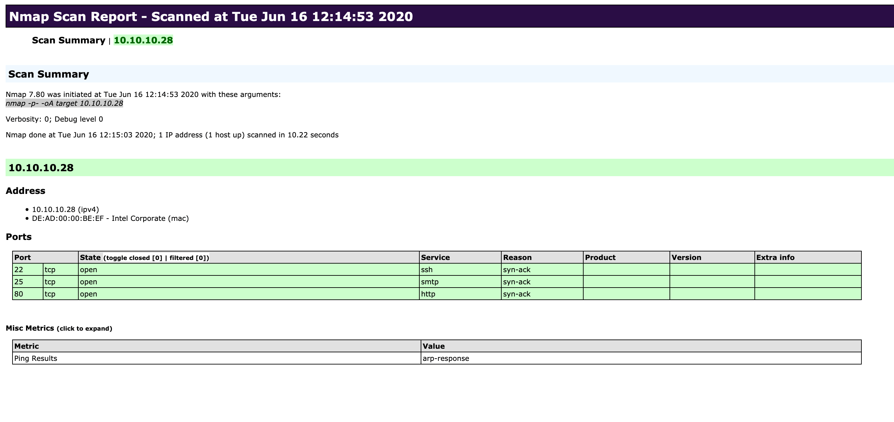

# nmap

## Host Discovery

Finding out who's around.

### Scan Network Range
```bash
$> sudo nmap 10.129.2.0/24 -sn -oA tnet | grep for | cut -d" " -f5

10.129.2.4
10.129.2.10
10.129.2.11
10.129.2.18
10.129.2.19
10.129.2.20
10.129.2.28
```

- `10.129.2.0/24` &rarr; Target network range.
- `-sn` &rarr; Disables port scanning.
- `-oA tnet` &rarr; Stores the results in all formats starting with the name 'tnet'.

note: Gives a file of list of IPs to scan to add to nmap later on (`-iL file`).

### Ip scan format

single: `sudo nmap 10.129.2.18 -sn -oA host `

multiple: `sudo nmap -sn -oA tnet 10.129.2.18 10.129.2.19 10.129.2.20`

mutliple (range): `sudo nmap -sn -oA tnet 10.129.2.18-20`

### Still alive pings

If we disable port scan (`-sn`) and in many other cases, nmap will automatically ping scan with `ICMP Echo Requests` (`-PE`). If available though namp will `ARP ping`. We can check this with `--packet-trace`. we can disable the `arp ping` with `--disable-arp-ping`.

## Host and port scanning

### Default behavior

default nmap scan:
- if root: `-sS` &rarr; SYN scan, if not root: `-sT` &rarr; TCP scan
- top 1000 Tcp porst (statistically)
- `--max-retries` &rarr; 10
 
note: `-sS` and `-sT` options are similar, but `-sS` only send a `TCP SYN` and waits for a `TCP SYN/ACK` or `TCP RST`, whereas `-sT` uses the system `connect()` function. This function establishes a full TCP connection, which is more likely to be logged on a target system. Advanced IDS/IPS systems have evolved to detect the more suble techniques like SYN scan.

Top 100 ports can be selected with option `-F`, and top n ports with `--top-ports=n`.

### Packet tracing

```bash
$> sudo nmap 10.129.2.28 -p 21 --packet-trace -Pn -n --disable-arp-ping

Starting Nmap 7.80 ( https://nmap.org ) at 2020-06-15 15:39 CEST
SENT (0.0429s) TCP 10.10.14.2:63090 > 10.129.2.28:21 S ttl=56 id=57322 iplen=44  seq=1699105818 win=1024 <mss 1460>
RCVD (0.0573s) TCP 10.129.2.28:21 > 10.10.14.2:63090 RA ttl=64 id=0 iplen=40  seq=0 win=0
Nmap scan report for 10.11.1.28
Host is up (0.014s latency).

PORT   STATE  SERVICE
21/tcp closed ftp
MAC Address: DE:AD:00:00:BE:EF (Intel Corporate)

Nmap done: 1 IP address (1 host up) scanned in 0.07 seconds
```

- `--packet-trace` &rarr; Shows all packets sent and received.
- `-Pn` &rarr; Disables ICMP Echo request.
- `-n` &rarr; Disables DNS resolution.
- `--disable-arp-ping` &rarr; Disables ARP ping.

#### How to read packet tracing

Request:

`SENT (0.0429s)` &rarr; Indicates the SENT operation of Nmap, which sends a packet to the target.

`TCP` &rarr; Shows the protocol that is being used to interact with the target port.

`10.10.14.2:63090 >` &rarr; Represents our IPv4 address and the source port, which will be used by Nmap to send the packets.

`10.129.2.28:21` &rarr; Shows the target IPv4 address and the target port.

`S` &rarr; SYN flag of the sent TCP packet.

`ttl=56 id=57322 iplen=44 seq=1699105818 win=1024 mss 1460` &rarr; Additional TCP Header parameters.

Response:

`RCVD (0.0573s)`	Indicates a received packet from the target.

`TCP` &rarr; Shows the protocol that is being used.

`10.129.2.28:21 >` &rarr; Represents targets IPv4 address and the source port, which will be used to reply.

`10.10.14.2:63090` &rarr; Shows our IPv4 address and the port that will be replied to.

`RA` &rarr; RST and ACK flags of the sent TCP packet.

`ttl=64 id=0 iplen=40 seq=0 win=0` &rarr; Additional TCP Header parameters.


### UDP scan   

Some system administrators sometimes forget to filter the UDP ports in addition to the TCP ones. Since UDP is a stateless protocol and does not require a three-way handshake like TCP. We do not receive any acknowledgment. Consequently, the timeout is much longer, making the whole UDP scan (-sU) much slower than the TCP scan (-sS).Some.

By default nmap sends empty datagrams so we do not receive any response.

- any response &rarr; `open` (uncommon, service must be configured for this)
- ICMP err 3 (port unreachable) &rarr; `closed`
- any other ICMP &rarr; `open|filtered`

### Version scan

use `-sV`. Much less stealthy because it sends many probes.

### Saving results

- Normal output (`-oN`) with the `.nmap` file extension
- Grepable output (`-oG`) with the `.gnmap` file extension
- XML output (`-oX`) with the `.xml` file extension
- All (`-oA`)

XML gives an easily readable format, even for non-technical people:
`xsltproc target.xml -o target.html`



### Service Enumeration

`-sV` to perform service detection. Often better to run a simple scan first to have some information in case we get banned.

note: press `[Space Bar]` during a long scan to show a scan status. we can also add the option `--stats-every=5s` for this update every 5 seconds for example.

by default nmap tries to look at the banners of the scanned ports. if it cannot identify versions through the banners, it attemps to identify the with signature based-matching (slower and cases might not be handled).

## Nmap script engine

- `auth` &rarr; Determination of authentication credentials.
- `broadcast` &rarr; Scripts, which are used for host discovery by broadcasting and the discovered hosts, can be automatically added to the remaining scans.
- `brute` &rarr; Executes scripts that try to log in to the respective service by brute-forcing with credentials.
- `default` &rarr; Default scripts executed by using the -sC option.
- `discovery` &rarr; Evaluation of accessible services.
- `dos` &rarr; These scripts are used to check services for denial of service vulnerabilities and are used less as it harms the services.
- `exploit` &rarr; This category of scripts tries to exploit known vulnerabilities for the scanned port.
- `external` &rarr; Scripts that use external services for further processing.
- `fuzzer` &rarr; This uses scripts to identify vulnerabilities and unexpected packet handling by sending different fields, which can take much time.
- `intrusive` &rarr; Intrusive scripts that could negatively affect the target system.
- `malware` &rarr; Checks if some malware infects the target system.
- `safe` &rarr; Defensive scripts that do not perform intrusive and destructive access.
- `version` &rarr; Extension for service detection.
- `vuln` &rarr; Identification of specific vulnerabilities.

#### How to run

`sudo nmap <target> -sC` for default script.

`sudo nmap <target> --script <category>` for specific category.

`sudo nmap <target> --script <script-name>,<script-name>,...` for defined scripts.

for example:

```bash
$> sudo nmap 10.129.2.28 -p 25 --script banner,smtp-commands

Starting Nmap 7.80 ( https://nmap.org ) at 2020-06-16 23:21 CEST
Nmap scan report for 10.129.2.28
Host is up (0.050s latency).

PORT   STATE SERVICE
25/tcp open  smtp
|_banner: 220 inlane ESMTP Postfix (Ubuntu)
|_smtp-commands: inlane, PIPELINING, SIZE 10240000, VRFY, ETRN, STARTTLS, ENHANCEDSTATUSCODES, 8BITMIME, DSN, SMTPUTF8,
MAC Address: DE:AD:00:00:BE:EF (Intel Corporate)
```

#### Aggressive scan


use `-A`.  This scans the target with multiple options as service detection (`-sV`), OS detection (`-O`), traceroute (`--traceroute`), and with the default NSE scripts (`-sC`).

## Performance

We can use various options to tell Nmap how fast (`-T <0-5>`), with which frequency (`--min-parallelism <number>`), which timeouts (`--max-rtt-timeout <time>`) the test packets should have, how many packets should be sent simultaneously (`--min-rate <number>`), and with the number of retries (`--max-retries <number>`) for the scanned ports the targets should be scanned.

## Firewall and IDS/IPS Evasion

Firewall security systems are based on a software component that monitors network traffic between the firewall and incoming data connections and decides how to handle the connection based on the rules that have been set.

### IDS/IPS

`IDS` (Intrusion detection system) and `IPS` (Intrusion prevention system) are both software-based components. IDS scans the network for potential attacks, analyzes them, and reports any detected attacks. IPS complements IDS by taking specific defensive measures if a potential attack should have been detected. The analysis of such attacks is based on pattern matching and signatures. If specific patterns are detected, such as a service detection scan, IPS may prevent the pending connection attempts.

`filtered` or `unfiltered` ports can show up differently base on different types of scans. eg:
- `-sS` (SYN scan) &rarr;  `22/tcp open     ssh` &rarr; reveived `SYN-ACK` packet
- `-sA` (TCP ACK scan) &rarr; `22/tcp unfiltered ssh` &rarr; received `RST` packet

Nmap's `-sA` method is much harder to filter for firewalls and IDS/IPS systems than regular `-sS` or `-sT` because they only send a TCP packet with only the ACK flag. When a port is closed or open, the host must respond with an `RST` flag. Unlike outgoing connections, all connection attempts (with the `SYN` flag) from external networks are usually blocked by firewalls. However, the packets with the `ACK` flag are often passed by the firewall because the firewall cannot determine whether the connection was first established from the external network or the internal network.

### Detecting IDS/IPS

`IDS` monitors all connections between hosts and may notify an administrator.

`IPS` takes measures configured by an administrator independently to prevent potential attacks automatically.

Having a few different `VPS` with different Ip addresse is recommended in case an IP gets banned. This is the first step and an administrator may take to stop an attack. Our `ISP` will be contacted and blocked from all access to the internet.

One method to detect if they is such a system is to scan from a single `VPS`. If at any time the host is blocked and has no access to the target, we know the administrators have taken some sort of secuirty measures. We will know to be quieter in our scans, and in the best case, disguise all interaction with the target network and its services.

### Spoofing IPs

we can also scan using decoys with the option `-D`. Set `RND` to a specific number to generate a certain amount of IP addresses.
```bash
$> sudo nmap 10.129.2.28 -p 80 -sS -Pn -n --disable-arp-ping --packet-trace -D RND:5

Starting Nmap 7.80 ( https://nmap.org ) at 2020-06-21 16:14 CEST
SENT (0.0378s) TCP 102.52.161.59:59289 > 10.129.2.28:80 S ttl=42 ... 
SENT (0.0378s) TCP 10.10.14.2:59289 > 10.129.2.28:80 S ttl=59 ...
SENT (0.0379s) TCP 210.120.38.29:59289 > 10.129.2.28:80 S ttl=37 ...
SENT (0.0379s) TCP 191.6.64.171:59289 > 10.129.2.28:80 S ttl=38 ...
SENT (0.0379s) TCP 184.178.194.209:59289 > 10.129.2.28:80 S ttl=39 ...
SENT (0.0379s) TCP 43.21.121.33:59289 > 10.129.2.28:80 S ttl=55 ...
RCVD (0.1370s) TCP 10.129.2.28:80 > 10.10.14.2:59289 SA ttl=64 ...
Nmap scan report for 10.129.2.28
Host is up (0.099s latency).

PORT   STATE SERVICE
80/tcp open  http
MAC Address: DE:AD:00:00:BE:EF (Intel Corporate)

Nmap done: 1 IP address (1 host up) scanned in 0.15 seconds
```

note: Spoofed packets may be filteres by ISPs and routers.

We can also spoof our IP with the `-S <IP>` option.

### DNS Proxying

We can give our preferred dns server with `--dsn-server <ns>,<ns>`. Sometimes used when a company DNS server is more trusted than those on the internet.

By default port `53` is allocated for DNS resolution unless specified otherwise. Some administrators do no filter IDS/IPS properly and we can pretend to come from this port to be trusted and pass through with `--source-port <port>`.

If indeed port `53` is accepted, it is very likely that IDS/IPS filter might also be configured much weaker than other. We can test this by trying to connect to this port by using `netcat`.
```bash
$> ncat -nv --source-port 53 10.129.2.28 50000

Ncat: Version 7.80 ( https://nmap.org/ncat )
Ncat: Connected to 10.129.2.28:50000.
220 ProFTPd
```

